# 阶段零：前置知识准备

> 在阅读 MiniMind-O 代码之前，你需要掌握以下基础。每个知识点都标注了本项目中的对应位置，方便你学完后回来验证。

---

## 0.1 Python 编程基础

### 类与继承

本项目大量使用了类的继承。核心继承链如下：

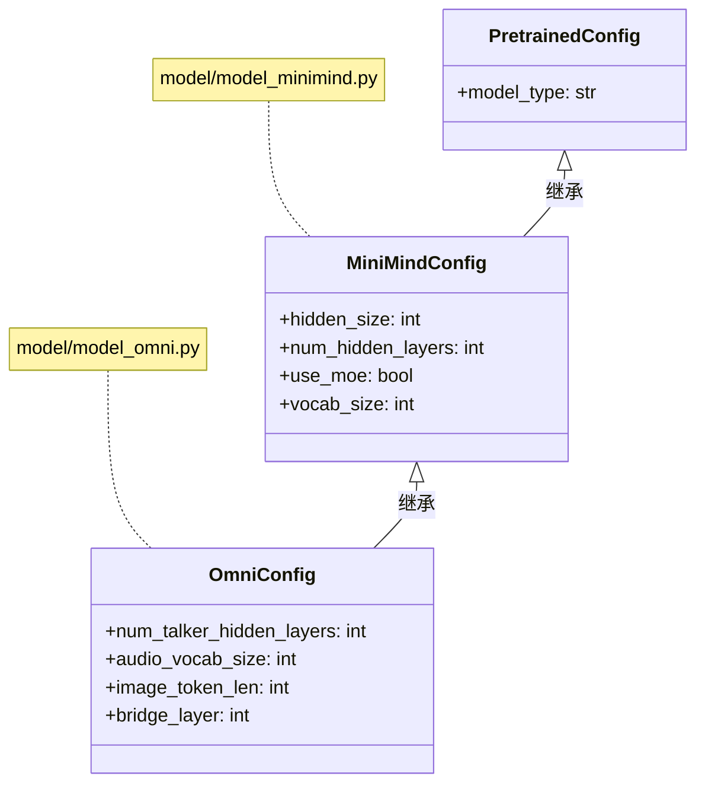

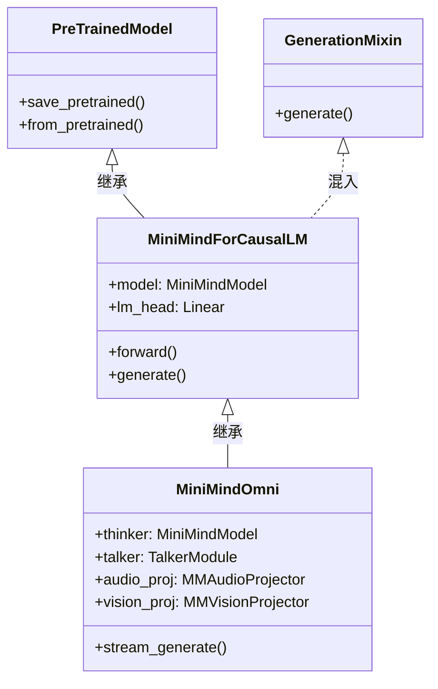

**关键概念**：
- `super().__init__()` — 调用父类的初始化方法
- `MiniMindOmni` 继承了 `MiniMindForCausalLM`，自动拥有 `forward()` 和 `generate()` 方法
- `OmniConfig` 继承了 `MiniMindConfig`，自动拥有 `hidden_size` 等属性

### 生成器 `yield`

本项目使用 `yield` 实现流式生成（逐 token 输出），这是推理的核心机制：

```python
# 简化的示例（类似 stream_generate 的逻辑）
def simple_generate():
    tokens = ["你", "好", "，", "世", "界"]
    for token in tokens:
        yield token  # 每次返回一个，不退出函数

# 调用方式
for token in simple_generate():
    print(token, end="")  # 逐字打印：你好，世界
```

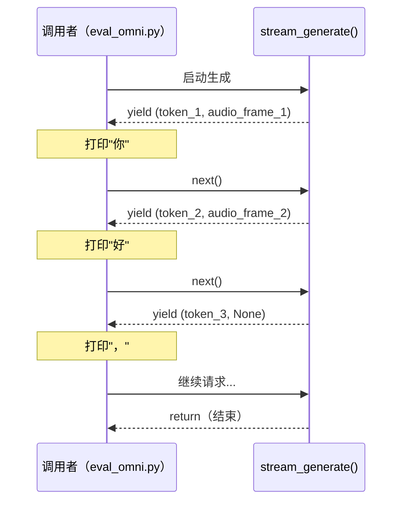

**本项目位置**：`model/model_omni.py:stream_generate()` 第 326-395 行

### 上下文管理器 `with`

用于资源管理，在本项目中常见于：

```python
# 禁用梯度计算（推理时节省内存）
with torch.no_grad():
    output = model(input_ids)

# 混合精度训练
with torch.cuda.amp.autocast(dtype=torch.bfloat16):
    output = model(input_ids)
    loss = compute_loss(output)
```

---

## 0.2 深度学习核心概念

### 什么是神经网络？

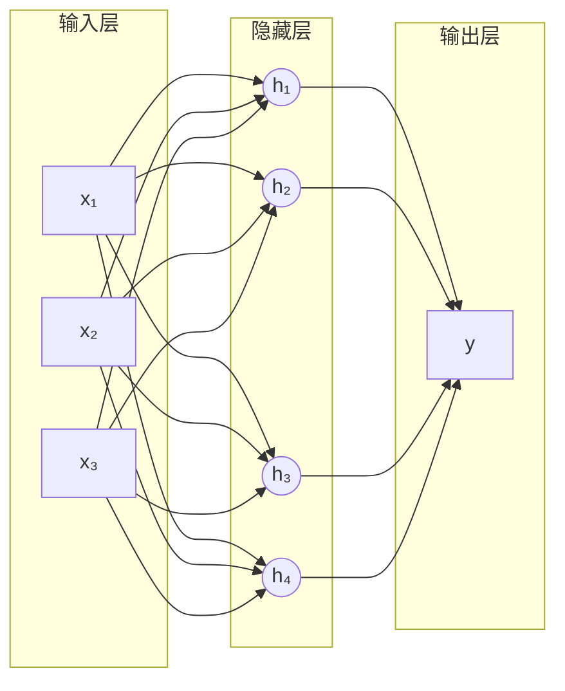

每个连接都有一个**权重（weight）**，训练的过程就是不断调整这些权重。

### 训练循环

深度学习的训练是一个反复的循环过程：

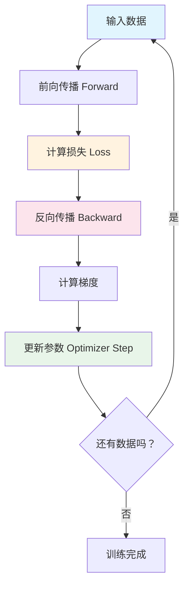

**本项目对应**（`trainer/train_sft_omni.py:train_epoch()`）：

```python
# 简化的训练循环
for step, batch in enumerate(loader):
    # 1. 前向传播
    output = model(batch.input_ids)
    # 2. 计算损失
    loss = compute_loss(output, batch.labels)
    # 3. 反向传播（自动计算梯度）
    loss.backward()
    # 4. 更新参数
    optimizer.step()
    optimizer.zero_grad()
```

### 张量（Tensor）

张量是 PyTorch 中的基本数据结构，可以理解为多维数组：

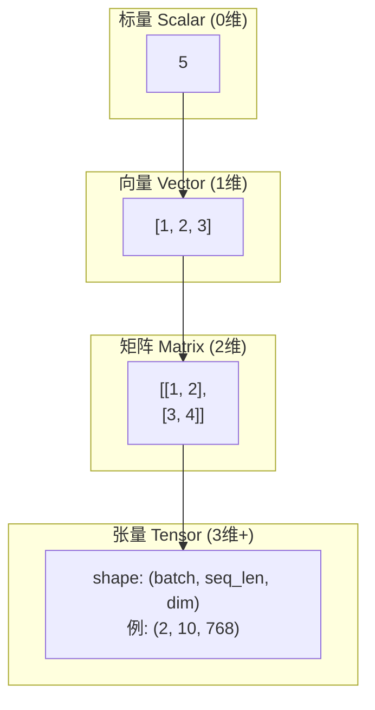

**本项目中常见的张量形状**：

| 张量 | 形状 | 含义 |
|------|------|------|
| `input_ids` | `(B, T)` | B 个样本，每个 T 个 token |
| `hidden_states` | `(B, T, 768)` | B 个样本，每个 T 个位置，每个 768 维 |
| `logits` | `(B, T, 6400)` | B 个样本，每个 T 个位置，6400 个词的概率 |
| `audio_logits[i]` | `(B, T, 2112)` | 第 i 层音频码本预测 |

> `B` = Batch Size（批次大小），`T` = Sequence Length（序列长度）

### 损失函数

损失函数衡量模型预测与真实答案的差距：

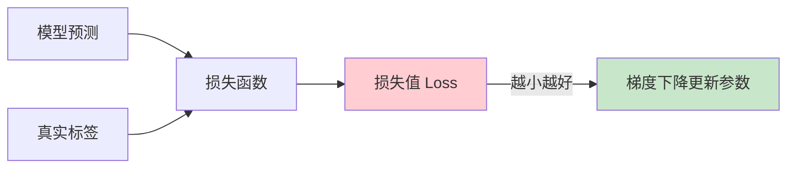

**本项目使用的损失**：交叉熵损失（CrossEntropyLoss），用于分类问题——"从 N 个选项中选正确的那个"。

```python
# 本项目的文本损失
text_loss = CrossEntropyLoss(predicted_logits, true_token_ids)
# predicted_logits: (B*T, 6400) — 每个位置预测 6400 个词的概率
# true_token_ids:   (B*T,)      — 每个位置的正确词 ID
```

---

## 0.3 PyTorch 框架

### 核心模块对应关系

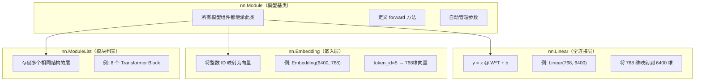

### 本项目的模块层次

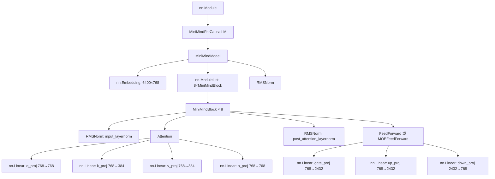

### GPU 加速

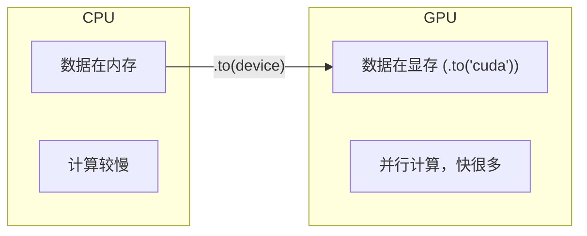

```python
# 本项目中的设备管理
device = "cuda" if torch.cuda.is_available() else "cpu"
model = model.to(device)
input_ids = input_ids.to(device)
```

---

## 0.4 自然语言处理（NLP）基础

### Tokenizer（分词器）

分词器将人类可读的文本转换为模型能理解的数字 ID：

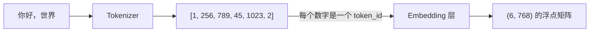

**本项目的分词器**（`model/tokenizer.json`）：
- 词汇表大小：6400
- 使用 BPE（字节对编码）算法
- 特殊 token：`<|im_start|>`(1), `<|im_end|>`(2), `<|audio_pad|>`(16), `<|image_pad|>`(12)

### Chat 格式（对话模板）

本项目使用 ChatML 格式组织对话：

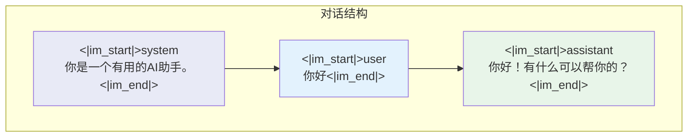

**训练时**：模型学习根据 `<|im_start|>user` 的内容，生成 `<|im_start|>assistant` 后面的回复。

### 特殊 Token 的作用

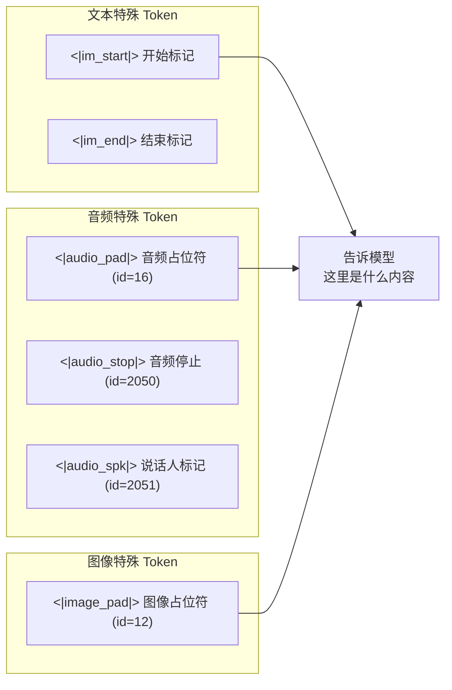

---

## 0.5 音频处理基础

### 音频信号

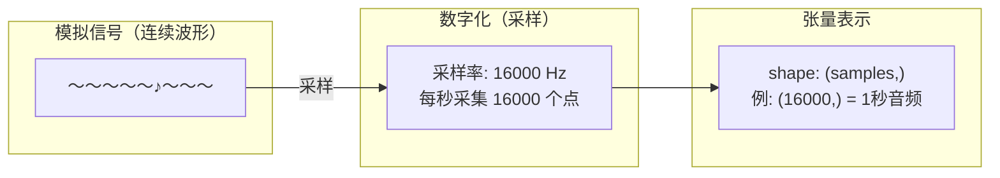

### 音频处理流水线

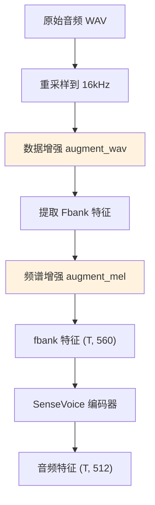

### Mimi 音频编解码

Mimi 是本项目使用的神经音频编解码器，将连续音频转换为 8 层离散码本：

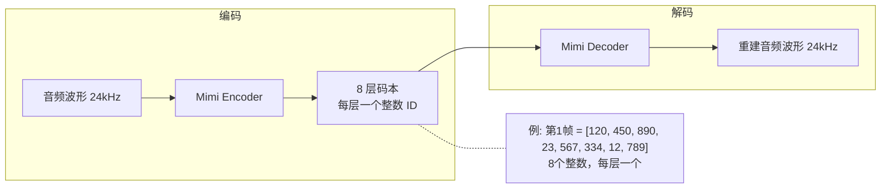

**为什么需要 8 层？** 每一层捕捉音频的不同层次信息（低层=基本音调，高层=语义细节），多层叠加可以更精确地重建音频。

---

## 0.6 计算机视觉基础

### 图像编码流水线

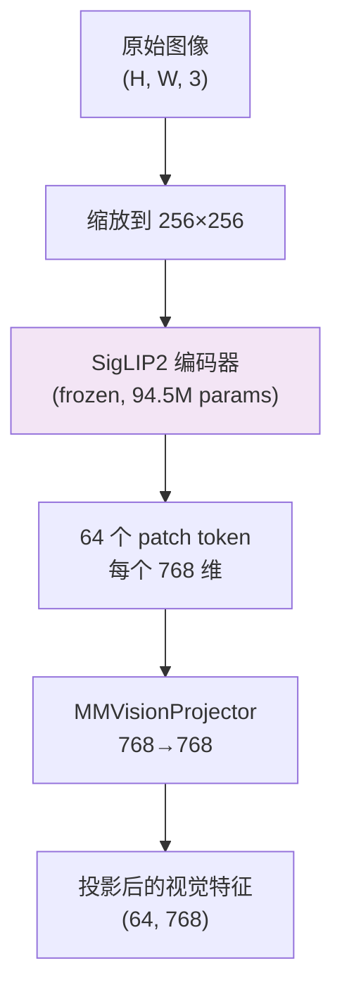

**什么是 Patch？** 将 256×256 的图片切分成 8×8=64 个小块（每块 32×32 像素），每块变成一个 token。

### 多模态融合直觉

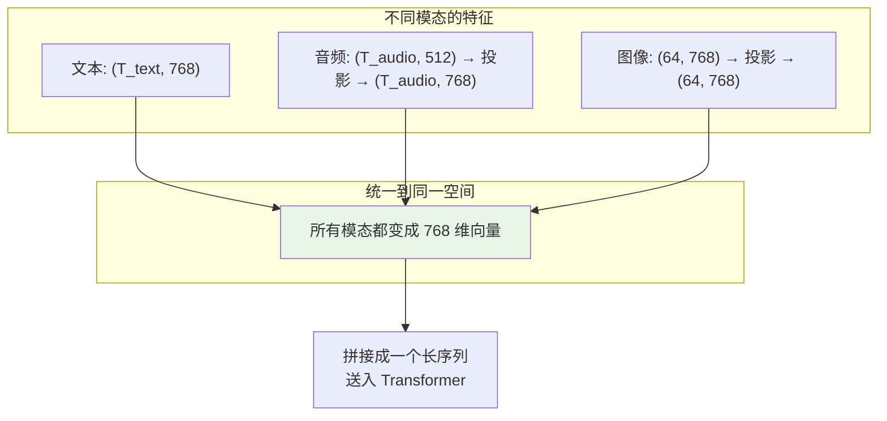

---

## 0.7 推荐学习资源

### 视频
- **3Blue1Brown《神经网络》** — 建立直觉
- **李沐《动手学深度学习》** — PyTorch 实践

### 文档
- **PyTorch 官方教程** — https://pytorch.org/tutorials/
- **HuggingFace Transformers 文档** — https://huggingface.co/docs/transformers

### 书籍
- **《动手学深度学习》（d2l.ai）** — 从零实现每个组件
- **《深度学习》（花书）** — 理论基础（选读）

### 练习平台
- 在本项目目录下创建 `playground/` 文件夹，写实验代码

---

## 学习检查清单

完成本阶段后，你应该能回答以下问题：

- [ ] 什么是张量？`(B, T, 768)` 中每个维度代表什么？
- [ ] `nn.Linear(768, 2432)` 做了什么操作？有多少参数？
- [ ] `loss.backward()` 和 `optimizer.step()` 分别做什么？
- [ ] 为什么推理时要用 `torch.no_grad()`？
- [ ] Tokenizer 的输入和输出分别是什么？
- [ ] `<|audio_pad|>` 在模型中的作用是什么？
- [ ] Mimi 编码器的输出为什么是 8 层码本？

> 如果以上问题你都能回答，恭喜你，可以进入阶段一了！
