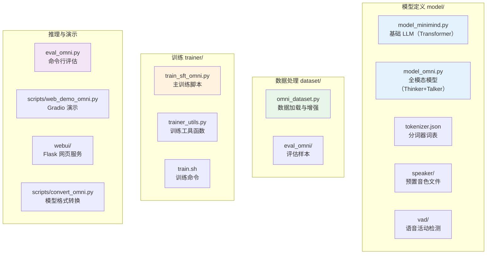
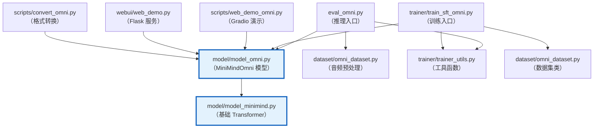
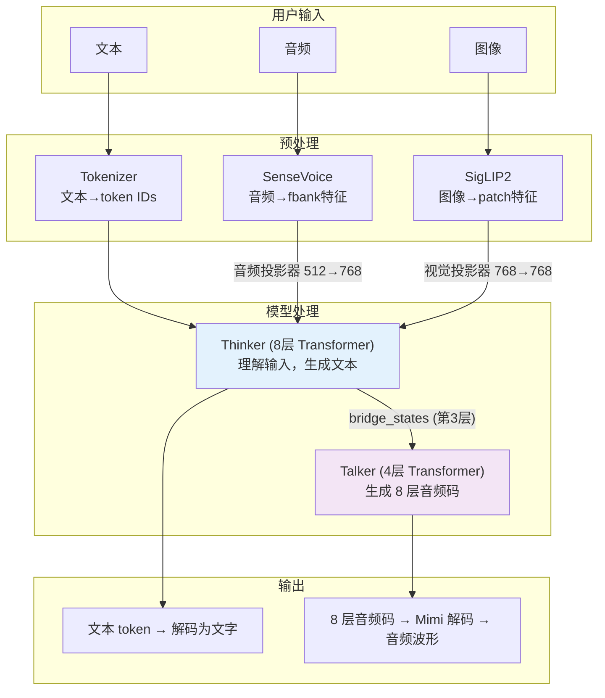
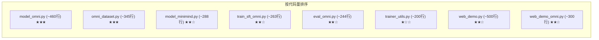
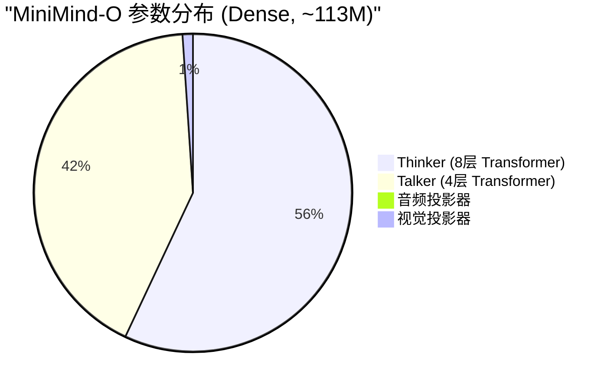
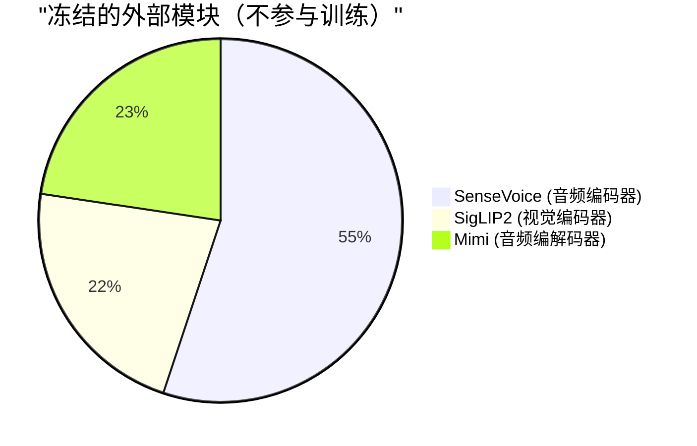
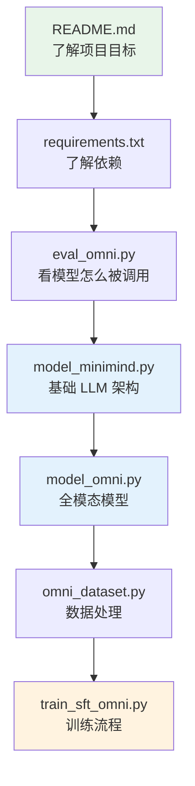

# 阶段一：理解项目结构与运行方式

> 目标：能跑通项目，理解每个文件的职责，建立全局观。

---

## 1.1 项目目录全景图



---

## 1.2 文件之间的依赖关系



> `model_omni.py` 是最核心的文件，几乎所有其他文件都依赖它。

---

## 1.3 数据流总览

从用户输入到模型输出的完整数据流：



---

## 1.4 各文件行数与复杂度



---

## 1.5 模型参数量





---

## 1.6 运行项目

### 安装环境

```bash
# 1. 创建虚拟环境
conda create -n minimind-o python=3.10
conda activate minimind-o

# 2. 安装依赖
pip install -r requirements.txt

# 3. 安装 PyTorch（GPU 版本）
pip install torch torchvision torchaudio --index-url https://download.pytorch.org/whl/cu121
```

### 下载模型

参照 `README.md` 中的说明，下载预训练权重到 `out/` 目录。

### 运行推理

```bash
# 文本对话（最简单）
python eval_omni.py --mode 0

# 语音对话
python eval_omni.py --mode 2

# 全部模式
python eval_omni.py --mode -1
```

---

## 1.7 建议的阅读路线



---

## 学习检查清单

- [ ] 你能说出每个文件夹的用途吗？
- [ ] 你知道哪个文件是"最核心"的吗？
- [ ] 你能画出从输入到输出的数据流吗？
- [ ] 你能成功运行 `python eval_omni.py --mode 0` 吗？
- [ ] 你知道 Thinker 和 Talker 的区别吗？

> 完成后进入阶段二，深入理解 Transformer 的每一个组件！
