# 阶段二：理解基础语言模型（Thinker 的骨架）

> 目标文件：`model/model_minimind.py`（约 288 行）
> 这是最重要的基础文件，值得花最多时间反复阅读。

---

## 2.1 总览：MiniMind LLM 的架构

MiniMind 是一个标准的 GPT 风格 Transformer，采用现代 LLM 的最佳实践：

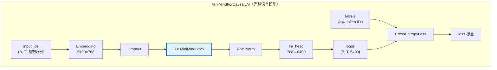

### 模型配置参数速查

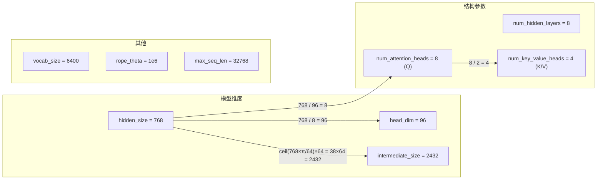

---

## 2.2 RMSNorm（根均方归一化）

**位置**：`model_minimind.py` 第 50-60 行

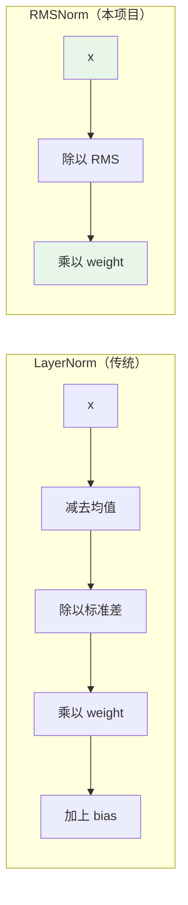

**公式对比**：
```
LayerNorm:  output = (x - mean(x)) / sqrt(var(x) + eps) * weight + bias
RMSNorm:    output = x / sqrt(mean(x²) + eps) * weight
```

**为什么用 RMSNorm？** 更简单、更快，效果与 LayerNorm 相当。省去了均值计算和偏置项。

```python
# 本项目实现
class RMSNorm(torch.nn.Module):
    def __init__(self, dim, eps=1e-5):
        self.weight = nn.Parameter(torch.ones(dim))  # 可学习参数

    def norm(self, x):
        return x * torch.rsqrt(x.pow(2).mean(-1, keepdim=True) + self.eps)

    def forward(self, x):
        return (self.weight * self.norm(x.float())).type_as(x)
```

---

## 2.3 RoPE（旋转位置嵌入）

**位置**：`model_minimind.py` 第 62-84 行

### 为什么需要位置编码？

Transformer 的注意力机制本身是"位置无关"的——它不知道词的顺序。位置编码告诉模型"这个词在第几个位置"。

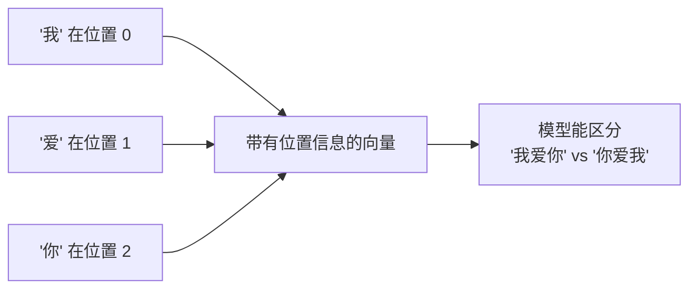

### RoPE 的核心思想

RoPE 通过**旋转** Q 和 K 的向量来编码位置信息：

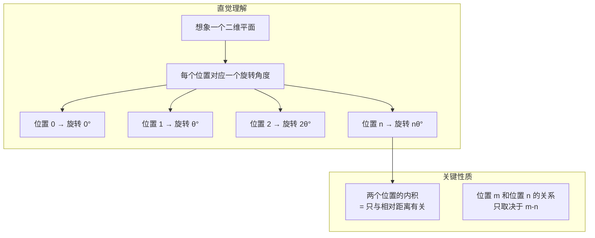

### 代码解读

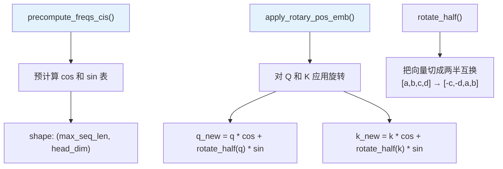

```python
# 简化的 RoPE 应用过程
def apply_rotary_pos_emb(q, k, cos, sin):
    def rotate_half(x):
        # [1, 2, 3, 4] → [-3, -4, 1, 2]
        half = x.shape[-1] // 2
        return torch.cat((-x[..., half:], x[..., :half]), dim=-1)

    q_new = q * cos + rotate_half(q) * sin
    k_new = k * cos + rotate_half(k) * sin
    return q_new, k_new
```

### YaRN 扩展（可选了解）

本项目支持 YaRN 位置缩放，允许模型处理比训练时更长的序列：

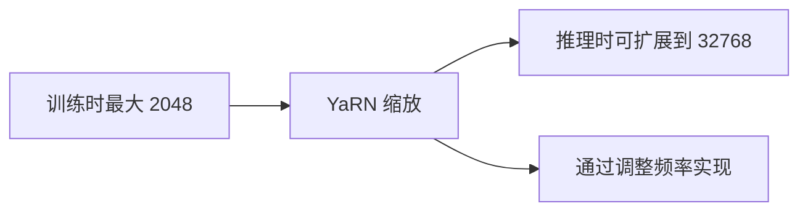

---

## 2.4 Attention（注意力机制）★★★ 最核心

**位置**：`model_minimind.py` 第 91-134 行

### 注意力机制的直觉

想象你在读一句话："小明喜欢打篮球，他经常在**周末**和朋友们一起去球场。"

当你读到"他"时，你的大脑会自动"注意"到"小明"——这就是注意力的本质：**根据当前内容，找到最相关的其他内容**。

### 注意力计算流程

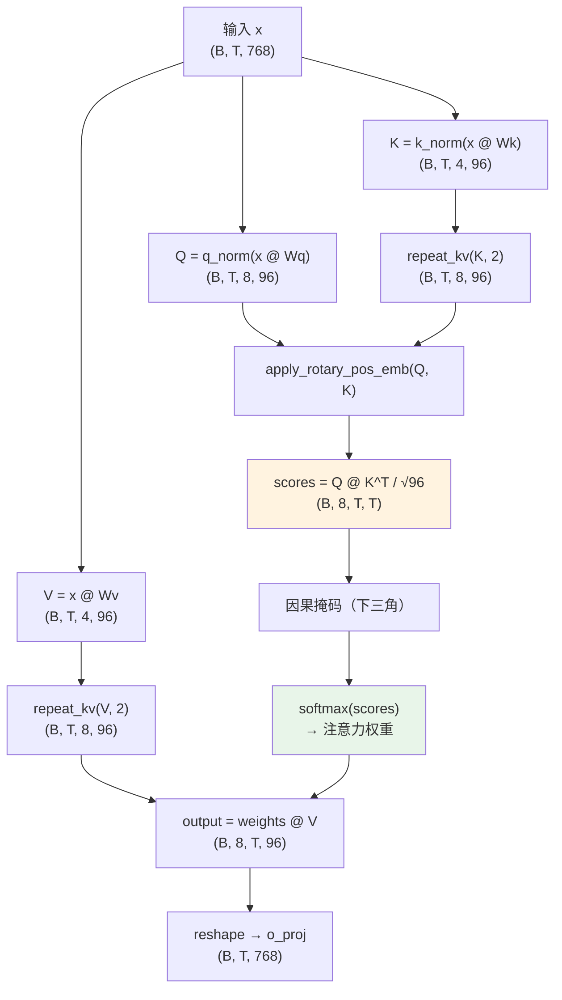

### 什么是 GQA（分组查询注意力）？

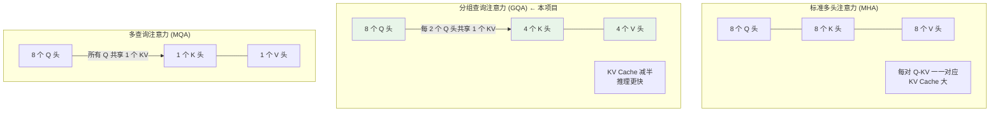

### repeat_kv 的作用

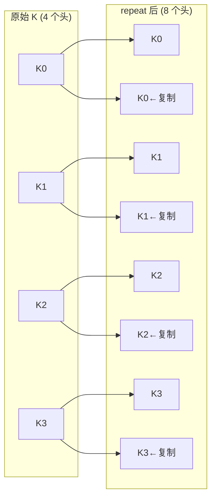

### 因果掩码（Causal Mask）

确保每个位置只能看到它之前的内容（自回归性质）：

```mermaid
graph TD
    subgraph "因果掩码矩阵（4×4 示例）"
        direction LR
        M["位置→  0  1  2  3<br>位置0 [ ✓  ✗  ✗  ✗ ]<br>位置1 [ ✓  ✓  ✗  ✗ ]<br>位置2 [ ✓  ✓  ✓  ✗ ]<br>位置3 [ ✓  ✓  ✓  ✓ ]<br><br>✓ = 可以看到<br>✗ = 不能看到（-inf）"]
    end

    N["确保生成是自左向右的<br>不会"偷看"未来的 token"]

    M --> N
```

### KV Cache

推理时避免重复计算已处理过的 K 和 V：

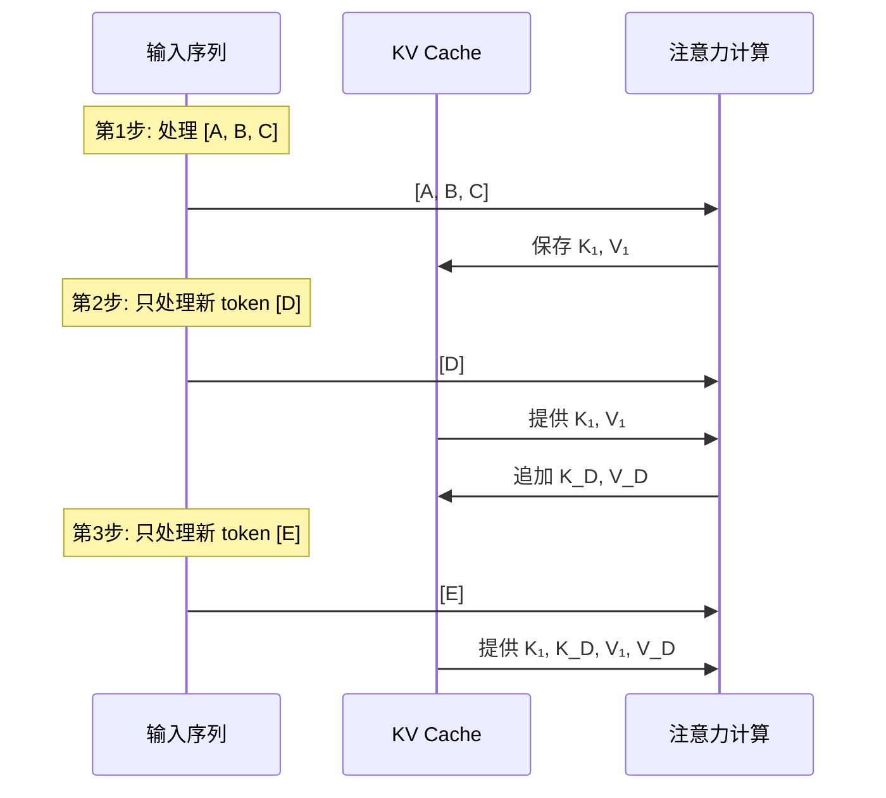

---

## 2.5 FeedForward（前馈网络）与 SwiGLU

**位置**：`model_minimind.py` 第 136-146 行

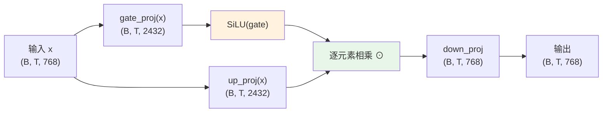

**SwiGLU = Swish Gated Linear Unit**：
```
output = down_proj(SiLU(gate_proj(x)) ⊙ up_proj(x))
```

- `gate_proj`：产生"门控"信号，决定哪些信息通过
- `up_proj`：产生"内容"信号
- `SiLU` 激活函数：`silu(x) = x * sigmoid(x)`
- `⊙`：逐元素乘法（门控机制）
- `down_proj`：将维度从 2432 映射回 768

---

## 2.6 MOEFeedForward（混合专家）

**位置**：`model_minimind.py` 第 148-176 行

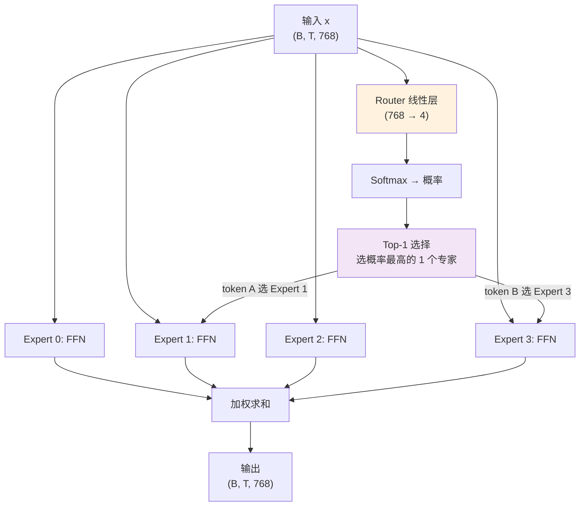

**核心思想**：不同的 token 可能需要不同的处理方式。MoE 让每个 token 选择最合适的"专家"。

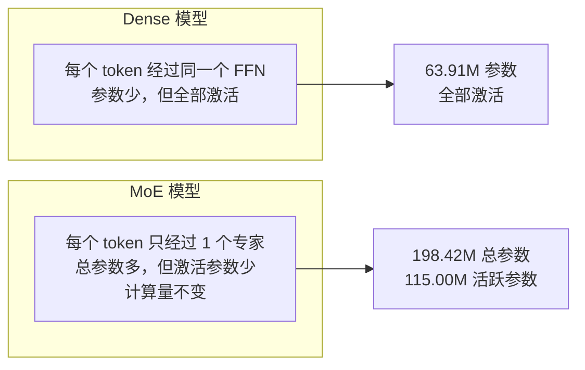

---

## 2.7 MiniMindBlock（Transformer 块）

**位置**：`model_minimind.py` 第 178-194 行

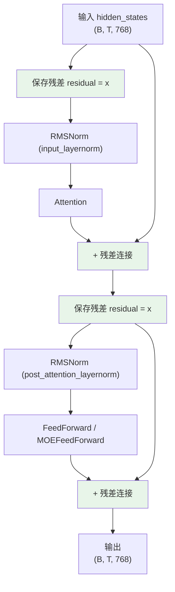

**Pre-Norm 风格**：归一化在子层（Attention/FFN）之前，而不是之后。这是现代 LLM 的标准做法。

**残差连接的作用**：让梯度可以"跳过"子层直接传播，防止梯度消失。想象一条高速公路，信息可以走下面的"主路"（子层），也可以直接走上面的"高架桥"（残差连接）。

---

## 2.8 MiniMindModel（Transformer 堆叠）

**位置**：`model_minimind.py` 第 196-232 行

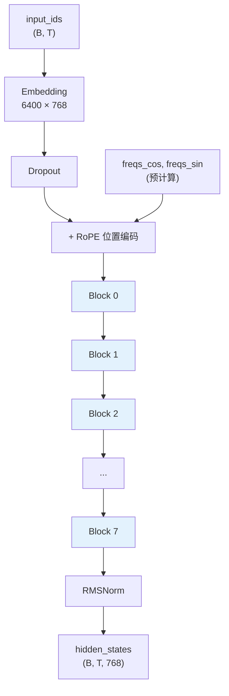

---

## 2.9 MiniMindForCausalLM（因果语言模型）

**位置**：`model_minimind.py` 第 234-288 行

### forward() 前向传播

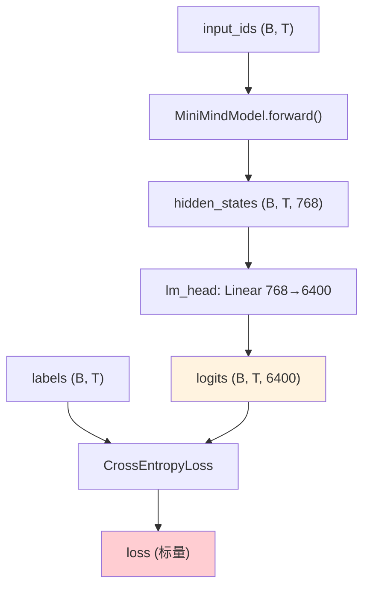

**权重共享（Tied Weights）**：
```python
self.model.embed_tokens.weight = self.lm_head.weight
# Embedding 的权重和 lm_head 的权重是同一份
# 6400×768 的矩阵，省了一半参数
```

### generate() 自回归生成

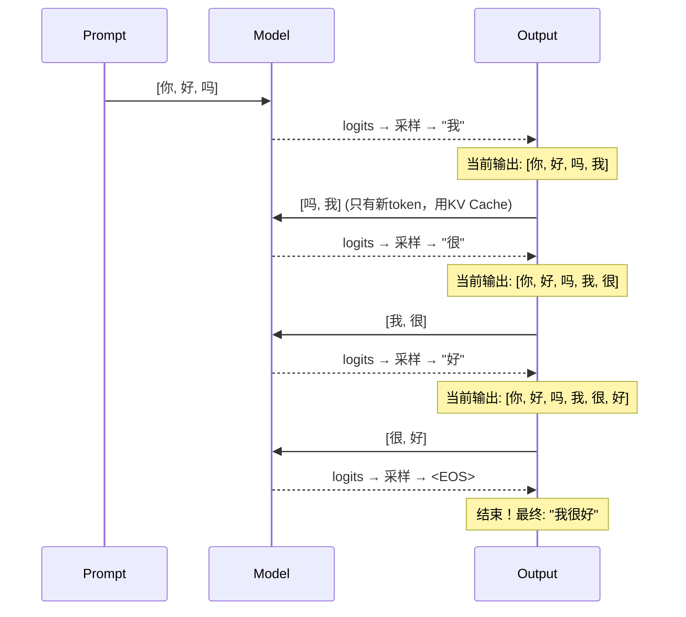

### 采样策略

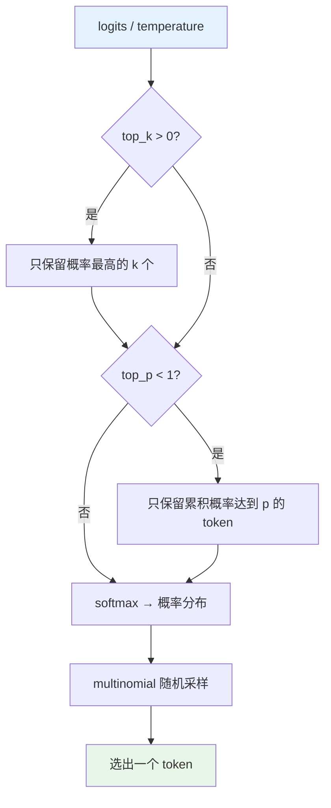

- **temperature**：越大越随机（有创意），越小越确定（保守）
- **top_k**：只在概率最高的 k 个中选（如 k=50）
- **top_p**：只在累积概率达到 p 的候选中选（如 p=0.85）
- **repetition_penalty**：降低已出现 token 的概率，避免重复

---

## 2.10 完整参数流

```mermaid
graph TD
    subgraph "可学习参数"
        P1["Embedding: 6400 × 768 = 4.9M"]
        P2["Attention per layer: ~1.8M"]
        P3["FFN per layer: ~5.6M"]
        P4["lm_head: 与 Embedding 共享 = 0"]
    end

    subgraph "每层参数明细"
        Q["q_proj: 768×768 = 0.59M"]
        K["k_proj: 768×384 = 0.30M"]
        V["v_proj: 768×384 = 0.30M"]
        O["o_proj: 768×768 = 0.59M"]
        QN["q_norm: 96"]
        KN["k_norm: 96"]
        FFN1["gate_proj: 768×2432 = 1.87M"]
        FFN2["up_proj: 768×2432 = 1.87M"]
        FFN3["down_proj: 2432×768 = 1.87M"]
    end

    P2 --> Q & K & V & O & QN & KN
    P3 --> FFN1 & FFN2 & FFN3

    subgraph "总参数量"
        TOTAL["8 layers × ~7.4M/layer + 4.9M embedding + 0.8M 归一化 ≈ 63.9M"]
    end

    P1 --> TOTAL
    P2 --> TOTAL
    P3 --> TOTAL
```

---

## 学习检查清单

- [ ] 你能画出 RMSNorm 和 LayerNorm 的区别吗？
- [ ] RoPE 是如何编码位置信息的？（旋转向量）
- [ ] GQA 中 `repeat_kv` 做了什么？为什么要这样做？
- [ ] 因果掩码为什么是下三角的？
- [ ] SwiGLU 中 gate 和 up 的作用分别是什么？
- [ ] MoE 的 Router 是如何选择专家的？
- [ ] 残差连接为什么能帮助训练？
- [ ] `generate()` 中 KV Cache 是如何加速推理的？

> 完成后进入阶段三，看看这些组件如何组成全模态模型！
