# 阶段三：理解全模态模型（Thinker + Talker）

> 目标文件：`model/model_omni.py`（约 462 行，最核心的文件）
> 建议反复阅读 3 遍以上。

---

## 3.1 总览：Thinker-Talker 双路径架构

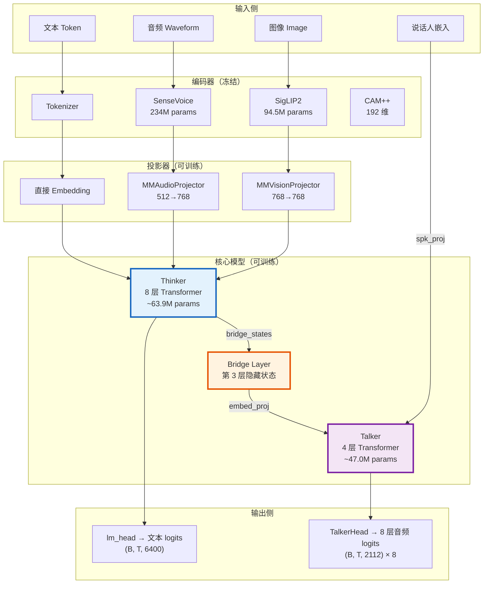

---

## 3.2 OmniConfig（全模态配置）

**位置**：`model_omni.py` 第 10-29 行

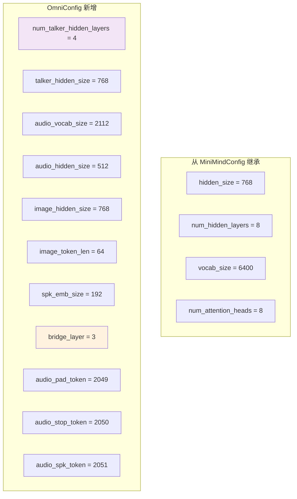

**`bridge_layer = 3` 的含义**：从 Thinker 的第 3 层（共 8 层，索引 0-7）提取隐藏状态传给 Talker。选中间层是因为：
- 太浅（前几层）：语义信息不足
- 太深（最后层）：信息已过度适配文本生成任务

---

## 3.3 模态投影器

### MMAudioProjector（音频投影器）

**位置**：`model_omni.py` 第 31-41 行

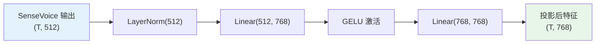

### MMVisionProjector（视觉投影器）

结构完全相同，只是输入维度不同：SigLIP2 输出 768 维，投影后还是 768 维。

---

## 3.4 TalkerHead（8 码本输出头）

**位置**：`model_omni.py` 第 57-65 行

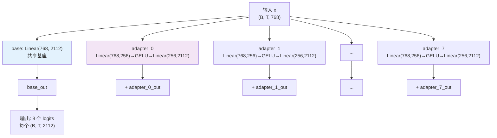

**为什么要共享 + 适配器？**

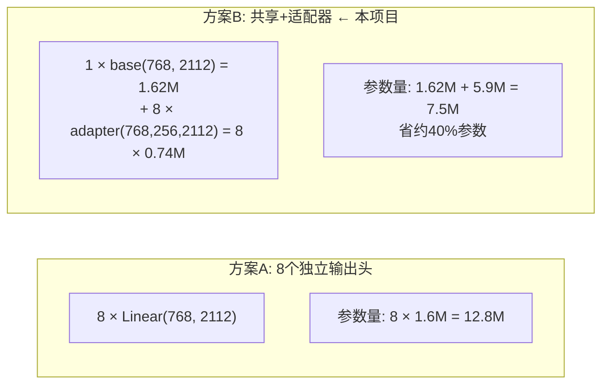

8 层码本预测的内容高度相关（都是同一句话的音频），所以大部分参数可以共享。

---

## 3.5 TalkerEmbedding（8 码本输入嵌入）

**位置**：`model_omni.py` 第 68-76 行

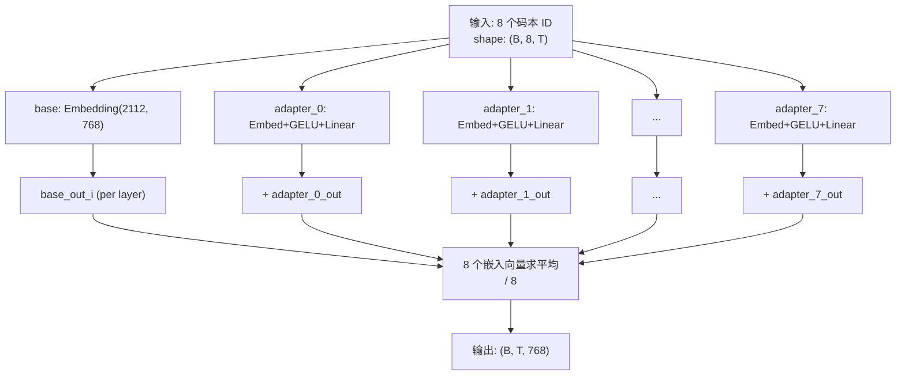

---

## 3.6 TalkerModule（Talker 子模型）

**位置**：`model_omni.py` 第 88-102 行

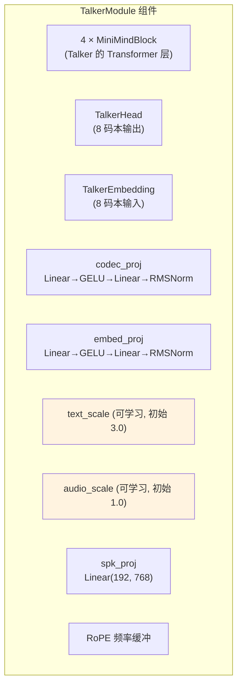

**Talker 初始化策略**：

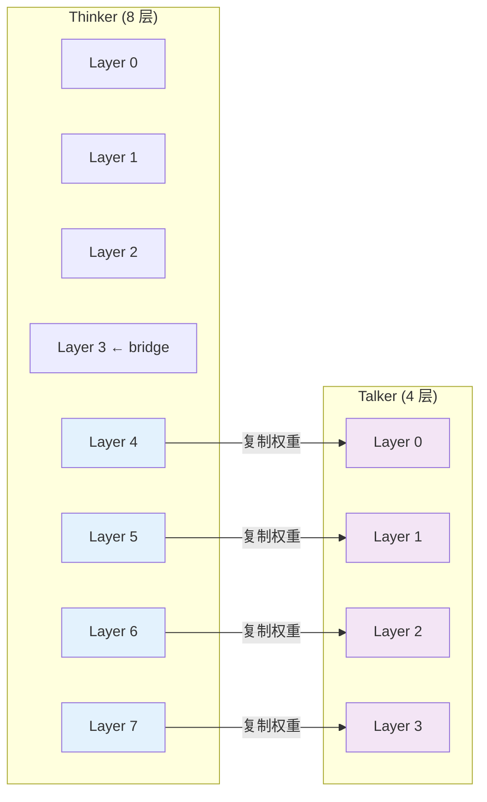

> Thinker 后 4 层已有较强的语言理解能力，直接复制给 Talker 作为初始化，比随机初始化效果好很多。

---

## 3.7 MiniMindOmni.forward() ★★★ 核心中的核心

**位置**：`model_omni.py` 第 245-316 行

### 完整数据流

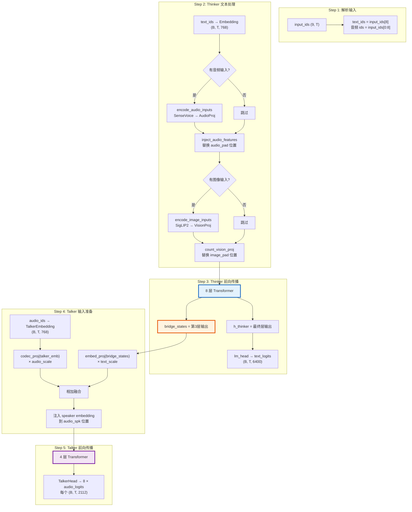

### 音频特征注入机制

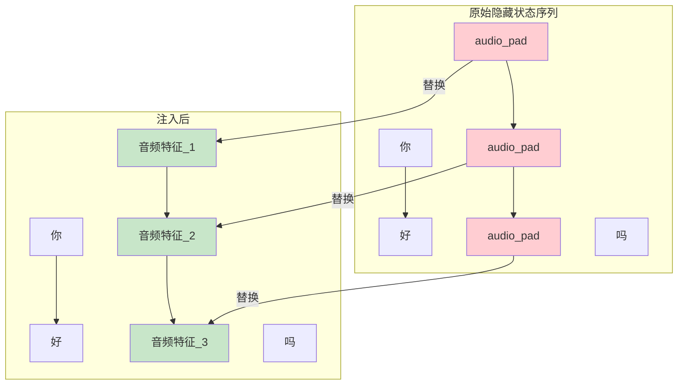

### Talker 输入融合公式

```
talker_input = embed_proj(bridge_states) × text_scale + codec_proj(audio_embeddings) × audio_scale
```

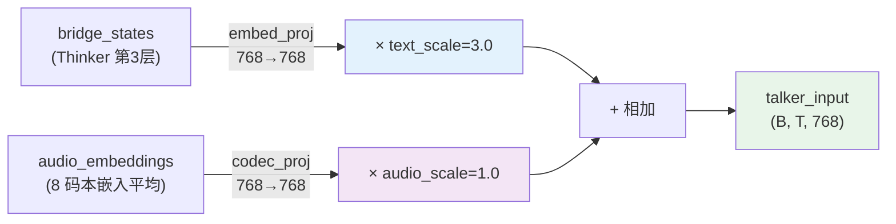

> 初始时文本信号更强（3.0），因为语义理解是基础；音频信号辅助（1.0）。这两个 scale 是可学习的，训练过程中模型会自动调整比例。

---

## 3.8 stream_generate() ★★★ 流式生成

**位置**：`model_omni.py` 第 326-395 行

### 生成流程

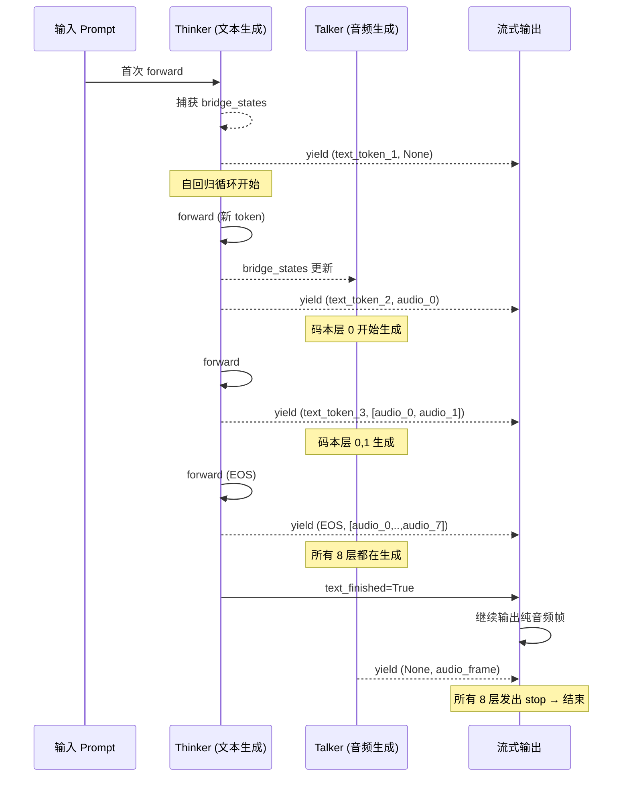

### 交错延迟机制（Staggered Delay）

```mermaid
graph TD
    subgraph "时间步 →"
        direction LR
        T["t0   t1   t2   t3   t4   t5   t6   t7   t8   t9"]
    end

    subgraph "文本生成"
        TEXT[" 你    好    吗   我   很   好   EOS  -    -    -"]
    end

    subgraph "码本层 0"
        L0[" -    a₀   a₁   a₂   a₃   a₄   a₅   a₆   a₇   stop"]
    end

    subgraph "码本层 1"
        L1[" -    -    a₀   a₁   a₂   a₃   a₄   a₅   a₆   a₇"]
    end

    subgraph "码本层 2"
        L2[" -    -    -    a₀   a₁   a₂   a₃   a₄   a₅   a₆"]
    end

    subgraph "...  "
        L3[" ...  ...  ...  ...  ...  ...  ...  ...  ...  ..."]
    end

    subgraph "码本层 7"
        L7[" -    -    -    -    -    -    -    -    a₀   a₁"]
    end

    style TEXT fill:#e3f2fd
    style L0 fill:#f3e5f5
    style L1 fill:#f3e5f5
    style L2 fill:#f3e5f5
    style L7 fill:#f3e5f5
```

> 第 i 层码本从第 i 步开始生成。这样低层（基本音调）先开始，高层（细节）后开始，形成自然的延迟结构。

### 完整的一帧音频输出

当 `audio_step >= 7` 时，可以从 8 个码本中各取一个码，组成一帧：

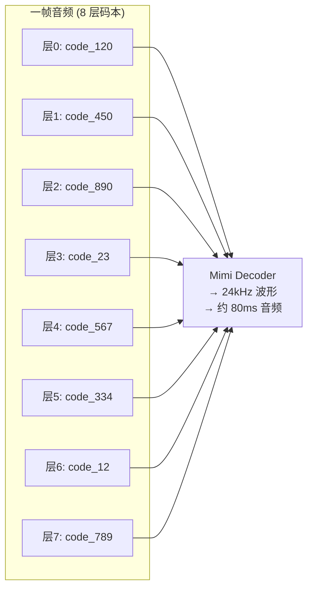

---

## 3.9 SileroVAD 与 RealtimeSession

**位置**：`model_omni.py` 第 398-462 行

### 语音活动检测（VAD）

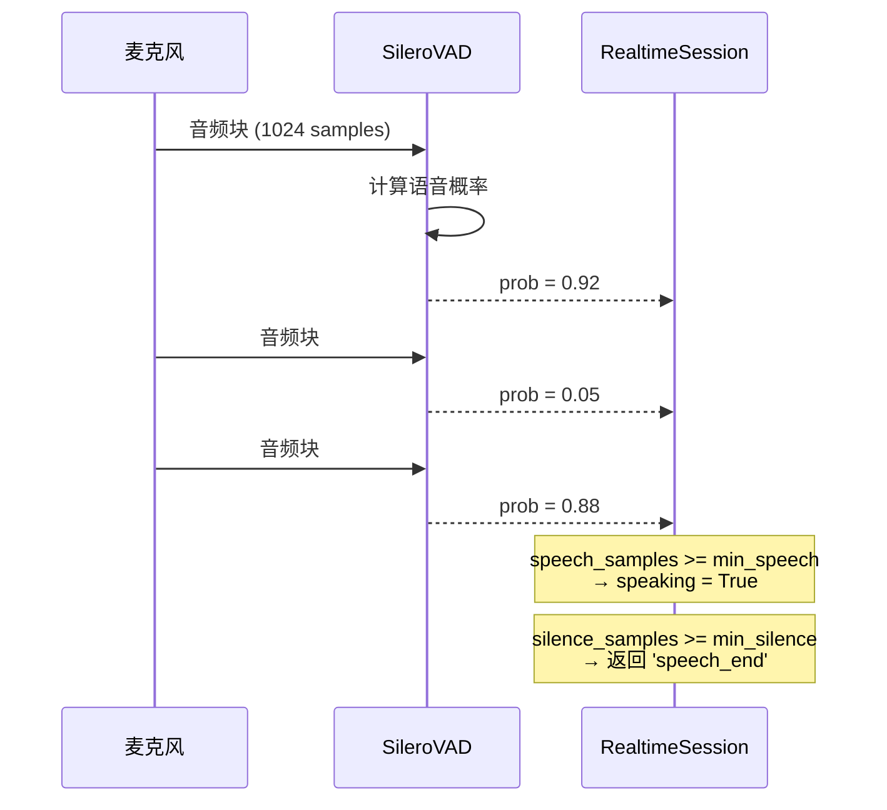

### RealtimeSession 状态机

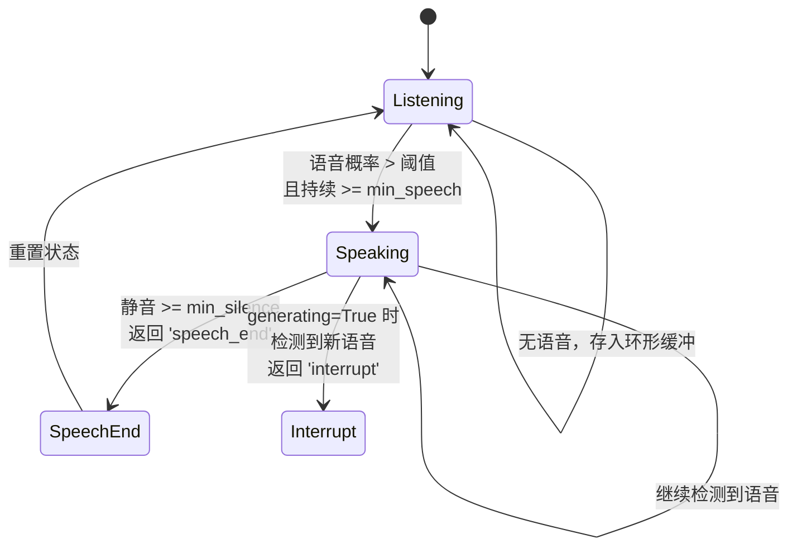

---

## 3.10 参数量统计

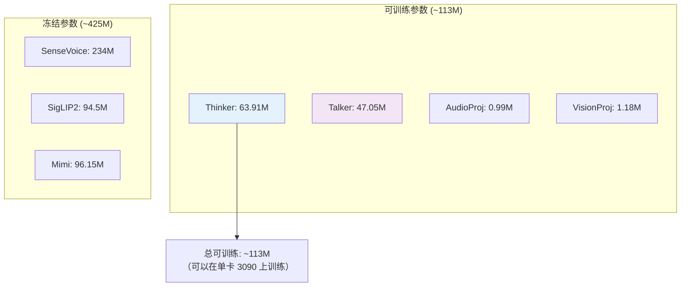

---

## 学习检查清单

- [ ] 你能画出 Thinker-Talker 双路径的数据流吗？
- [ ] `bridge_layer` 为什么选第 3 层？
- [ ] 音频特征是如何"注入"到文本序列中的？
- [ ] `text_scale` 和 `audio_scale` 的初始值为什么不同？
- [ ] TalkerHead 为什么用共享基座 + 适配器？
- [ ] 交错延迟的码本生成是怎么工作的？
- [ ] 一帧音频由几个码组成？解码后是多长时间的音频？

> 完成后进入阶段四，看看训练数据是如何准备的！
