# 阶段四：理解数据处理

> 目标文件：`dataset/omni_dataset.py`（约 345 行）
> 理解训练数据的格式和如何被处理成模型输入。

---

## 4.1 训练数据格式

数据存储在 Parquet 文件中，每条样本包含：

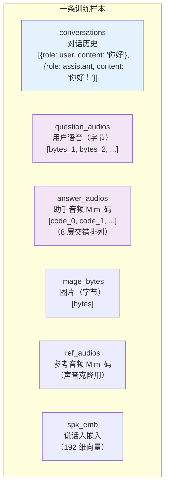

### answer_audios 的交错编码

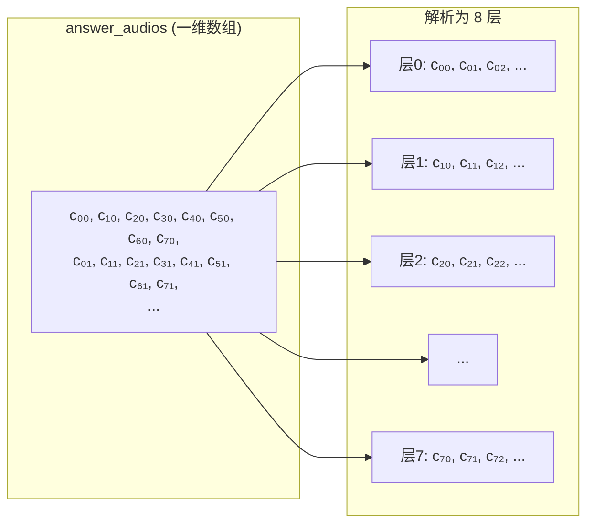

> 每 8 个连续整数分别属于 8 个码本层，加上 `audio_stop_token=2050` 作为结束标记。

---

## 4.2 数据处理流水线

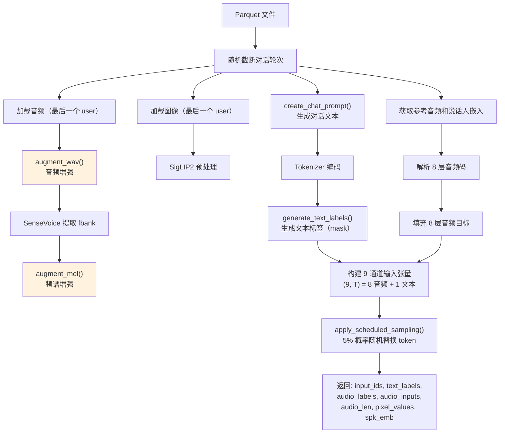

---

## 4.3 音频增强详解

**位置**：`omni_dataset.py` 第 89-121 行

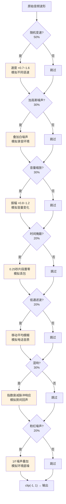

**为什么需要数据增强？** 训练数据有限，通过模拟各种真实环境下的音频变化，让模型更鲁棒。

---

## 4.4 频谱增强详解

**位置**：`omni_dataset.py` 第 123-136 行

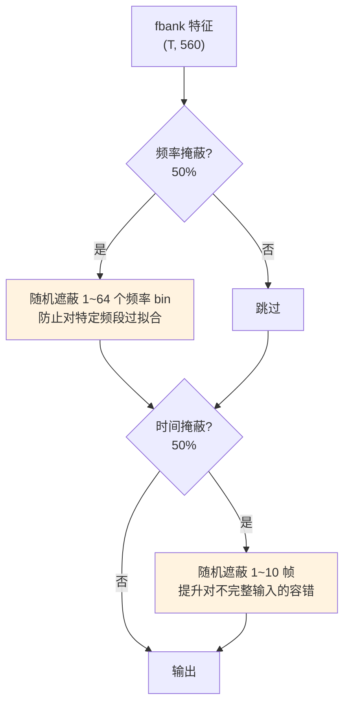

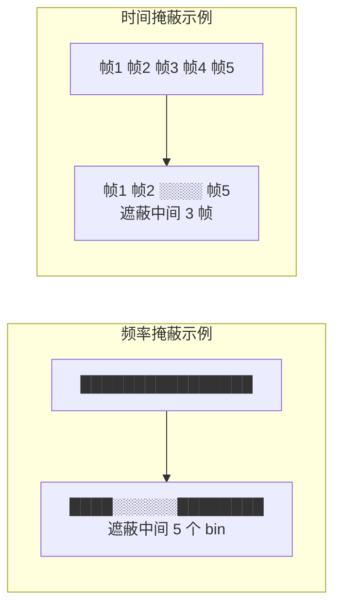

---

## 4.5 对话提示构造

**位置**：`omni_dataset.py` 第 155-176 行

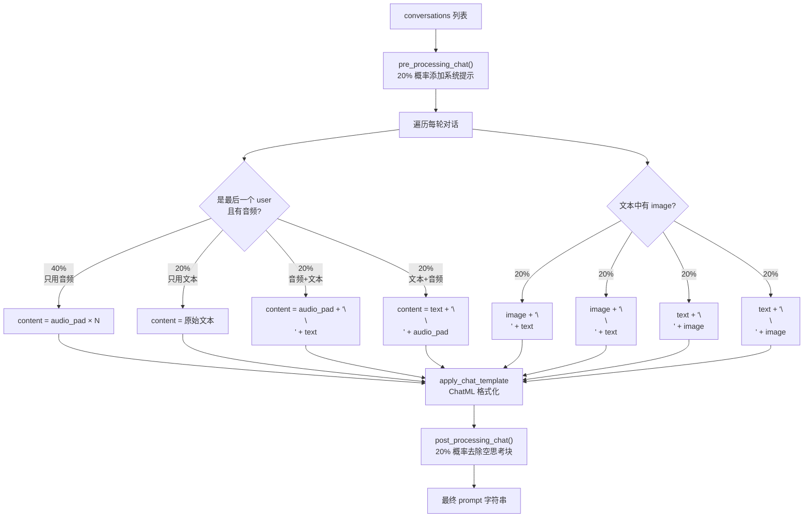

> 音频和图像的位置随机化是一种数据增强，让模型学会在不同输入排列下都能工作。

---

## 4.6 标签生成

**位置**：`omni_dataset.py` 第 179-197 行

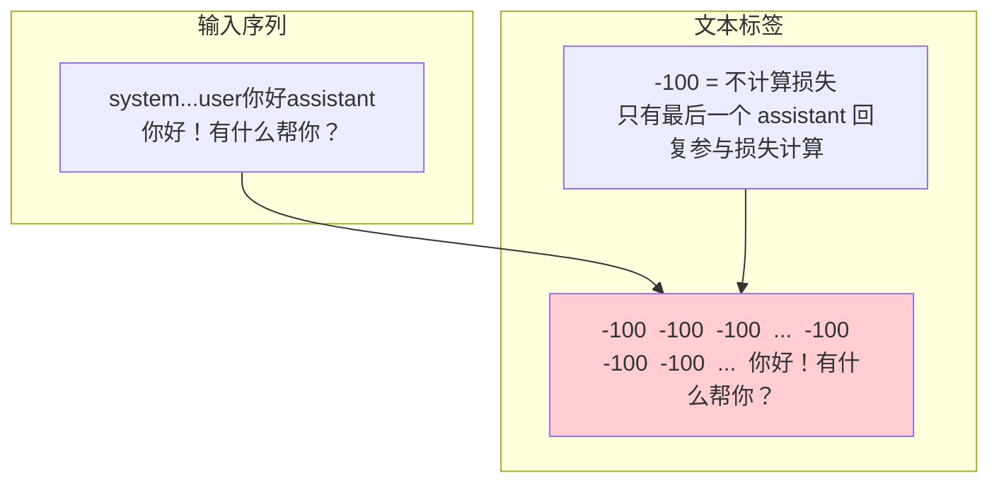

**为什么只训练最后一个 assistant 回复？**
- 前面的轮次是上下文，不是当前要学习的内容
- 只学习"根据对话历史，生成当前回复"的能力

---

## 4.7 9 通道输入张量构造 ★★★

**位置**：`omni_dataset.py` 第 320-329 行

这是最关键的数据构造步骤：

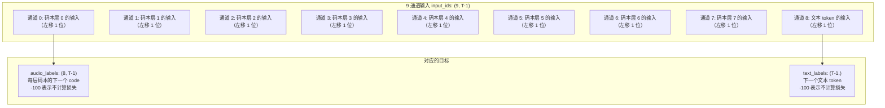

### 具体例子

假设对话是：`<user>你好</user><assistant>你好呀！</assistant>`

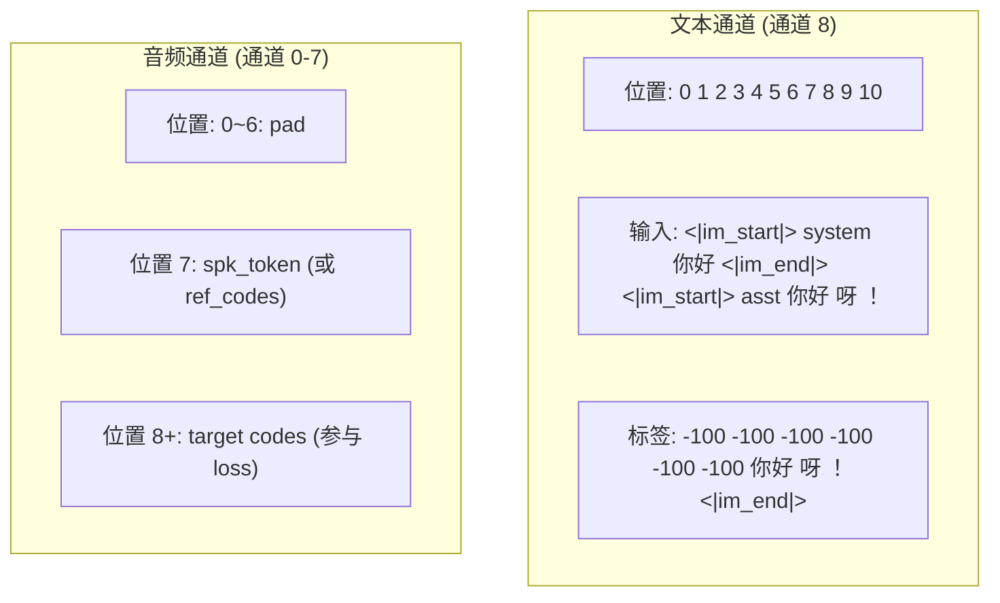

### 音频目标填充细节

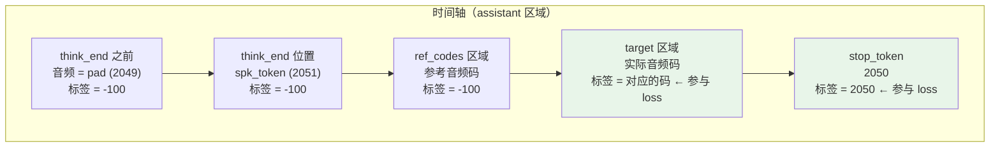

> 注意第 i 层码本的 target 从 `assistant_start + i + 1` 位置开始，实现了交错延迟。

---

## 4.8 Scheduled Sampling

**位置**：`omni_dataset.py` 第 199-209 行

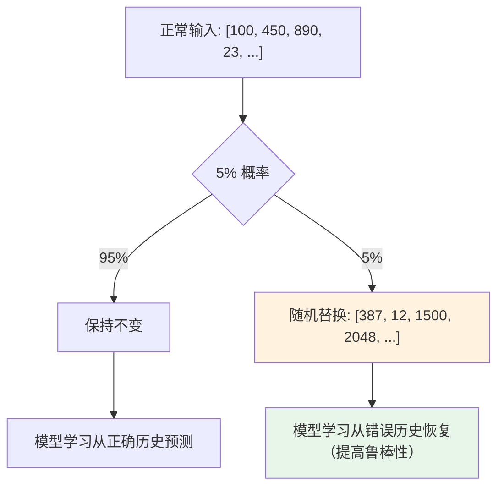

> 类似于老师偶尔故意写错答案让学生纠正，训练模型"纠错"的能力。

---

## 4.9 collate_fn（批次整理）

**位置**：`trainer/train_sft_omni.py` 第 24-48 行

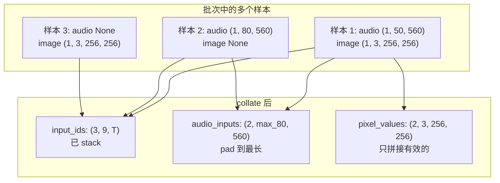

> 不同样本的音频长度不同，需要 pad 到同一个长度才能组成 batch。

---

## 学习检查清单

- [ ] 你能说出训练数据的 6 个字段分别是什么吗？
- [ ] `augment_wav()` 包含了哪些增强方法？各有何作用？
- [ ] 为什么音频和图像的位置在 prompt 中是随机的？
- [ ] 9 通道输入张量中每个通道代表什么？
- [ ] 为什么音频目标从 `think_end` 之后才开始？
- [ ] Scheduled Sampling 的目的是什么？
- [ ] 为什么只有最后一个 assistant 回复参与损失计算？

> 完成后进入阶段五，理解训练流程！
