# 阶段五：理解训练流程

> 目标文件：`trainer/train_sft_omni.py` + `trainer/trainer_utils.py` + `trainer/train.sh`
> 理解如何从零开始训练一个全模态模型。

---

## 5.1 训练脚本总体结构

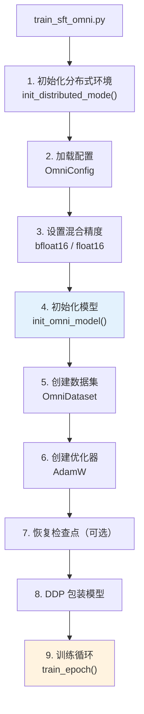

---

## 5.2 训练模式详解

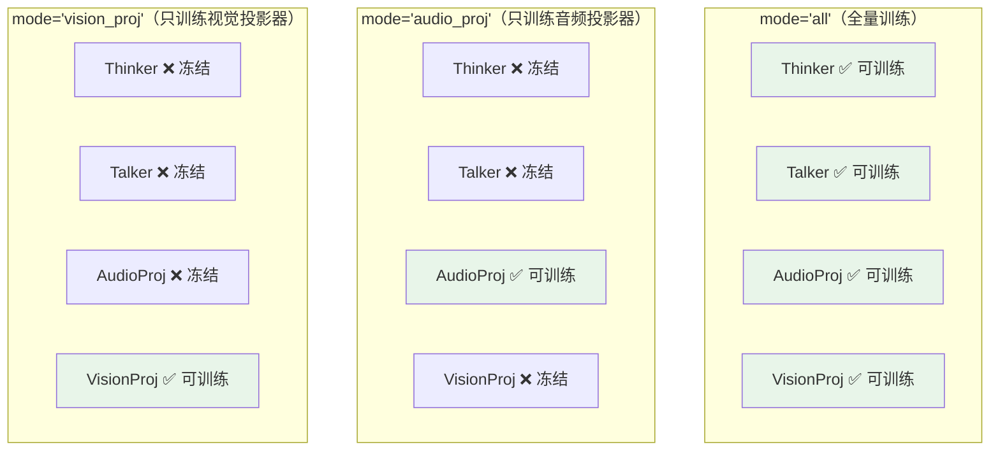

### freeze_backbone 冻结策略

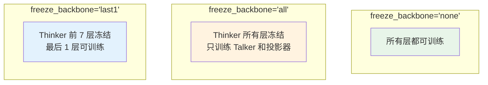

---

## 5.3 三阶段训练流水线

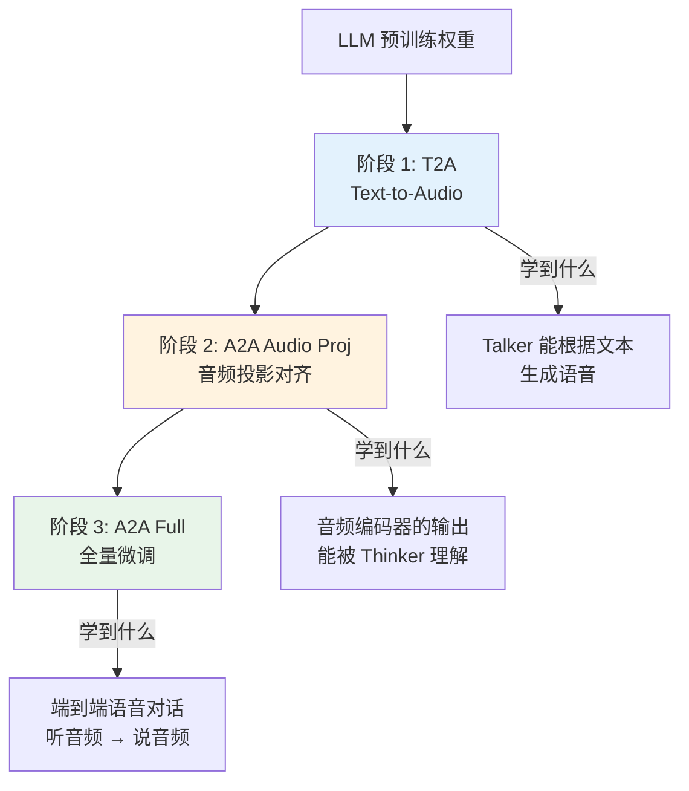

### Mini 版本（单卡 3090，约 2 小时）

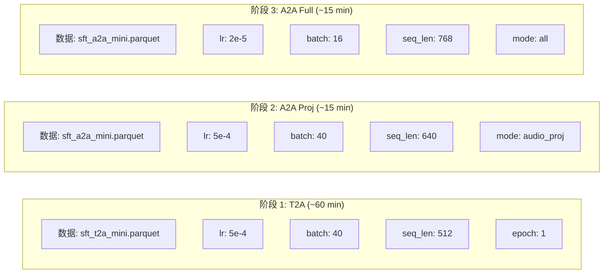

### Full 版本（4 卡 GPU）

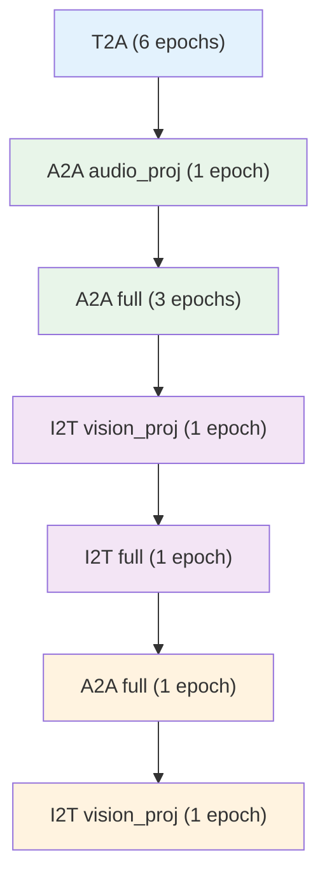

> Full 版本在 A2A 和 I2T 之间交替训练，实现多模态的联合优化。

---

## 5.4 损失函数详解

**位置**：`train_sft_omni.py:train_epoch()` 第 72-95 行

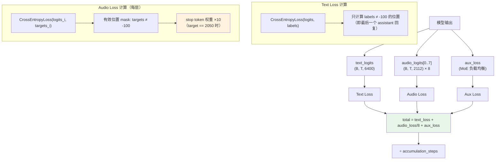

### 为什么 stop token 权重 ×10？

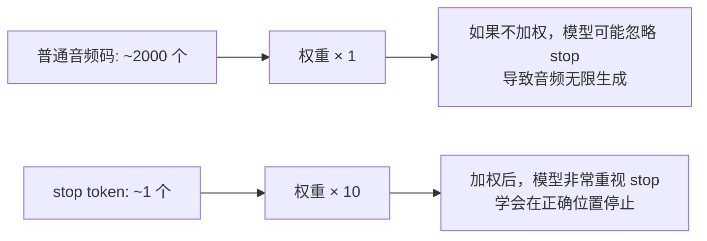

### 为什么 audio_loss 除以 8？

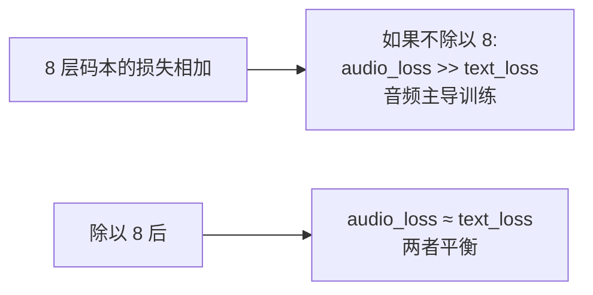

---

## 5.5 学习率调度

**位置**：`trainer_utils.py:get_lr()` 第 25-27 行

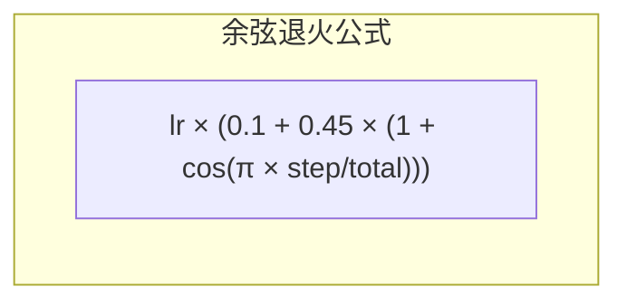

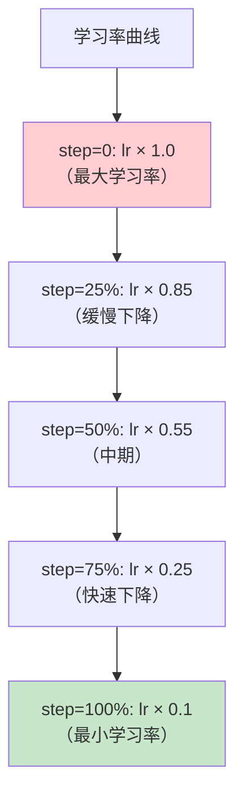

> 学习率从 100% 平滑衰减到 10%，让模型在训练初期大胆探索，后期精细调整。

---

## 5.6 混合精度训练

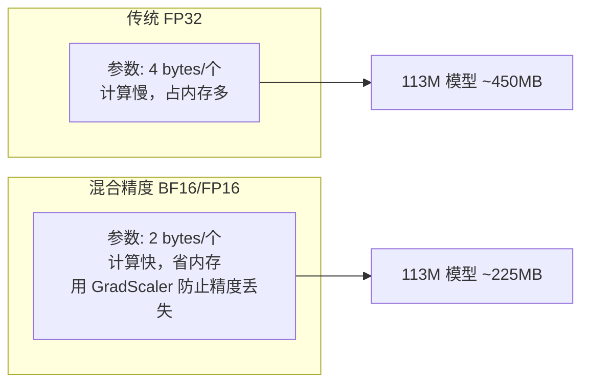

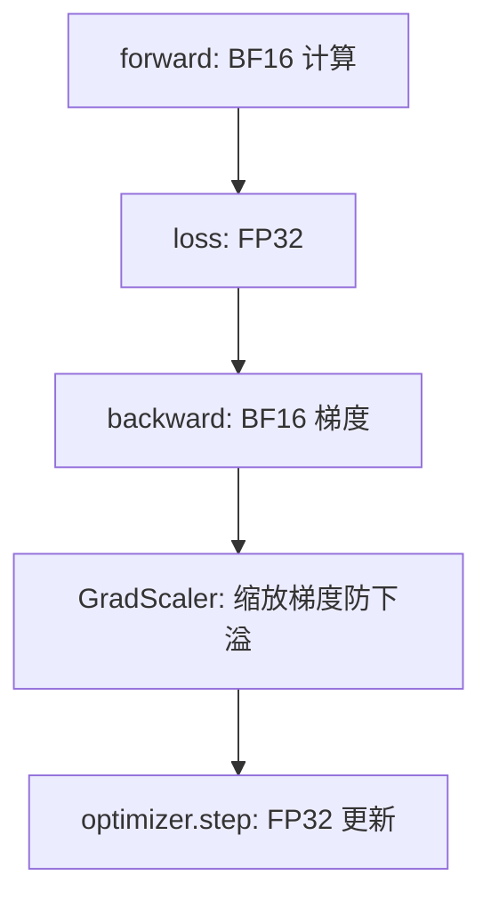

---

## 5.7 梯度累积

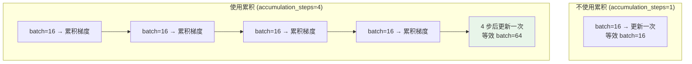

> 显存不够大时，用多次小 batch 模拟大 batch 的效果。

---

## 5.8 检查点保存与恢复

**位置**：`trainer_utils.py:omni_checkpoint()` 第 107-162 行

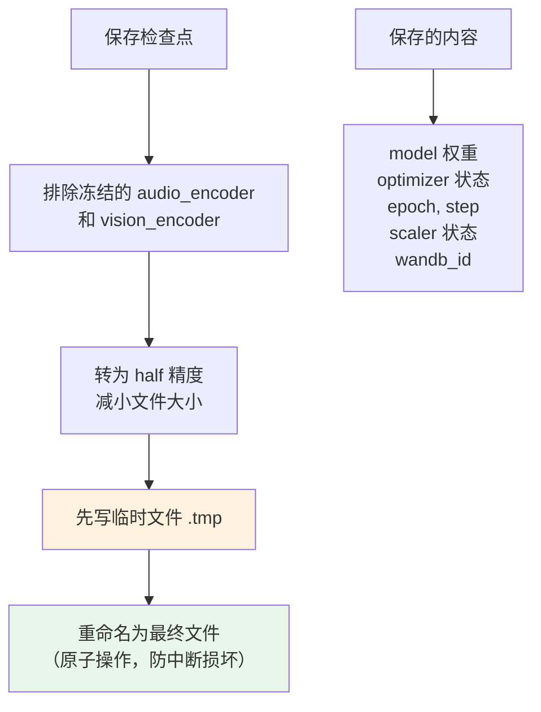

### 恢复训练

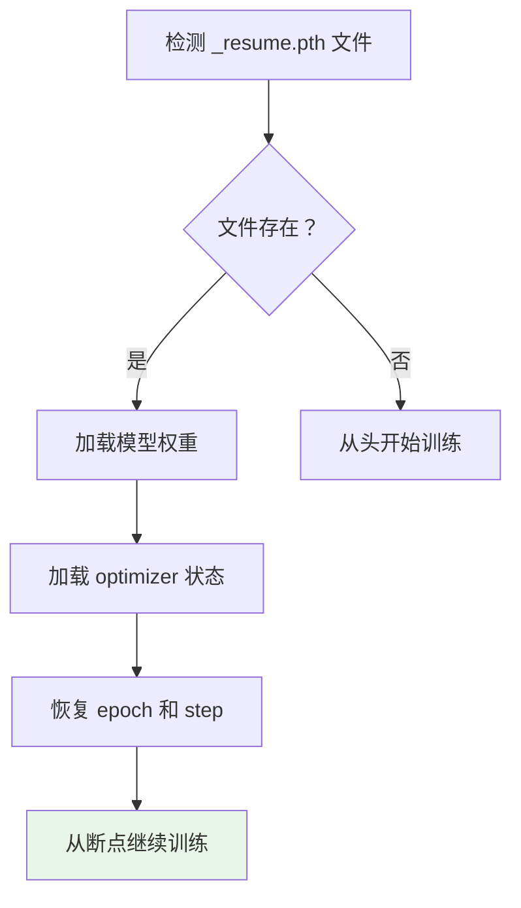

---

## 5.9 Talker 初始化策略

**位置**：`trainer_utils.py:init_omni_model()` 第 81-89 行

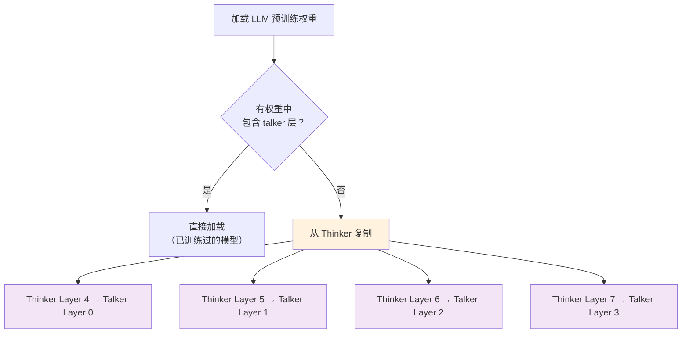

**为什么要复制后几层？**
- Thinker 的后几层已经学会了"理解语言"
- Talker 需要类似的能力来"理解要说什么"
- 比随机初始化收敛更快、效果更好

---

## 5.10 DDP（分布式数据并行）

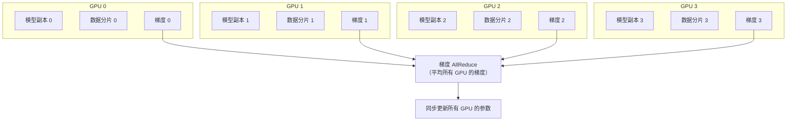

> 每个 GPU 处理不同的数据分片，但共享同一份模型参数。梯度在所有 GPU 之间同步平均。

---

## 学习检查清单

- [ ] 三阶段训练流水线分别训练什么能力？
- [ ] `mode='audio_proj'` 时哪些参数被冻结？
- [ ] 为什么 audio_loss 要除以 8？
- [ ] stop token 为什么权重 ×10？
- [ ] 余弦退火学习率的变化趋势是什么？
- [ ] 混合精度训练为什么能加速？
- [ ] Talker 为什么从 Thinker 的后几层初始化？
- [ ] 检查点保存时为什么要排除冻结的编码器？

> 完成后进入阶段六，理解推理与评估！
