# 阶段六：理解推理与评估

> 目标文件：`eval_omni.py`（约 244 行）
> 理解模型如何从磁盘加载到生成输出的完整流程。

---

## 6.1 评估脚本总体结构

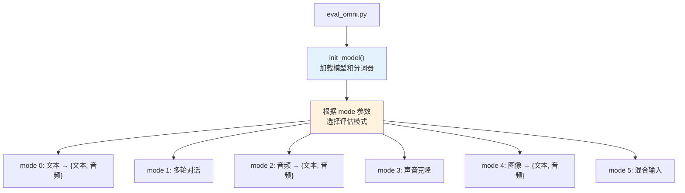

---

## 6.2 模型加载流程

**位置**：`eval_omni.py:init_model()` 第 17-40 行

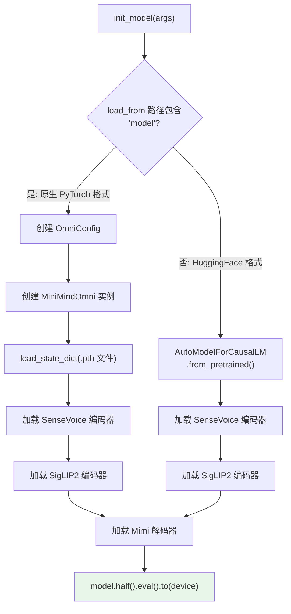

> 支持 PyTorch 原生格式和 HuggingFace Transformers 格式两种加载方式。

---

## 6.3 六种评估模式详解

### Mode 0：文本对话

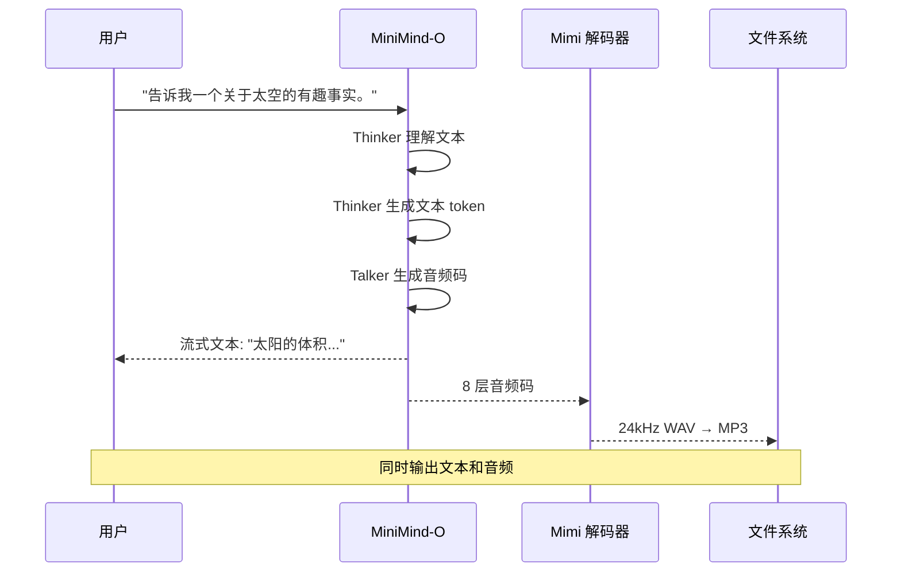

**代码**：`eval_omni.py` 第 116-129 行

```python
# 文本输入不需要特殊处理
eval_sample(model, tokenizer, args, idx, prompt, None, f"text-{idx:02d}.mp3")
#                                                    ↑ 无音频输入    ↑ 输出文件名
```

### Mode 1：多轮对话

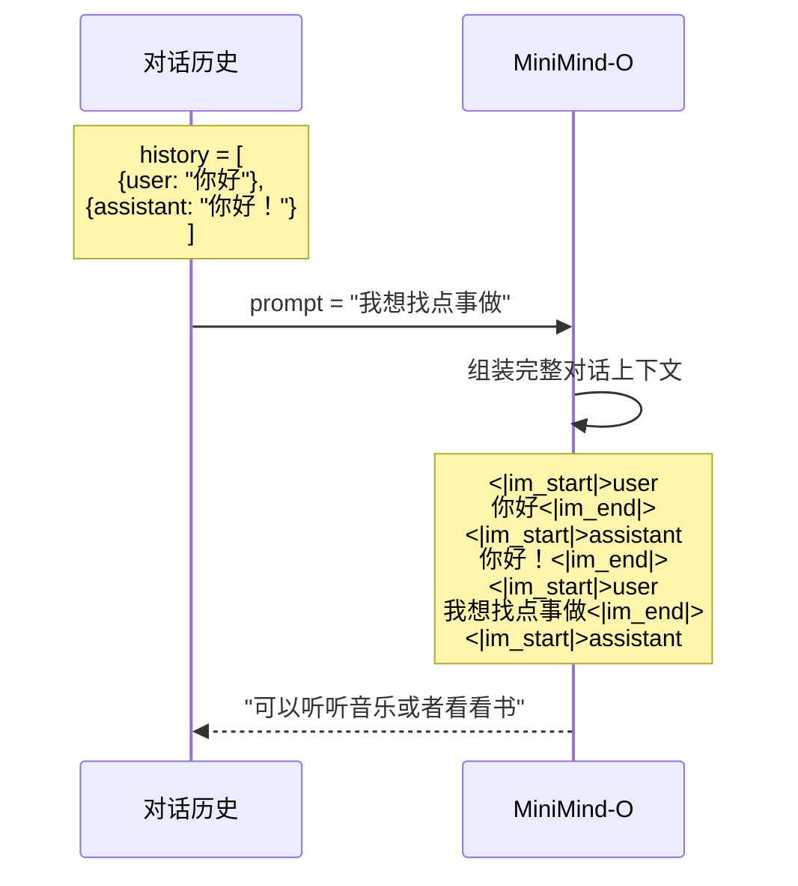

### Mode 2：音频输入（语音对话）

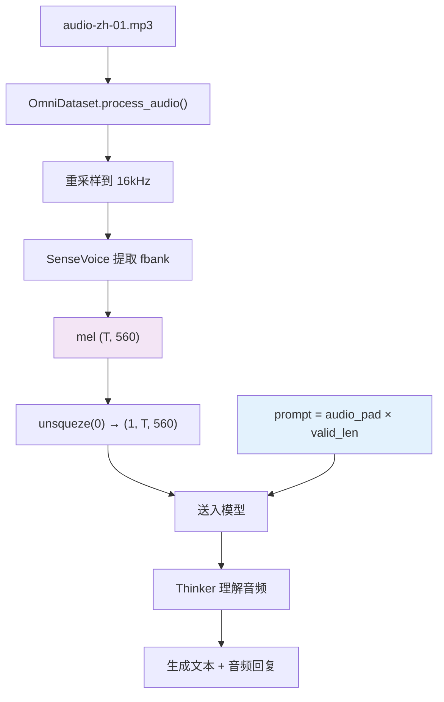

### Mode 3：声音克隆

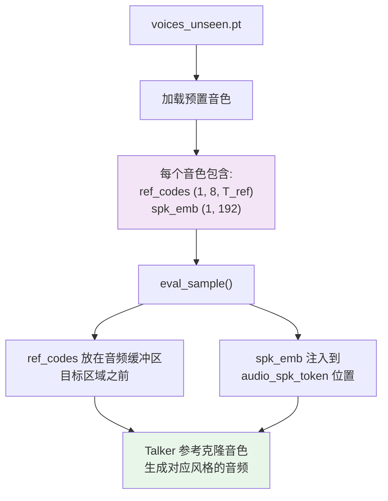

### Mode 4：图像理解

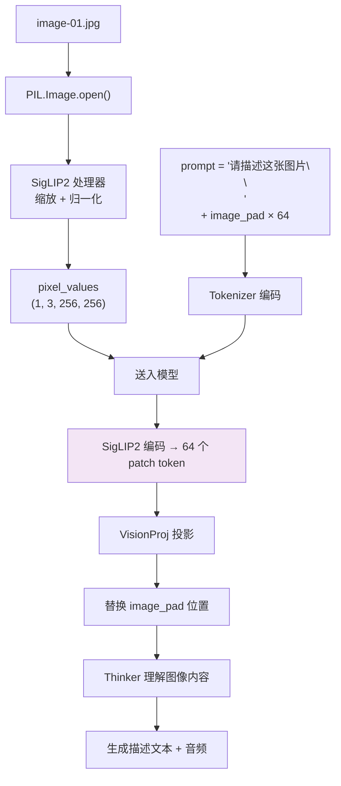

### Mode 5：混合输入（音频 + 图像）

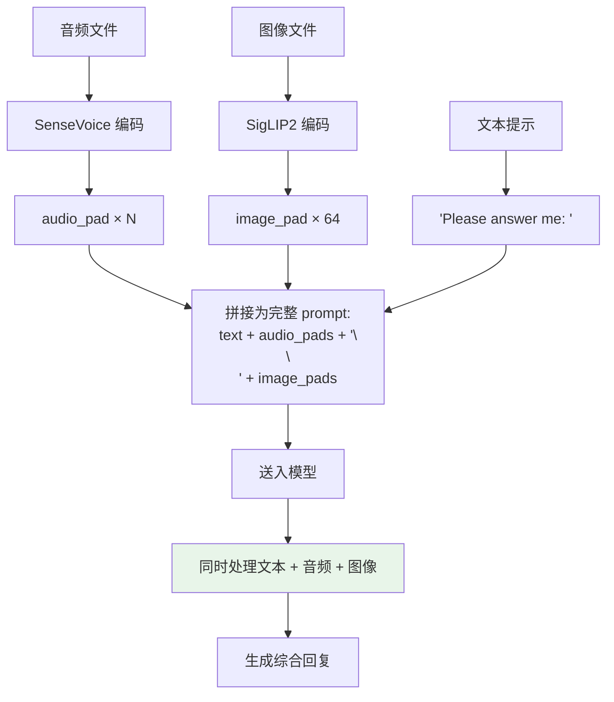

---

## 6.4 推理核心：eval_sample()

**位置**：`eval_omni.py:eval_sample()` 第 43-87 行

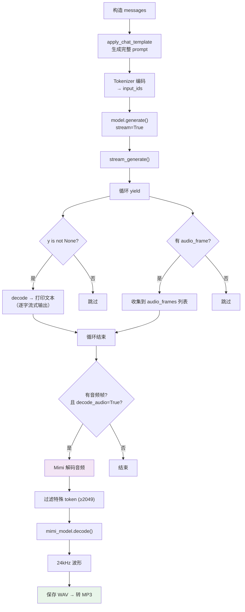

---

## 6.5 音频解码流程

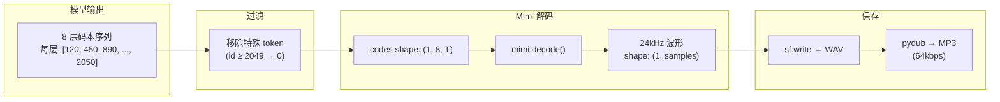

---

## 6.6 流式输出的用户体验

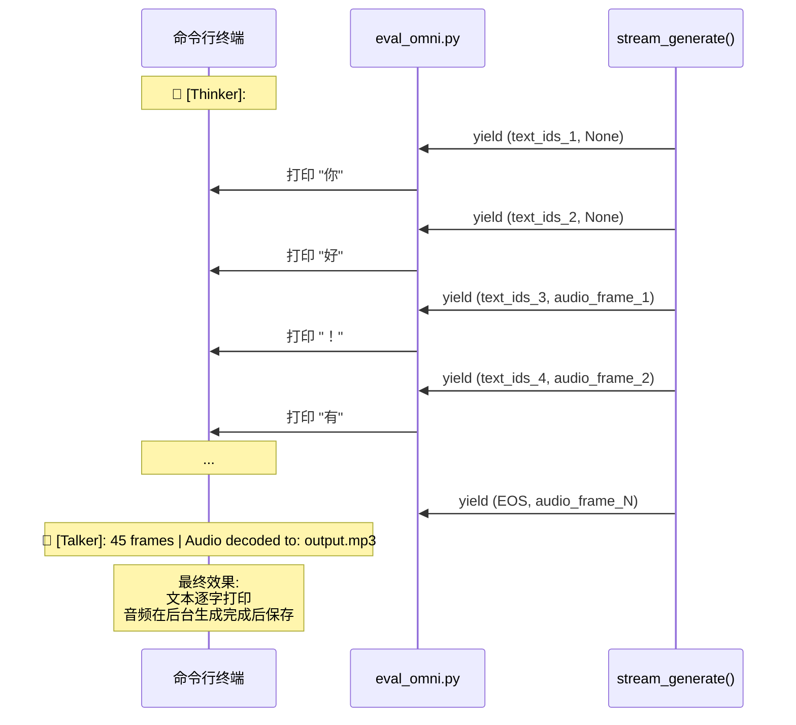

---

## 6.7 命令行参数速查

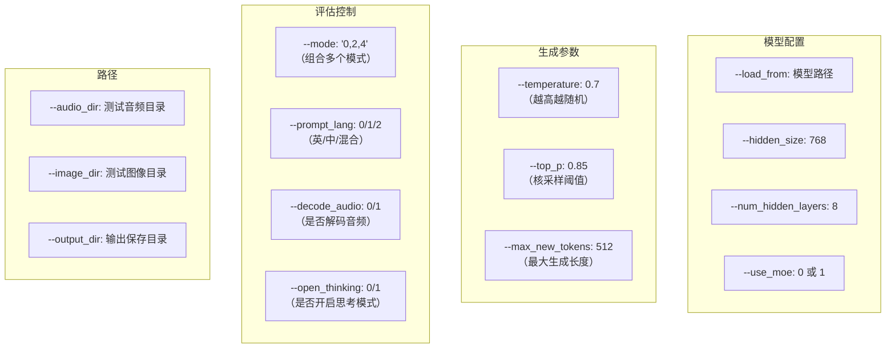

---

## 学习检查清单

- [ ] 你能说出 6 种评估模式分别做什么吗？
- [ ] 模型支持哪两种加载格式？
- [ ] 音频输入时，prompt 中为什么要用 `audio_pad × N`？
- [ ] 声音克隆时 `ref_codes` 和 `spk_emb` 分别起什么作用？
- [ ] Mimi 解码前为什么要过滤掉 `id ≥ 2049` 的 token？
- [ ] 流式生成中，文本和音频是如何同步输出的？

> 完成后进入阶段七，看看 Web 演示界面！
