# 阶段七：Web 演示界面

> 目标文件：`scripts/web_demo_omni.py`（Gradio）和 `webui/`（Flask + WebSocket）
> 理解前后端如何配合实现实时交互。

---

## 7.1 两个 Web 演示版本

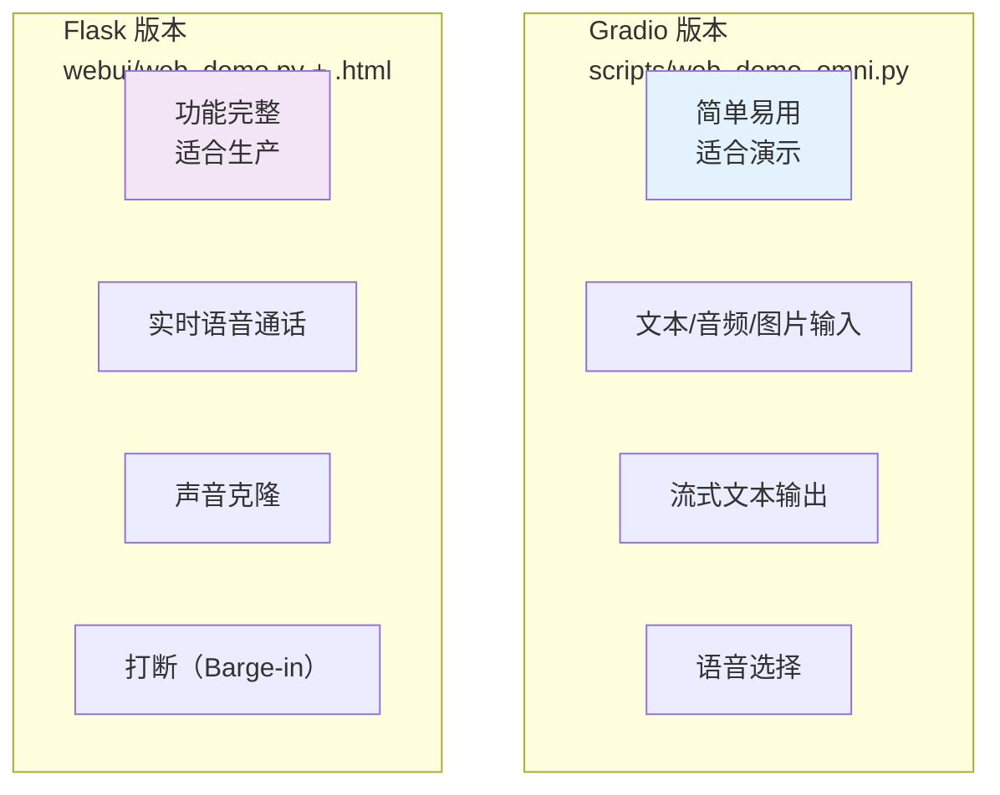

---

## 7.2 Gradio 版本架构

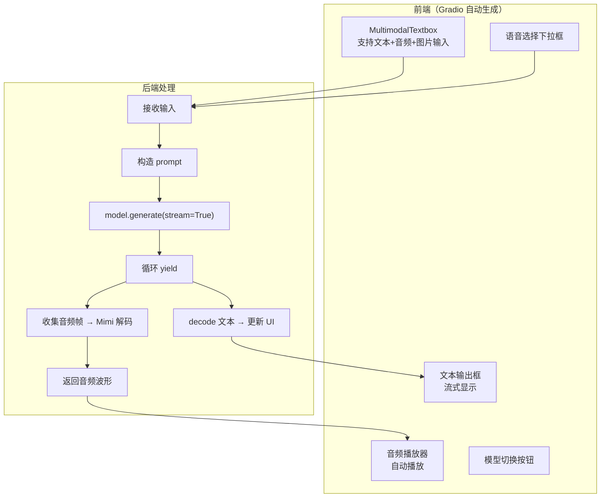

### Gradio 流式输出

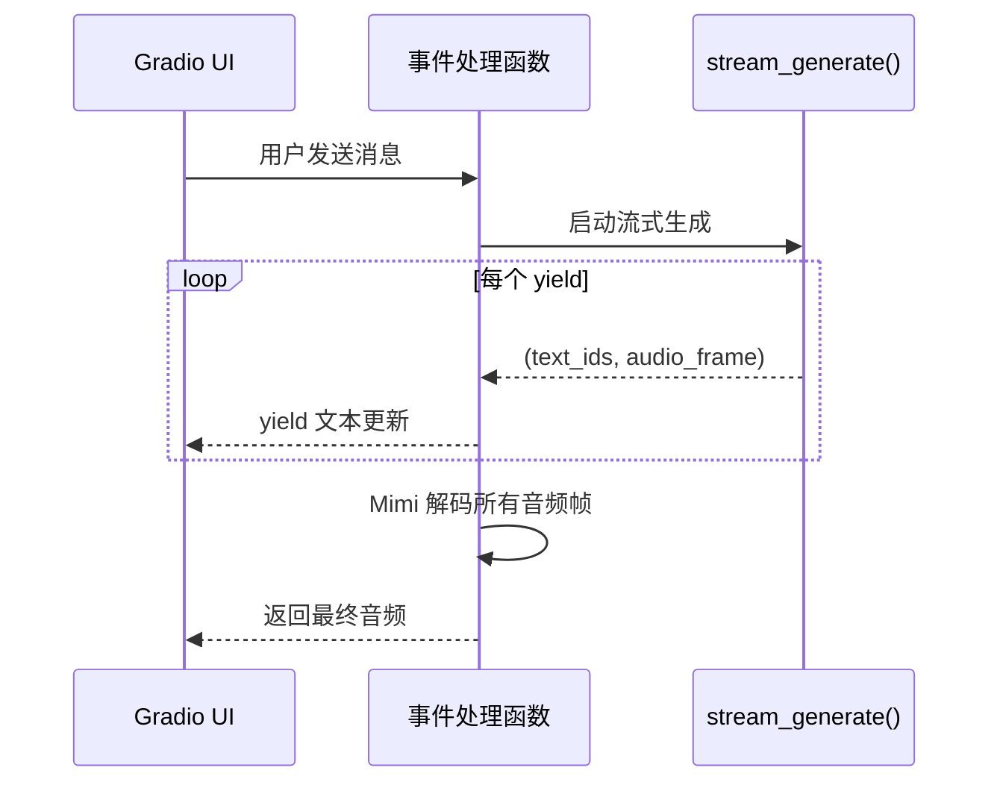

---

## 7.3 Flask 版本 — Chat 模式

**位置**：`webui/web_demo.py`

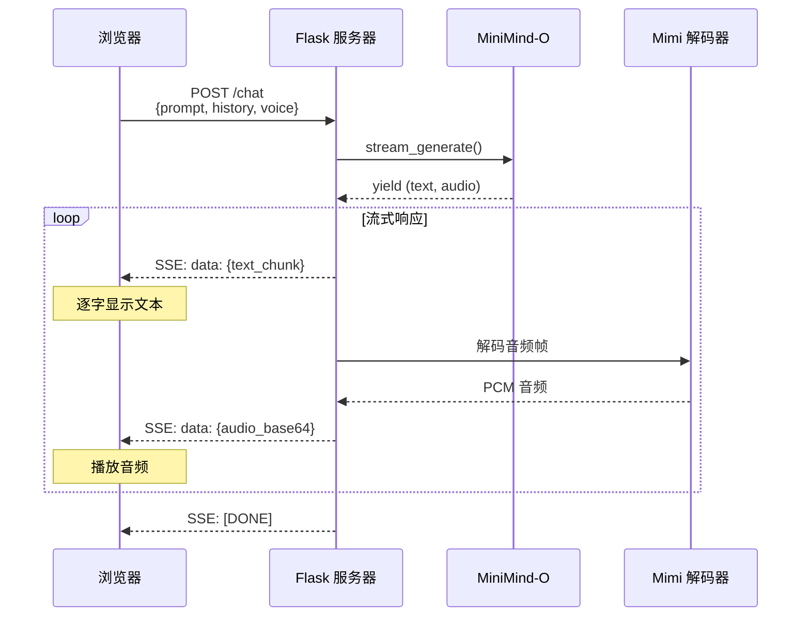

### SSE（Server-Sent Events）数据格式

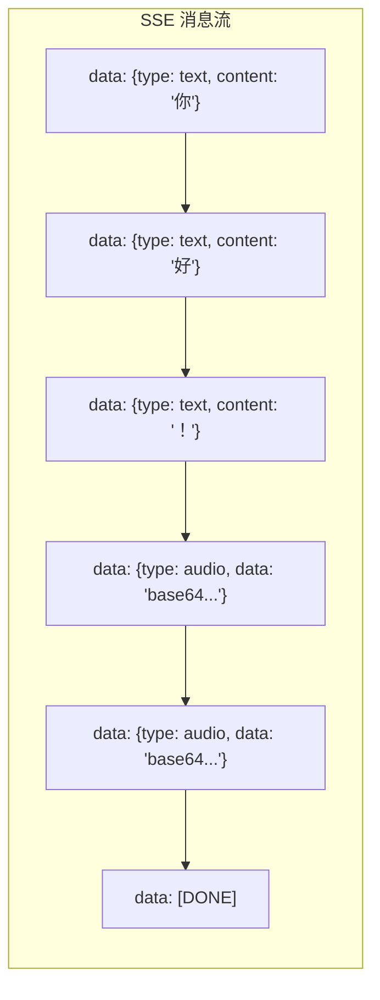

---

## 7.4 Flask 版本 — Call 模式（实时通话）

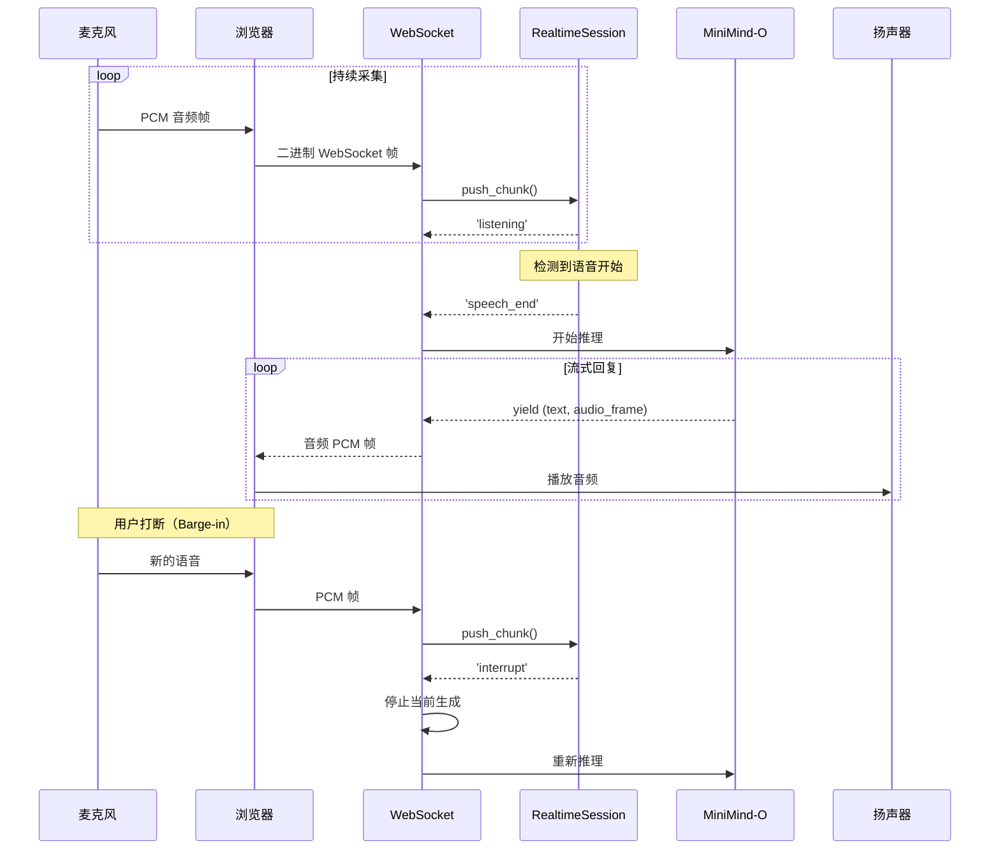

### Call 模式状态机

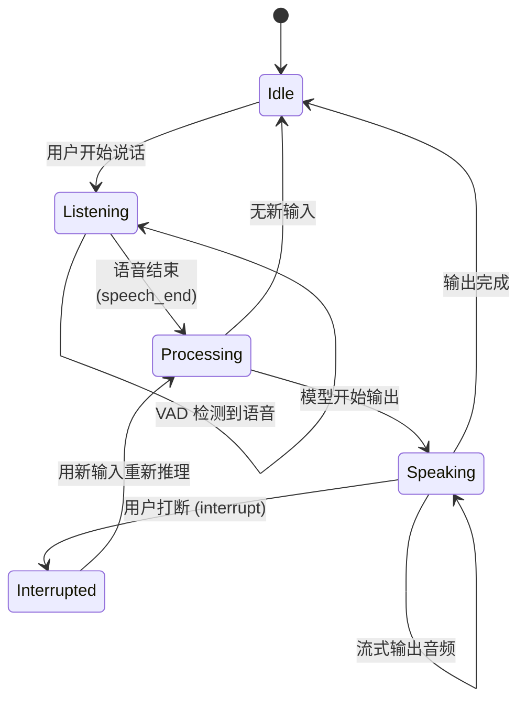

---

## 7.5 声音克隆功能

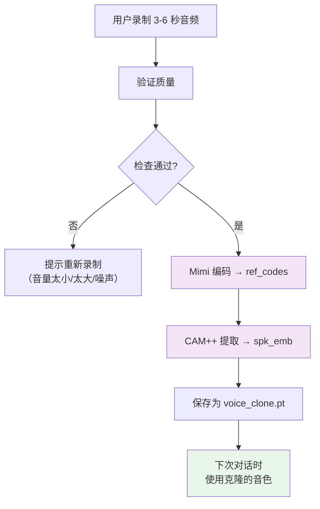

### 质量验证

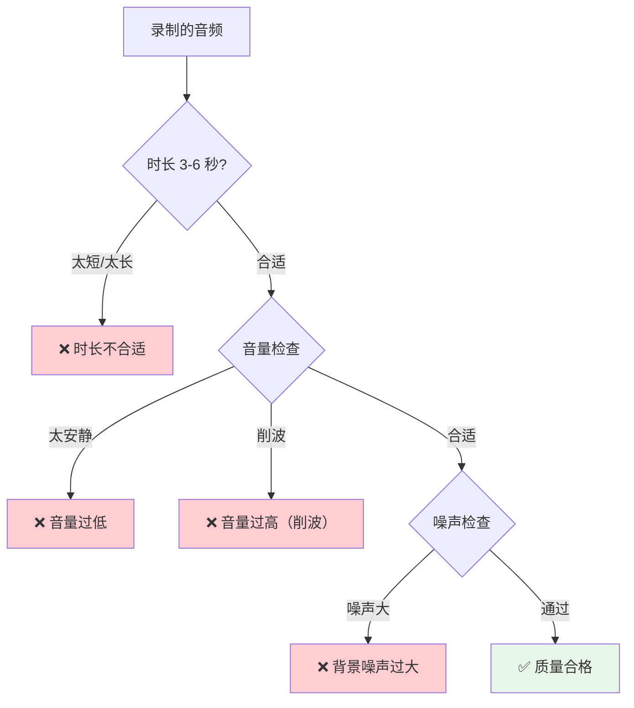

---

## 7.6 前端界面（web_demo.html）

### Chat 模式 UI

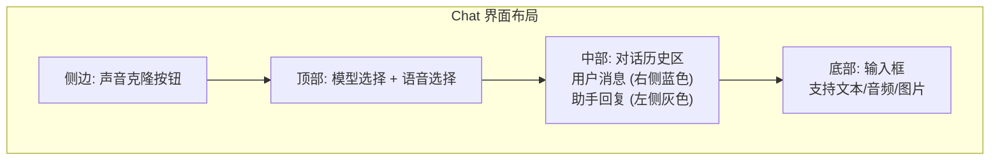

### Call 模式 UI

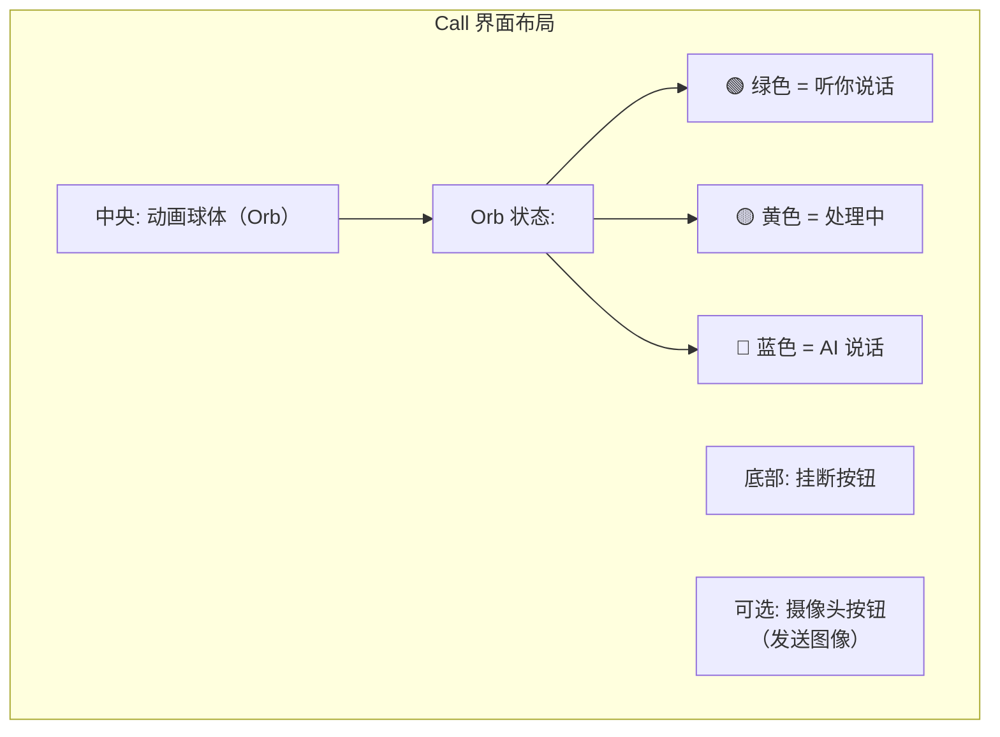

### 动画球体的音频响应

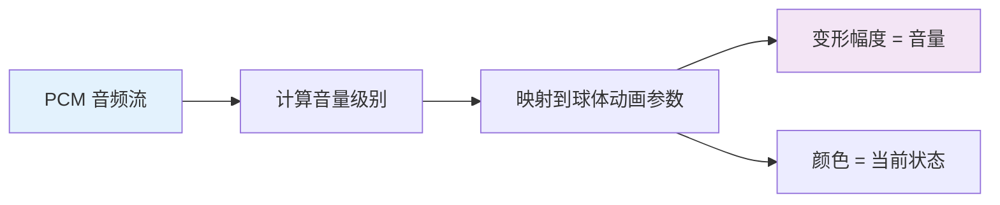

---

## 7.7 音频播放机制

### Chat 模式（Base64 传输）

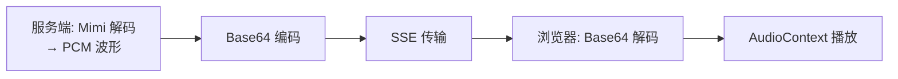

### Call 模式（WebSocket 二进制流）

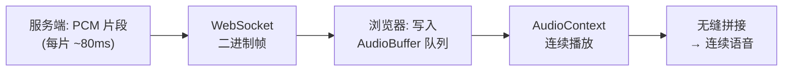

> Call 模式用 WebSocket 二进制帧直接传输 PCM 数据，延迟更低。通过维护一个播放队列，实现音频的无缝拼接。

---

## 7.8 线程安全与并发

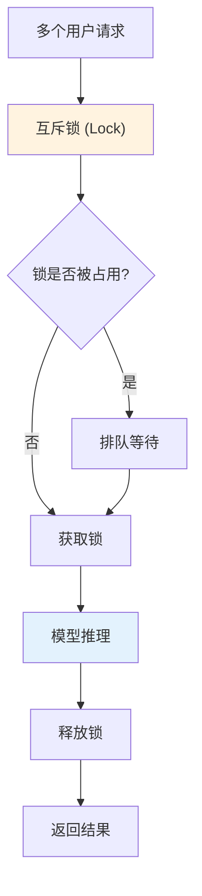

> 由于模型推理不能并行（单 GPU），使用互斥锁确保同一时间只有一个请求在进行推理。

---

## 学习检查清单

- [ ] 两个 Web 版本的区别是什么？
- [ ] SSE 是如何实现流式传输的？
- [ ] Call 模式中 VAD 如何检测语音结束？
- [ ] Barge-in（打断）是如何实现的？
- [ ] 声音克隆的流程是什么？
- [ ] PCM 音频流如何在浏览器中无缝播放？
- [ ] 为什么需要互斥锁？

> 完成后进入阶段八，开始动手实践！
