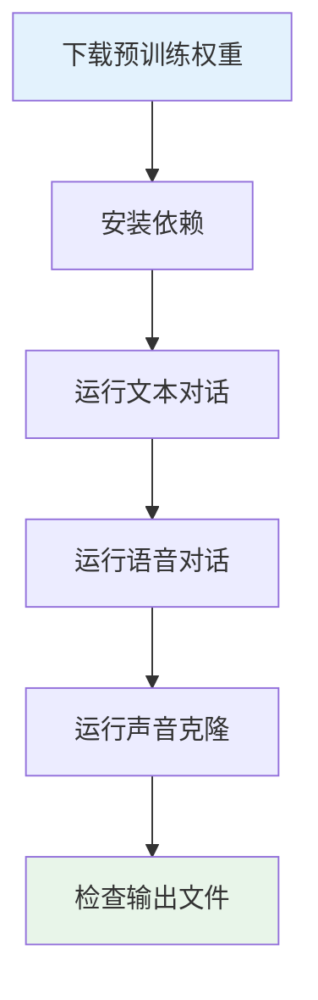
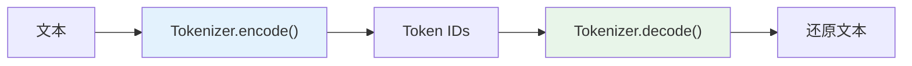
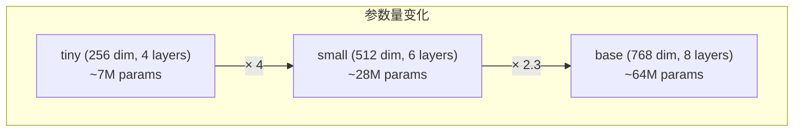
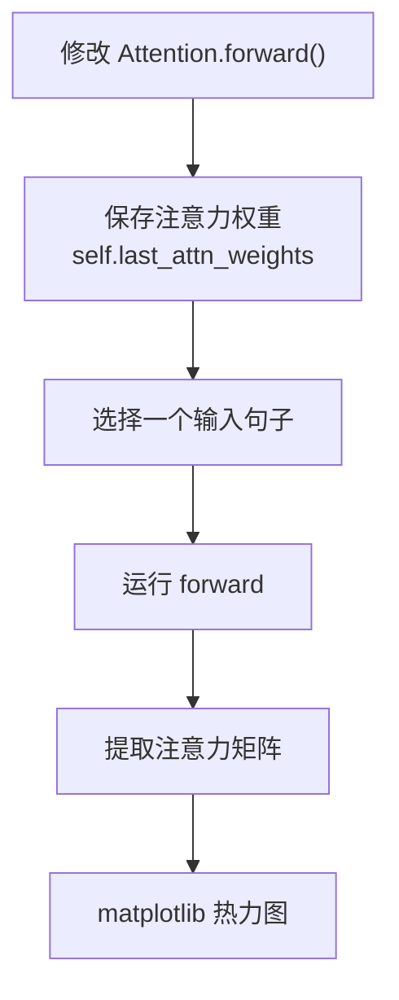
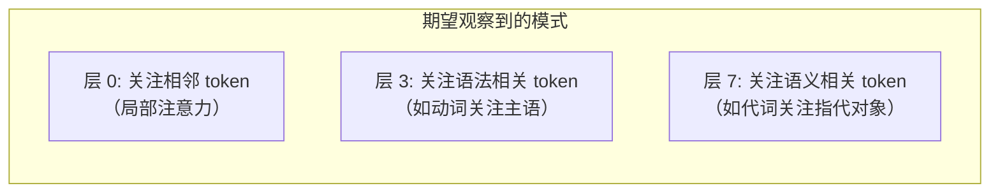
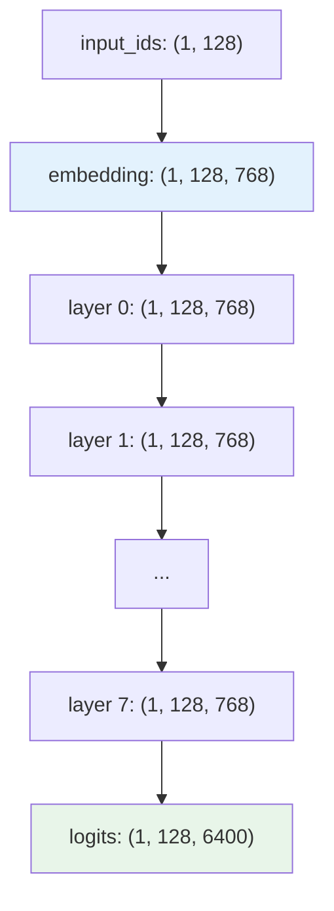
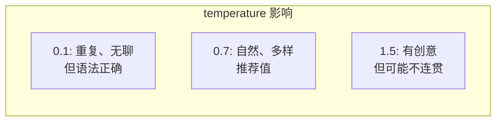
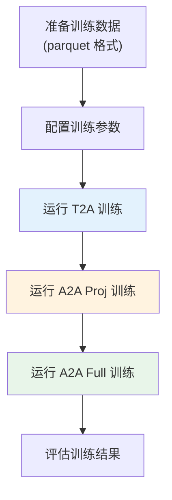
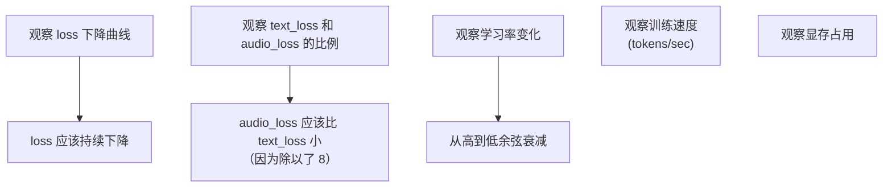
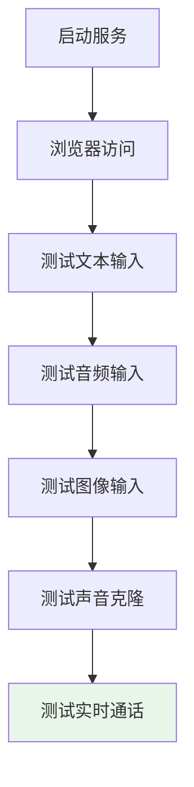

# 阶段八：动手实践项目

> 理论学完后，通过动手实践巩固理解。按难度递增排列。

---

## 实践 1：运行推理（难度 ★☆☆）

### 目标
理解从加载模型到生成输出的完整流程。

### 步骤



### 具体操作

```bash
# 1. 文本对话
python eval_omni.py --mode 0 --prompt_lang 1
# 观察输出：逐字打印的文本 + 保存的 MP3 文件

# 2. 语音对话
python eval_omni.py --mode 2 --prompt_lang 1
# 观察输入音频如何被处理

# 3. 声音克隆
python eval_omni.py --mode 3 --prompt_lang 1
# 对比不同说话人的音色差异

# 4. 图像理解
python eval_omni.py --mode 4
# 观察图像如何被描述

# 5. 全部模式
python eval_omni.py --mode -1 --decode_audio 1
```

### 检查点
- [ ] 成功生成了文本回复
- [ ] 成功生成了音频文件并可以播放
- [ ] 理解了 `output_audio/` 目录下文件的命名规则

---

## 实践 2：探索 Tokenizer（难度 ★☆☆）

### 目标
理解分词器的工作原理。

### 代码模板

```python
from transformers import AutoTokenizer

tokenizer = AutoTokenizer.from_pretrained("./model")

# 1. 编码
text = "你好，世界！"
ids = tokenizer.encode(text)
print(f"文本: {text}")
print(f"Token IDs: {ids}")
print(f"Tokens: {tokenizer.convert_ids_to_tokens(ids)}")

# 2. 解码
decoded = tokenizer.decode(ids)
print(f"解码后: {decoded}")

# 3. 特殊 token
print(f"BOS: {tokenizer.bos_token} (id={tokenizer.bos_token_id})")
print(f"EOS: {tokenizer.eos_token} (id={tokenizer.eos_token_id})")
print(f"PAD: {tokenizer.pad_token} (id={tokenizer.pad_token_id})")

# 4. Chat 格式
messages = [
    {"role": "user", "content": "你好"},
    {"role": "assistant", "content": "你好！"},
]
prompt = tokenizer.apply_chat_template(messages, tokenize=False)
print(f"Chat 格式:\n{prompt}")
```



### 检查点
- [ ] 观察 BPE 如何切分中文和英文
- [ ] 理解特殊 token 的 ID
- [ ] 能手动构造一个 Chat 格式的 prompt

---

## 实践 3：修改模型配置并观察变化（难度 ★☆☆）

### 目标
理解模型配置参数如何影响模型行为。

### 实验

```python
from model.model_minimind import MiniMindConfig, MiniMindForCausalLM

# 实验 1: 不同 hidden_size
configs = [
    ("tiny",   MiniMindConfig(hidden_size=256, num_hidden_layers=4)),
    ("small",  MiniMindConfig(hidden_size=512, num_hidden_layers=6)),
    ("base",   MiniMindConfig(hidden_size=768, num_hidden_layers=8)),
]

for name, config in configs:
    model = MiniMindForCausalLM(config)
    params = sum(p.numel() for p in model.parameters()) / 1e6
    print(f"{name}: {params:.2f}M params")
```



### 检查点
- [ ] 理解 `hidden_size` 如何影响参数量
- [ ] 理解 `num_hidden_layers` 如何影响参数量
- [ ] 尝试修改 `num_attention_heads`，理解 GQA 的约束

---

## 实践 4：可视化注意力权重（难度 ★★☆）

### 目标
直观理解注意力机制"在看什么"。

### 步骤



### 代码模板

```python
import torch
import matplotlib.pyplot as plt
import seaborn as sns

# 1. 在 Attention.forward() 中添加:
# self.last_attn_weights = attn_weights  # (B, heads, T, T)

# 2. 运行推理后可视化
model = ...  # 加载模型
# ... forward ...

# 3. 取第一个样本、第一个头
attn = model.model.layers[0].self_attn.last_attn_weights[0, 0].cpu().numpy()

# 4. 绘制热力图
plt.figure(figsize=(10, 8))
tokens = [...]  # token 文本
sns.heatmap(attn, xticklabels=tokens, yticklabels=tokens, cmap='YlOrRd')
plt.title("Layer 0, Head 0 - Attention Weights")
plt.xlabel("Key Position")
plt.ylabel("Query Position")
plt.savefig("attention_viz.png")
```



### 检查点
- [ ] 成功绘制出注意力热力图
- [ ] 观察到因果掩码（上三角为 0）
- [ ] 比较不同层的注意力模式差异

---

## 实践 5：跟踪张量形状（难度 ★★☆）

### 目标
理解 forward 过程中每个张量的形状变化。

### 代码模板

```python
# 在关键位置添加 print
def forward(self, input_ids, ...):
    print(f"input_ids: {input_ids.shape}")          # (B, T)
    hidden_states = self.thinker.embed_tokens(text_ids)
    print(f"after embedding: {hidden_states.shape}") # (B, T, 768)

    for i, layer in enumerate(self.thinker.layers):
        hidden_states, _ = layer(hidden_states, ...)
        print(f"after layer {i}: {hidden_states.shape}")  # (B, T, 768)

    text_logits = self.lm_head(hidden_states)
    print(f"text_logits: {text_logits.shape}")       # (B, T, 6400)
```



### 检查点
- [ ] 能解释每个维度的含义
- [ ] 理解为什么 `hidden_states` 的形状始终不变
- [ ] 理解 `logits` 最后一维为什么是 6400

---

## 实践 6：修改采样参数（难度 ★★☆）

### 目标
理解温度、top-p、top-k 对生成质量的影响。

### 实验

```python
# 在 eval_omni.py 中修改参数
# 实验 1: 不同温度
python eval_omni.py --mode 0 --temperature 0.1   # 非常确定
python eval_omni.py --mode 0 --temperature 0.7   # 适中
python eval_omni.py --mode 0 --temperature 1.5   # 非常随机

# 实验 2: 不同 top_p
python eval_omni.py --mode 0 --top_p 0.5         # 保守
python eval_omni.py --mode 0 --top_p 0.95        # 开放
```



### 检查点
- [ ] 对比不同温度的输出差异
- [ ] 理解 temperature 如何影响 softmax 分布

---

## 实践 7：用小数据集训练模型（难度 ★★★）

### 目标
理解完整的训练流程。

### 步骤



```bash
# 使用 Mini 流水线（单卡 3090）
# 修改 trainer/train.sh 中的路径后运行
bash trainer/train.sh
```

### 观察要点



### 检查点
- [ ] 成功跑完一轮训练
- [ ] loss 有明显下降
- [ ] 能用训练后的模型进行推理

---

## 实践 8：搭建自己的 Web Demo（难度 ★★★）

### 目标
理解前后端如何配合。

### 步骤

```bash
# 1. 启动 Gradio 版本
python scripts/web_demo_omni.py

# 2. 在浏览器中打开显示的地址
# 3. 尝试不同输入方式

# 4. 启动 Flask 版本
python webui/web_demo.py
# 5. 打开浏览器，体验 Chat 和 Call 模式
```



### 检查点
- [ ] Web 界面能正常显示
- [ ] 文本输入能收到流式回复
- [ ] 音频能正常播放
- [ ] Call 模式能实现实时对话

---

## 学习检查清单

- [ ] 实践 1-3：基础操作（必须完成）
- [ ] 实践 4-5：深入理解（强烈推荐）
- [ ] 实践 6-7：实验能力（推荐完成）
- [ ] 实践 8：工程实践（选做）

> 完成后进入阶段九，扩展阅读与深入理解！
