# 阶段九：扩展阅读与深入理解

> 学完本项目后，深入理解背后的原理和前沿进展。

---

## 9.1 核心论文阅读清单

按阅读优先级排序：

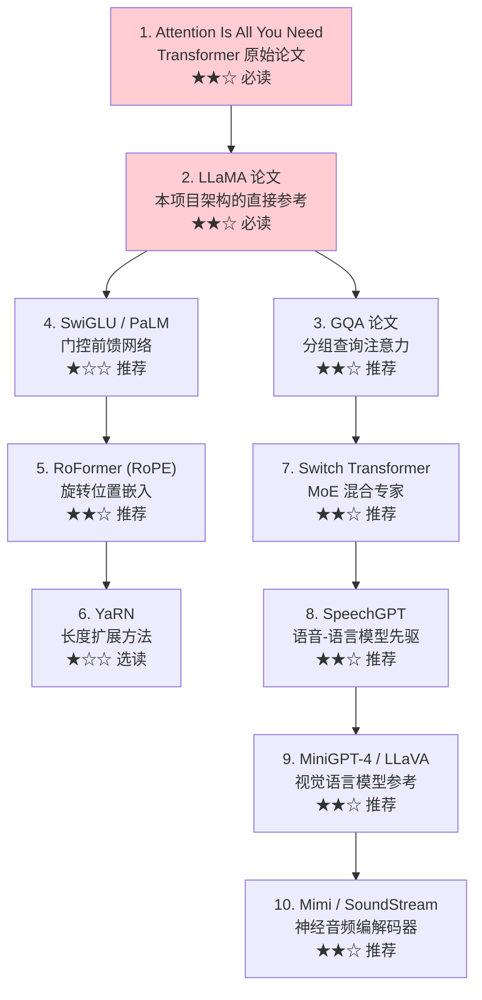

---

## 9.2 关键技术深入

### Transformer 架构演进

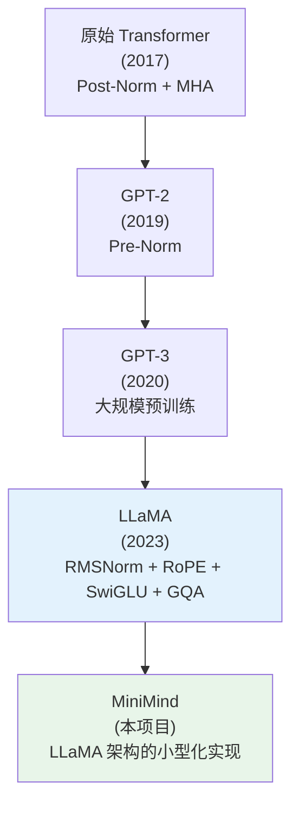

### 注意力机制演进

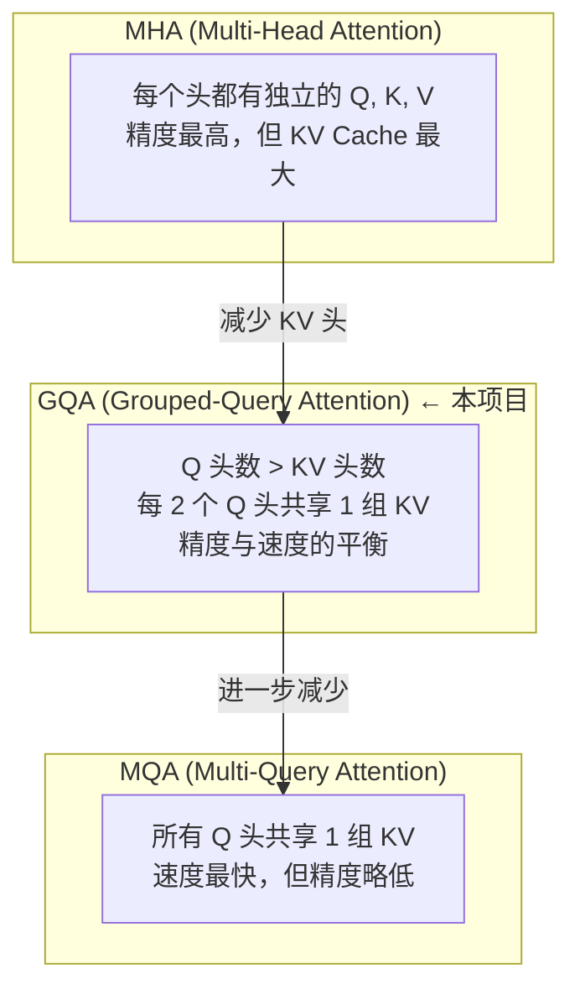

### 位置编码对比

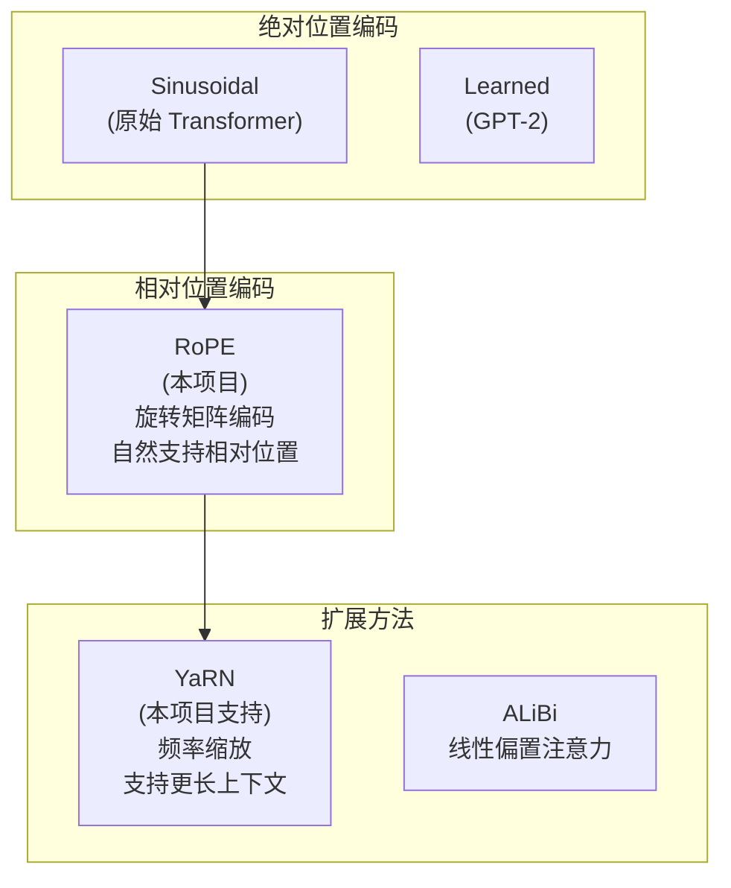

---

## 9.3 全模态模型的前沿进展

### 从单模态到全模态

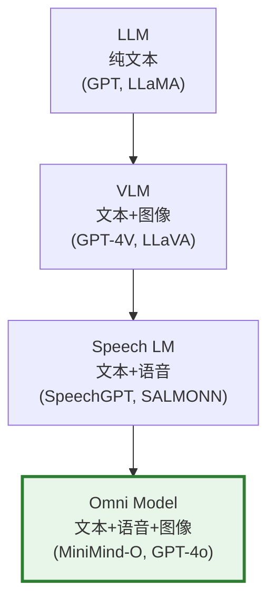

### Thinker-Talker 架构的灵感来源

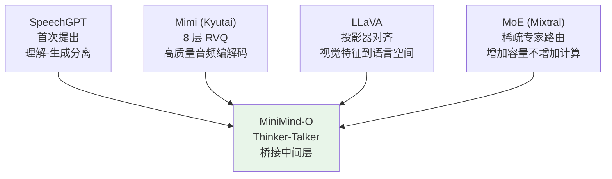

### 多 Token 预测（MTP）

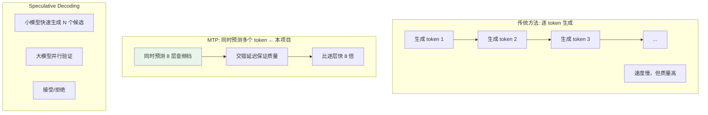

---

## 9.4 训练技术深入

### 分阶段训练策略

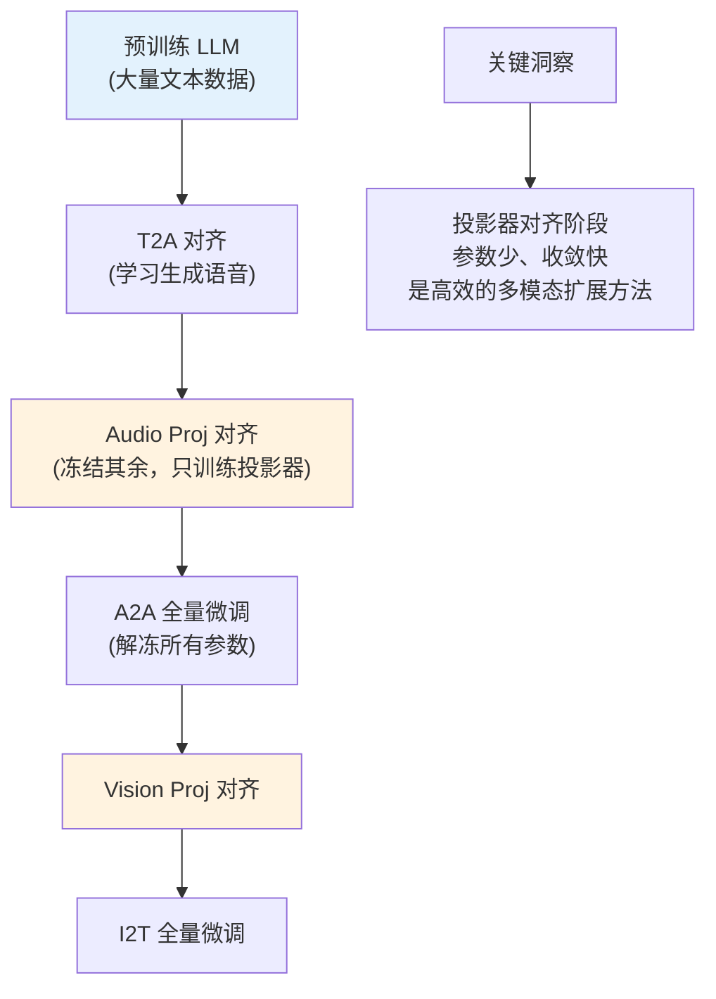

### 为什么投影器对齐阶段只训练投影器？

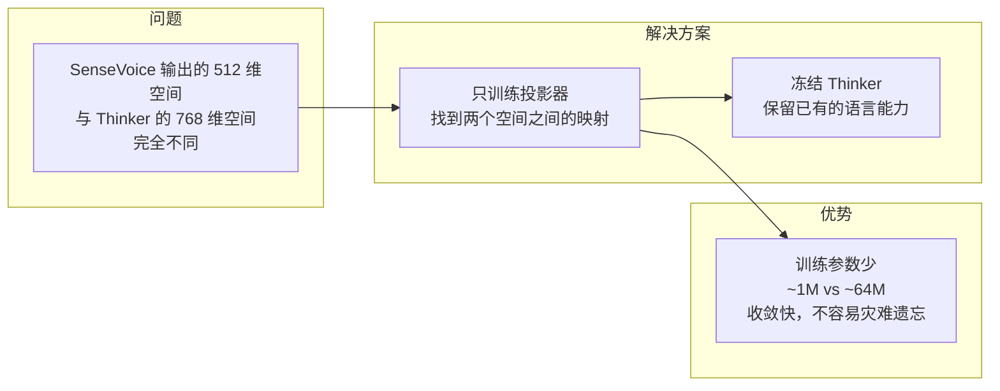

### 数据增强的原理

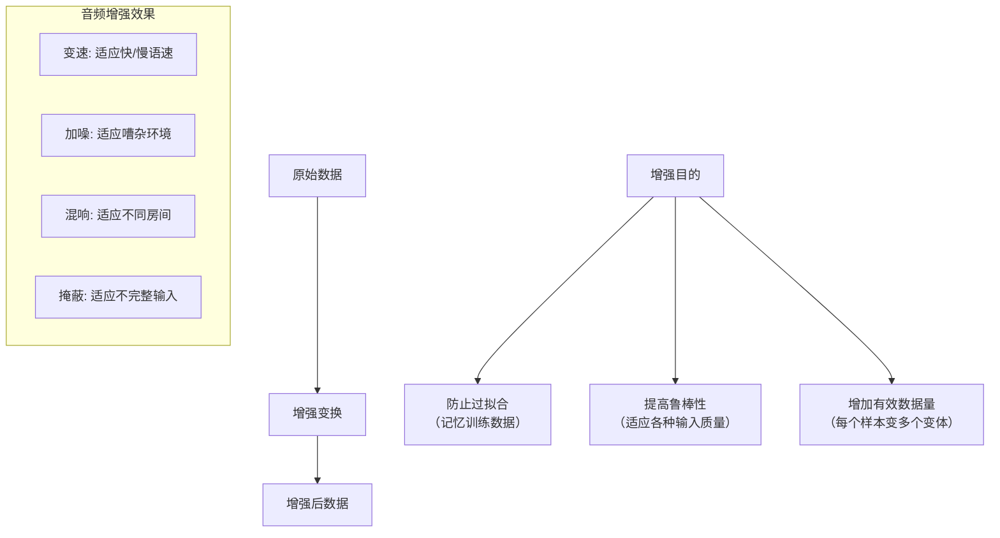

---

## 9.5 推荐进阶项目

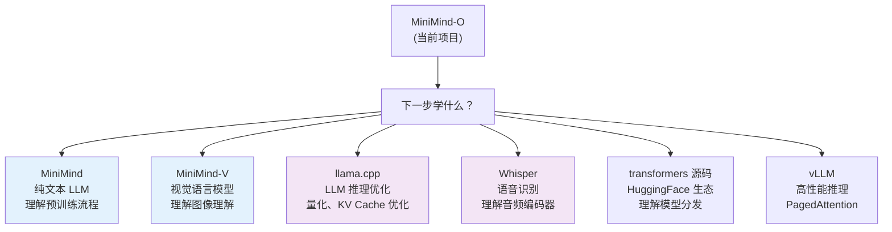

### 进阶学习路径

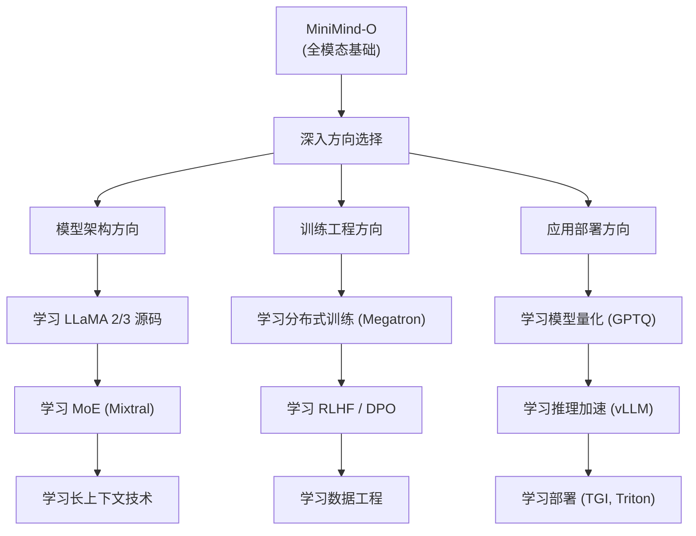

---

## 9.6 本项目技术总结图

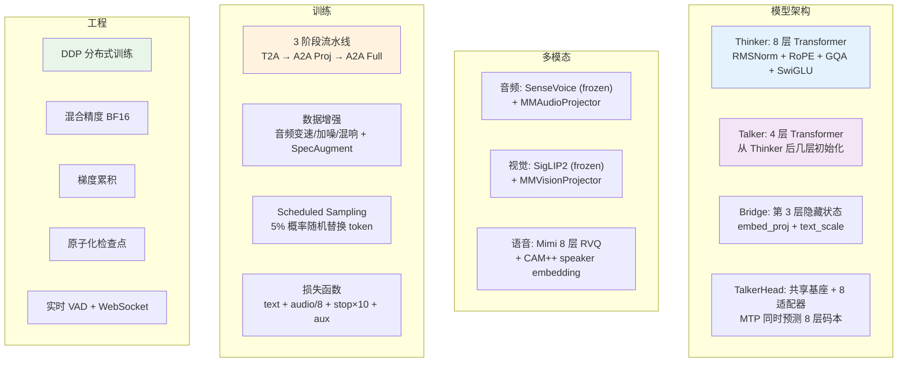

---

## 学习检查清单

- [ ] 你能说出 Transformer 架构从 2017 到现在的关键改进吗？
- [ ] 你理解 MHA → GQA → MQA 的演进动机吗？
- [ ] 你知道为什么投影器对齐只需要训练投影器吗？
- [ ] 你能画出 Thinker-Talker 架构的灵感来源吗？
- [ ] 你有下一步的学习计划了吗？

> 恭喜你完成了整个学习路线！🎉
> 记住：学习 AI 最好的方式是动手实践。不要害怕修改代码、做实验。
> 遇到问题时，回到对应的阶段文档重新阅读，你会有新的理解。
