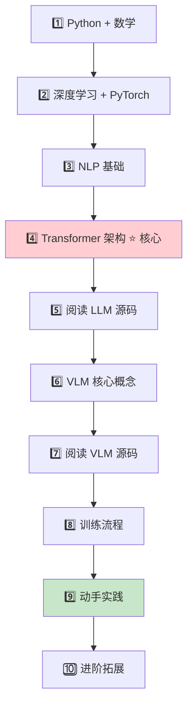
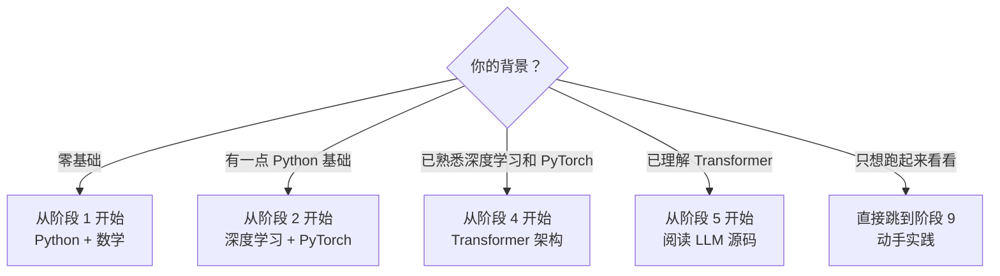

# MiniMind-V 学习路线：从零开始理解视觉语言模型

> 专为零基础新手设计。MiniMind-V 是一个极简的视觉语言模型（VLM），核心代码不到 500 行 Python。
> 跟随本路线循序渐进，你将完整理解一个多模态 AI 如何从图片和文字中学习并生成回答。

---

## 学习全景图



---

## 各阶段索引

| 阶段 | 主题 | 文件 | 预计时间 | 核心内容 |
|------|------|------|----------|---------|
| 1 | Python 与数学基础 | [01](01-python-math-fundamentals.md) | 1-2 周 | 变量/类/函数、矩阵乘法、Softmax、梯度 |
| 2 | 深度学习与 PyTorch | [02](02-deep-learning-pytorch.md) | 2-3 周 | Tensor、nn.Module、前向/反向传播、DataLoader |
| 3 | NLP 基础 | [03](03-nlp-basics.md) | 1 周 | Tokenization、Embedding、Chat Template、Labels |
| 4 | **Transformer 架构** ⭐ | [04](04-transformer-architecture.md) | 2-3 周 | RMSNorm、RoPE、Attention、GQA、FFN、MoE、生成采样 |
| 5 | 阅读 LLM 源码 | [05](05-reading-minimind-llm.md) | 1 周 | MiniMindConfig→RMSNorm→Attention→FFN→Block→Model→CausalLM |
| 6 | VLM 核心概念 | [06](06-vlm-core-concepts.md) | 1-2 周 | SigLIP2、投影层、Token 替换、冻结策略 |
| 7 | 阅读 VLM 源码 | [07](07-reading-minimind-v.md) | 1 周 | model_vlm.py、lm_dataset.py、trainer_utils.py |
| 8 | 训练流程详解 | [08](08-training-pipeline.md) | 1 周 | Pretrain/SFT 两阶段、超参数、断点续训 |
| 9 | **动手实践** 🔧 | [09](09-hands-on-practice.md) | 2-3 周 | 环境搭建、6 个渐进实验 |
| 10 | 进阶拓展 | [10](10-advanced-topics.md) | 持续 | 论文推荐、改进方向、相关项目 |

---

## 快速导航：我是谁？应该从哪里开始？



---

## 项目架构速览

```
minimind-v/
├── model/
│   ├── model_minimind.py      ← LLM 基础架构 (288行)
│   ├── model_vlm.py           ← VLM 扩展 (172行)
│   ├── tokenizer.json         ← 分词器词表 (6400 tokens)
│   └── tokenizer_config.json  ← 分词器配置
├── dataset/
│   ├── lm_dataset.py          ← 数据集类 (127行)
│   └── eval_images/           ← 6张评估图片
├── trainer/
│   ├── train_pretrain_vlm.py  ← Pretrain 训练
│   ├── train_sft_vlm.py       ← SFT 训练
│   └── trainer_utils.py       ← 训练工具函数
├── scripts/
│   ├── web_demo_vlm.py        ← Gradio Web 界面
│   └── convert_vlm.py         ← 模型格式转换
├── eval_vlm.py                ← 命令行推理
└── requirements.txt           ← 依赖列表
```

---

## 学习建议

1. **不要跳阶段**：每个阶段都是下一阶段的前提，跳过了会看不懂后面的内容
2. **代码 + 理论并行**：每学一个概念，立即去源码中找到对应的代码
3. **动手验证**：每个阶段末尾都有自我检测题，确保掌握后再前进
4. **阶段 4 是最重要的里程碑**：Transformer 架构理解了，后面的 VLM 只是"加两个零件"
5. **阶段 9 建议有 GPU**：推理可用 CPU（慢），训练必须 GPU（至少 8GB 显存）

---

## 项目核心概念一句话总结

> **图片就是一门"外语"，视觉编码器就是"翻译词典"，把图片翻译成语言模型能理解的"语言"。**

```
图片(256×256) → SigLIP2(冻结) → 64个视觉token → MLP投影层 → 插入文本中 → LLM处理 → 输出回答
```

---

> 最后更新：2026-05-09
> 点击上方表格中的链接，开始你的学习之旅！
