# 第一阶段：Python 与数学基础

> 🎯 **目标**：掌握读懂 MiniMind-V 项目所需的 Python 编程能力和数学知识
> ⏰ **预计时间**：1-2 周
> 📌 **前提**：无（零基础）

---

## 本章知识地图

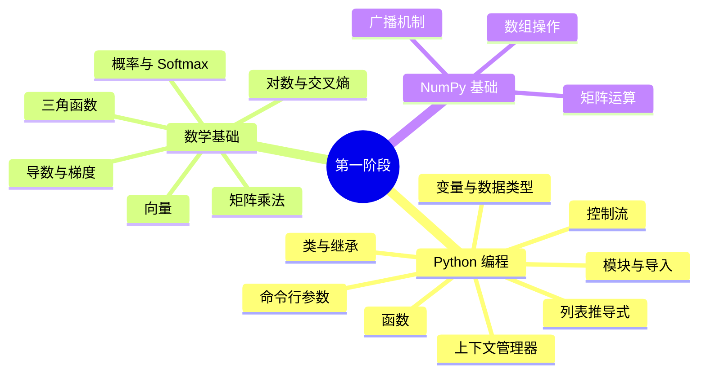

---

## 1.1 Python 编程基础

### 变量与数据类型

Python 中最基本的概念是变量。你可以把变量想象成一个"盒子"，里面装着数据。

```python
# 整数 (int) — 像计数器
hidden_size = 768          # 神经网络的隐藏层维度
num_layers = 8             # Transformer 的层数

# 浮点数 (float) — 带小数点的数
learning_rate = 5e-6       # 学习率，等价于 0.000005
dropout = 0.0              # Dropout 概率

# 字符串 (str) — 文本
model_name = "minimind-v"  # 模型名字
special_token = "<|image_pad|>"  # 图片占位符

# 布尔值 (bool) — 真/假
use_moe = True             # 是否使用 MoE（混合专家）
flash_attn = True          # 是否使用 Flash Attention

# 列表 (list) — 有序集合，像购物清单
layers = [1, 2, 3, 4, 5, 6, 7, 8]          # 8 层的编号
experts = ["专家A", "专家B", "专家C", "专家D"]  # MoE 的 4 个专家

# 字典 (dict) — 键值对，像通讯录
config = {
    "hidden_size": 768,
    "num_layers": 8,
    "vocab_size": 6400,
    "use_moe": False
}

# 元组 (tuple) — 不可变的列表，像坐标
tensor_shape = (1, 64, 768)  # [batch, tokens, dimension]
```

> **在 MiniMind-V 中**：`model_minimind.py` 第12-18行的 `MiniMindConfig.__init__` 中，
> 所有模型配置都用变量存储，`hidden_size`、`num_layers` 等贯穿整个项目。

### 函数

函数就像一个"配方"——给输入材料，按步骤处理，返回结果。

```python
# 基本函数
def add(a, b):
    return a + b

result = add(3, 5)  # result = 8

# 带默认参数的函数
def create_layer(input_dim, output_dim, bias=False):
    """创建一个线性层"""
    return f"Linear({input_dim} → {output_dim}, bias={bias})"

print(create_layer(768, 768))           # Linear(768 → 768, bias=False)
print(create_layer(768, 768, bias=True)) # Linear(768 → 768, bias=True)

# *args 和 **kwargs — 灵活的参数
def flexible_func(*args, **kwargs):
    print(f"位置参数: {args}")     # 收集多余的普通参数
    print(f"关键字参数: {kwargs}") # 收集多余的命名参数

flexible_func(1, 2, 3, name="minimind", size=768)
# 位置参数: (1, 2, 3)
# 关键字参数: {'name': 'minimind', 'size': 768}
```

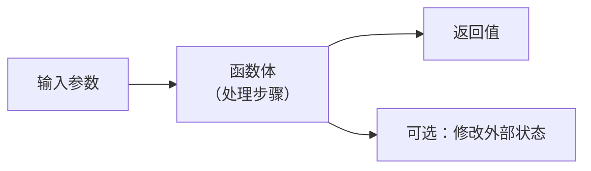

> **在 MiniMind-V 中**：`trainer/trainer_utils.py` 第42行的 `get_lr()` 函数接收当前步数和总步数，
> 返回当前应该使用的学习率。几乎每个模块都大量使用函数。

### 类与继承

类是面向对象编程的核心。你可以把类理解为"蓝图"，实例化就是"按照蓝图造东西"。

```python
# 基础类
class Animal:
    def __init__(self, name):
        """构造函数 — 创建实例时自动调用"""
        self.name = name     # self 代表实例本身

    def speak(self):
        return f"{self.name} makes a sound"

# 继承 — 子类获得父类的所有能力
class Dog(Animal):
    def speak(self):
        return f"{self.name} 汪汪汪！"   # 重写父类方法

class Cat(Animal):
    def speak(self):
        return f"{self.name} 喵喵喵！"

dog = Dog("旺财")
print(dog.speak())  # "旺财 汪汪汪！"
```

MiniMind-V 中的继承关系：

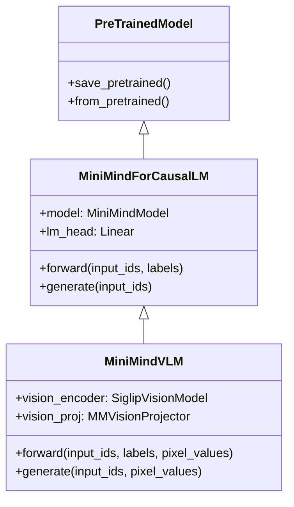

关键概念：
- `__init__`：构造函数，创建对象时自动运行
- `super()`：调用父类的方法
- `self`：指代实例本身
- `@staticmethod`：静态方法，不需要 `self` 参数

```python
# MiniMind-V 中的真实例子 (model_vlm.py 第36-43行)
class MiniMindVLM(MiniMindForCausalLM):     # 继承自 LLM
    def __init__(self, config):
        super().__init__(config)              # 先初始化父类 (LLM 部分)
        self.vision_encoder = ...             # 再添加视觉编码器
        self.vision_proj = ...                # 和投影层
```

### 控制流

```python
# if / elif / else — 条件判断
freeze_llm = 1
if freeze_llm == 0:
    print("全部参数可训练")
elif freeze_llm == 1:
    print("投影层 + LLM 首末层可训练")    # ← 这行会执行
else:
    print("仅投影层可训练")

# for 循环 — 遍历序列
for layer_idx in range(8):           # 遍历 0, 1, 2, ..., 7
    print(f"处理第 {layer_idx} 层")

# while 循环 — 条件循环
token_position = 0
while token_position < len(tokens):
    if tokens[token_position] == image_marker:
        print("找到图片占位符！")
        break                         # 跳出循环
    token_position += 1

# enumerate — 同时获取索引和值
for step, (input_ids, labels, images) in enumerate(loader):
    print(f"训练第 {step} 步")
```

> **在 MiniMind-V 中**：`model_vlm.py` 第83-95行的 `count_vision_proj()` 方法中，
> 使用 `while` 循环遍历 token 序列，找到所有 `<|image_pad|>` 占位符并替换为视觉特征。

### 列表推导式

```python
# 普通写法
squares = []
for i in range(10):
    squares.append(i ** 2)

# 列表推导式 — 更简洁
squares = [i ** 2 for i in range(10)]

# 带条件的列表推导式
even_squares = [i ** 2 for i in range(10) if i % 2 == 0]

# 在 MiniMind-V 中 (model_minimind.py 第153行)
# 创建 4 个专家网络：
experts = nn.ModuleList([FeedForward(config) for _ in range(4)])
```

### 上下文管理器（with 语句）

`with` 语句用于自动管理资源的获取和释放。

```python
# 读取文件 — with 自动关闭文件
with open("model.pth", "rb") as f:
    data = f.read()
# 离开 with 块后，文件自动关闭

# MiniMind-V 中的使用 (model_vlm.py 第71-73行)
with torch.no_grad():           # 在这个块内，不计算梯度
    outputs = vision_model(**inputs)
# 离开块后，梯度计算恢复正常
# 好处：节省内存，因为不需要存储中间结果用于反向传播

# 混合精度训练 (train_sft_vlm.py 第36行)
with torch.cuda.amp.autocast(dtype=torch.bfloat16):
    # 在这个块内，自动使用 bfloat16 精度计算
    loss = model(input_ids, labels=labels)
```

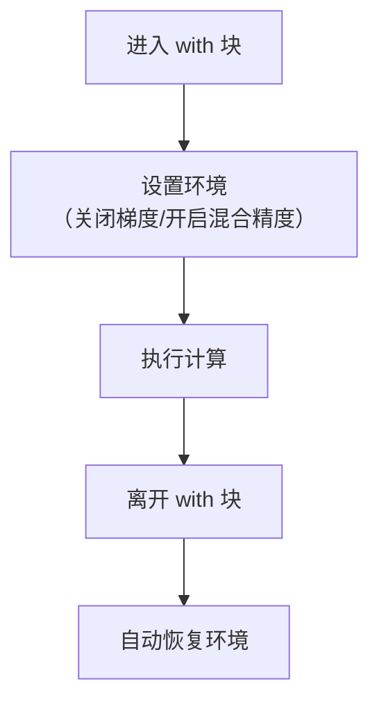

### 模块与导入

```python
# 导入整个模块
import torch

# 导入模块中的特定内容
from torch import nn
from transformers import AutoTokenizer

# 从项目本地文件导入
from model.model_vlm import MiniMindVLM   # 导入 VLM 模型类
from dataset.lm_dataset import VLMDataset  # 导入数据集类
```

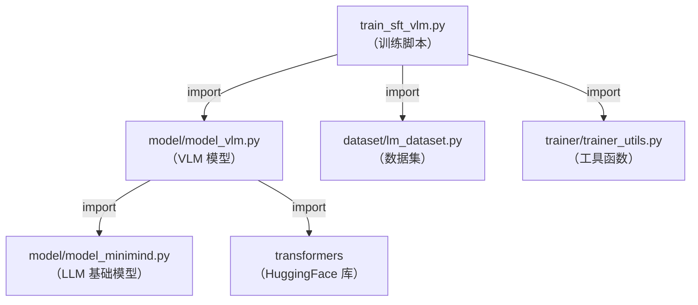

### argparse（命令行参数）

训练脚本通过命令行参数控制超参数，这样不用每次修改代码。

```python
# trainer/train_sft_vlm.py 中的参数定义
import argparse
parser = argparse.ArgumentParser()

parser.add_argument("--epochs", type=int, default=2)           # 训练轮数
parser.add_argument("--batch_size", type=int, default=4)       # 批次大小
parser.add_argument("--learning_rate", type=float, default=5e-6) # 学习率
parser.add_argument("--use_moe", type=int, default=0, choices=[0, 1]) # 是否 MoE

args = parser.parse_args()
# 命令行: python train_sft_vlm.py --epochs 4 --batch_size 8
# 结果: args.epochs = 4, args.batch_size = 8
```

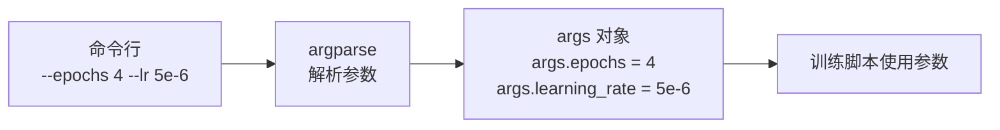

---

## 1.2 数学基础

### 线性代数：向量

向量就是一列数字。在 MiniMind-V 中，每个词被表示为一个 768 维的向量。

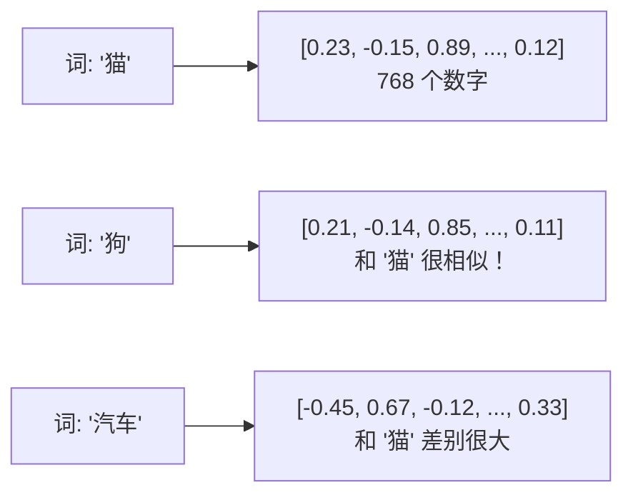

```python
import numpy as np

# 向量加法
a = np.array([1, 2, 3])
b = np.array([4, 5, 6])
print(a + b)  # [5, 7, 9]

# 向量点积 — 衡量两个向量的"相似度"
print(np.dot(a, b))  # 1*4 + 2*5 + 3*6 = 32
# 点积越大 → 越相似（方向越接近）
```

### 线性代数：矩阵乘法

矩阵乘法是神经网络的核心运算。`nn.Linear` 本质就是矩阵乘法。

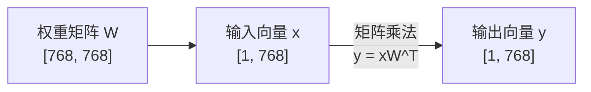

```python
# 神经网络的线性层就是矩阵乘法
# nn.Linear(in_features=768, out_features=768, bias=False)
# 等价于: output = input @ W.T

import numpy as np
x = np.random.randn(1, 768)    # 输入: 1 个样本, 768 维
W = np.random.randn(768, 768)  # 权重: 768 × 768
y = x @ W.T                    # 输出: 1 × 768
```

在 MiniMind-V 中，**几乎每个操作都是矩阵乘法**：
- 注意力中的 Q、K、V 计算：`xq = self.q_proj(x)` （矩阵乘法）
- 注意力分数：`scores = Q @ K^T` （矩阵乘法）
- 输出映射：`output = self.o_proj(attention_output)` （矩阵乘法）
- FFN 中的门控：`gate = self.gate_proj(x)` （矩阵乘法）

### 概率论：Softmax

Softmax 将一组任意数字转化为概率分布（所有值在 0~1 之间，总和为 1）。

```python
import numpy as np

# 原始分数（可能是负数、可能很大）
scores = np.array([2.0, 1.0, 0.1])

# Softmax 公式: softmax(x_i) = e^(x_i) / Σ e^(x_j)
exp_scores = np.exp(scores - np.max(scores))  # 减去最大值防止数值溢出
probabilities = exp_scores / exp_scores.sum()

print(f"原始分数: {scores}")
print(f"概率分布: {probabilities}")
print(f"概率总和: {probabilities.sum():.4f}")

# 原始分数: [2.0, 1.0, 0.1]
# 概率分布: [0.6590, 0.2424, 0.0986]  ← 总和为 1
# 概率总和: 1.0000
```

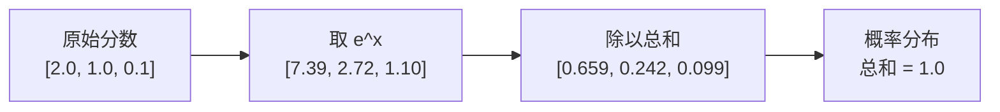

> **在 MiniMind-V 中**：`model_minimind.py` 第131行使用了 `F.softmax(scores, dim=-1)`
> 将注意力分数转化为注意力权重。

### 概率论：条件概率

语言模型的本质就是条件概率：

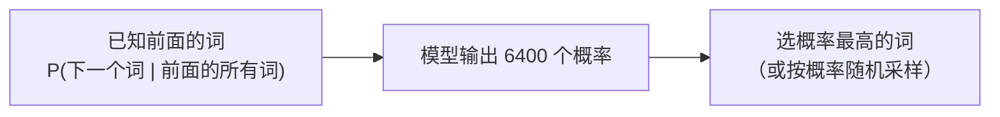

```
P("猫" | "我", "养", "了", "一", "只") = 0.35  ← 最可能的
P("狗" | "我", "养", "了", "一", "只") = 0.25
P("鸟" | "我", "养", "了", "一", "只") = 0.10
...
```

### 微积分：梯度

**梯度**就是"函数增长最快的方向"。训练神经网络就是沿着梯度的**反方向**走，让损失越来越小。

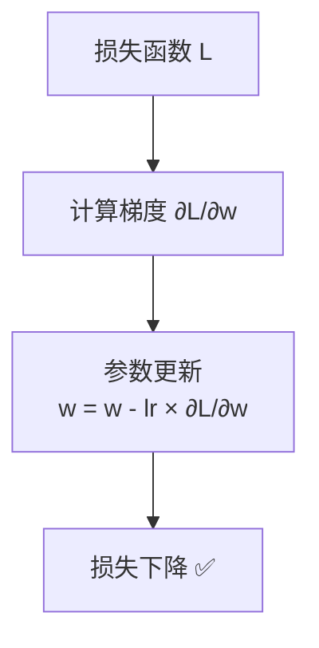

```python
# 简化理解
# 假设损失函数是 L = w^2（一个简单的抛物线）
# 梯度 dL/dw = 2w
# 更新: w_new = w_old - learning_rate * 2w

w = 10.0       # 初始值
lr = 0.1       # 学习率
for step in range(10):
    gradient = 2 * w           # 计算梯度
    w = w - lr * gradient      # 更新参数
    loss = w ** 2
    print(f"Step {step}: w={w:.4f}, loss={loss:.4f}")

# Step 0: w=8.0000, loss=64.0000   ← 损失在下降
# Step 1: w=6.4000, loss=40.9600
# Step 2: w=5.1200, loss=26.2144
# ...
# 最终 w → 0, loss → 0 ✅
```

> **在 MiniMind-V 中**：`train_sft_vlm.py` 第41-48行
> ```python
> scaler.scale(loss).backward()           # ← 计算梯度
> scaler.step(optimizer)                  # ← 更新参数
> ```

### 三角函数：RoPE 位置编码

MiniMind-V 使用旋转位置编码（RoPE），核心就是 sin 和 cos。


```python
import numpy as np

# 位置 0 的旋转角度
angle_0 = 0 * 1.0    # = 0
print(f"位置 0: cos={np.cos(angle_0):.4f}, sin={np.sin(angle_0):.4f}")
# 位置 0: cos=1.0000, sin=0.0000

# 位置 1 的旋转角度
angle_1 = 1 * 1.0    # = 1.0
print(f"位置 1: cos={np.cos(angle_1):.4f}, sin={np.sin(angle_1):.4f}")
# 位置 1: cos=0.5403, sin=0.8415

# 位置 2 的旋转角度
angle_2 = 2 * 1.0    # = 2.0
print(f"位置 2: cos={np.cos(angle_2):.4f}, sin={np.sin(angle_2):.4f}")
# 位置 2: cos=-0.4161, sin=0.9093

# 每个位置的旋转角度不同 → 编码了位置信息
# 两个位置的旋转角度差 = 它们的相对距离
```

### 对数：交叉熵损失

交叉熵损失函数中使用了 `-log(p)`，理解对数是关键。

```python
import numpy as np

# -log(p) 的直觉：模型越确信正确答案，损失越小
p_correct = 0.9    # 模型 90% 确信正确答案
print(f"loss = -log({p_correct}) = {-np.log(p_correct):.4f}")  # 0.1054 ← 很小

p_correct = 0.5    # 模型只有 50% 确信
print(f"loss = -log({p_correct}) = {-np.log(p_correct):.4f}")  # 0.6931 ← 中等

p_correct = 0.01   # 模型几乎猜不到正确答案
print(f"loss = -log({p_correct}) = {-np.log(p_correct):.4f}")  # 4.6052 ← 很大！
```

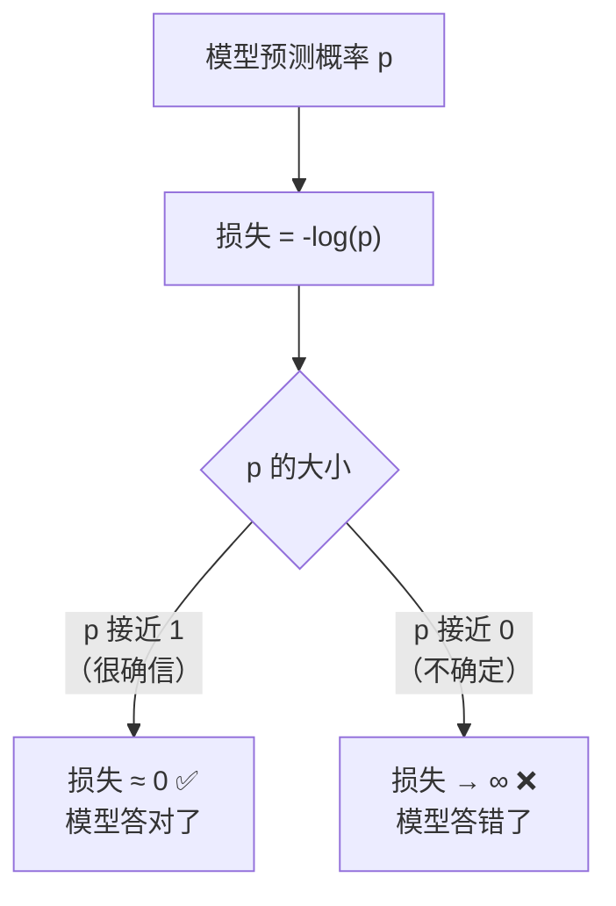

> **在 MiniMind-V 中**：`model_minimind.py` 第252行
> ```python
> loss = F.cross_entropy(shift_logits.view(-1, ...), shift_labels.view(-1))
> # cross_entropy 内部就是: -log(softmax(logits)[正确答案的索引])
> ```

---

## 1.3 NumPy 基础

NumPy 是 Python 的数值计算库，PyTorch 的 Tensor 操作与 NumPy 非常相似。

```python
import numpy as np

# 创建数组
a = np.array([1, 2, 3])           # 一维数组 (3,)
b = np.zeros((3, 4))              # 3×4 零矩阵
c = np.random.randn(2, 3)         # 2×3 随机矩阵

# 查看形状
print(a.shape)   # (3,)
print(b.shape)   # (3, 4)

# 改变形状 (非常重要！)
x = np.arange(12)              # [0, 1, 2, ..., 11]，形状 (12,)
y = x.reshape(3, 4)            # 形状变成 (3, 4)
z = x.reshape(3, -1)           # -1 表示自动推断 → (3, 4)

# 矩阵乘法
A = np.random.randn(2, 3)      # 2×3
B = np.random.randn(3, 4)      # 3×4
C = A @ B                       # 2×4（矩阵乘法）
```

### 广播机制（Broadcasting）

NumPy/PyTorch 的广播机制允许不同形状的数组进行运算。

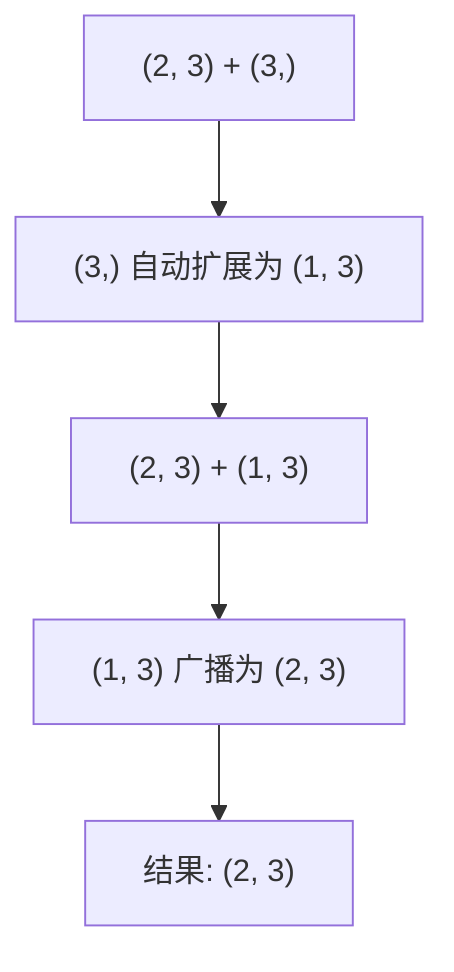

```python
# 广播示例
a = np.array([[1, 2, 3],
              [4, 5, 6]])       # 形状 (2, 3)
b = np.array([10, 20, 30])     # 形状 (3,)

# b 自动"广播"（复制）为 [[10, 20, 30], [10, 20, 30]]
print(a + b)
# [[11, 22, 33],
#  [14, 25, 36]]
```

> **在 MiniMind-V 中**：广播无处不在。例如注意力计算中：
> `scores = Q @ K^T` 的结果是 `[batch, heads, seq, seq]`，
> 而因果掩码是 `[seq, seq]`，通过广播自动应用到每个 batch 和 head。

---

## 1.4 自我检测

完成本阶段后，你应该能回答以下问题：

1. ✅ `nn.Linear(768, 768)` 本质上做了什么？（矩阵乘法）
2. ✅ 为什么 Softmax 要用 `e^x`？（保证非负 + 可微 + 保序）
3. ✅ 梯度的直觉是什么？（函数增长最快的方向）
4. ✅ `-log(0.9)` 和 `-log(0.1)` 哪个大？为什么？（0.1 大，因为不确定）
5. ✅ Python 中 `class Child(Parent)` 是什么意思？（继承，Child 获得 Parent 的能力）
6. ✅ `with torch.no_grad():` 的作用？（不计算梯度，节省内存）

如果以上问题你都能回答，恭喜！你已经准备好进入第二阶段了。
