# 第二阶段：深度学习与 PyTorch 入门

> 🎯 **目标**：理解神经网络基本原理，能用 PyTorch 读懂 MiniMind-V 的代码
> ⏰ **预计时间**：2-3 周
> 📌 **前提**：已完成第一阶段（Python 与数学基础）

---

## 本章知识地图

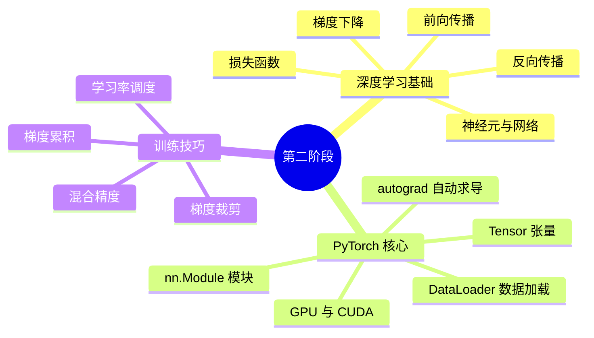

---

## 2.1 什么是深度学习

### 从生物神经元到人工神经元

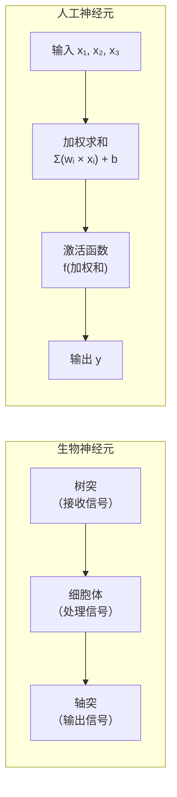

一个神经元做的事情非常简单：

```
输出 = 激活函数(权重 × 输入 + 偏置)
```

用代码表示就是：

```python
# 一个"人工神经元"
def neuron(x, w, b):
    weighted_sum = sum(wi * xi for wi, xi in zip(w, x)) + b  # 加权求和
    return sigmoid(weighted_sum)  # 激活函数

# 例子
x = [0.5, 0.3, 0.8]  # 输入（3个信号）
w = [0.2, -0.1, 0.4] # 权重（3个连接强度）
b = 0.1               # 偏置
output = neuron(x, w, b)
```

**深度学习**就是把很多这样的神经元连在一起，形成"深层"网络。层数越多，能学到的模式越复杂。

### 神经网络如何学习

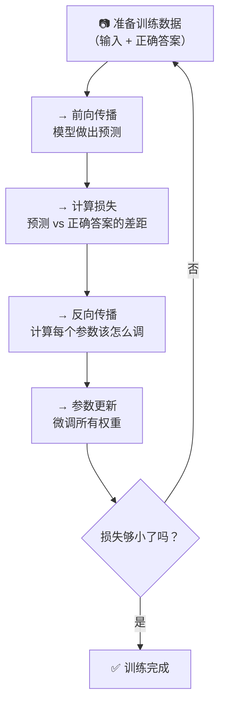

> 就像学开车：踩油门（前向传播）→ 发现偏了（计算损失）→ 调方向盘（反向传播）→ 重复直到开直

---

## 2.2 神经网络的基本组件

### 线性层（nn.Linear）

线性层是最基本的神经网络层，做一件事：**矩阵乘法**。

```python
# PyTorch 中的线性层
import torch.nn as nn

linear = nn.Linear(in_features=3, out_features=2)
# 本质: y = xW^T + b
# 输入: 3 维 → 输出: 2 维
```

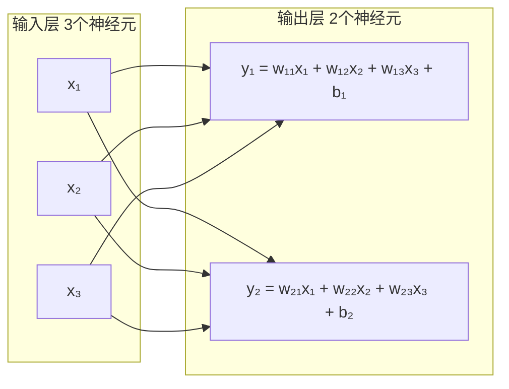

> **在 MiniMind-V 中**：`model_minimind.py` 第100-103行
> ```python
> self.q_proj = nn.Linear(768, 768, bias=False)  # Query 投影
> self.k_proj = nn.Linear(768, 384, bias=False)  # Key 投影
> self.v_proj = nn.Linear(768, 384, bias=False)  # Value 投影
> ```

### 激活函数

没有激活函数，多层线性网络等价于一层。激活函数引入**非线性**。

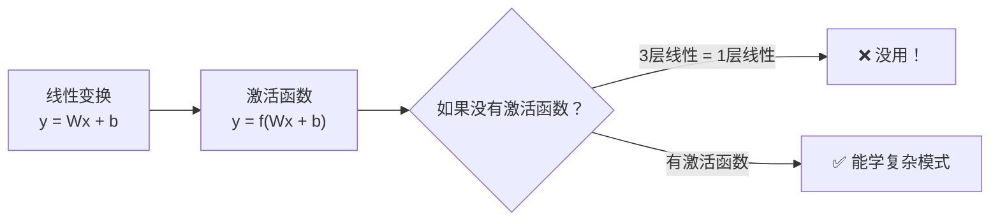

常用激活函数：

```python
import torch
import torch.nn.functional as F

# ReLU: 最简单，负数变0，正数不变
x = torch.tensor([-2.0, -1.0, 0.0, 1.0, 2.0])
print(F.relu(x))        # [0.0, 0.0, 0.0, 1.0, 2.0]

# SiLU (Swish): sigmoid(x) * x — MiniMind-V 使用这个
print(F.silu(x))         # [-0.238, -0.269, 0.0, 0.731, 1.762]

# GELU: 近似于 SiLU，常用于 Transformer
print(F.gelu(x))         # [-0.036, -0.159, 0.0, 0.841, 1.954]
```

> **在 MiniMind-V 中**：`model_minimind.py` 第143行使用 `SiLU` 激活函数
> `model_vlm.py` 第29行投影层使用 `GELU` 激活函数

### 损失函数

损失函数衡量模型预测与正确答案之间的差距。

#### 交叉熵损失（Cross-Entropy Loss）— 语言模型最常用的损失

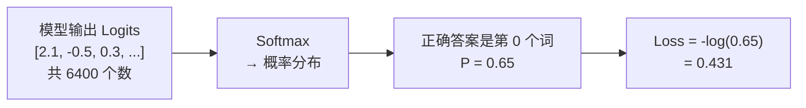

```python
import torch
import torch.nn.functional as F

# 模型对 5 个词的原始打分
logits = torch.tensor([[2.1, -0.5, 0.3, 0.1, -1.0]])
# 正确答案是第 0 个词
target = torch.tensor([0])

# 计算交叉熵损失
loss = F.cross_entropy(logits, target)
print(f"Loss: {loss.item():.4f}")

# 手动计算验证
probs = F.softmax(logits, dim=-1)
print(f"概率: {probs}")
print(f"-log(P[正确答案]): {-torch.log(probs[0, 0]):.4f}")
# 两者应该相等！
```

> **在 MiniMind-V 中**：`model_minimind.py` 第252行
> ```python
> loss = F.cross_entropy(x.view(-1, x.size(-1)), y.view(-1), ignore_index=-100)
> ```
> `ignore_index=-100` 表示标签为 -100 的位置不计算损失。

### 优化器

优化器决定如何根据梯度更新参数。

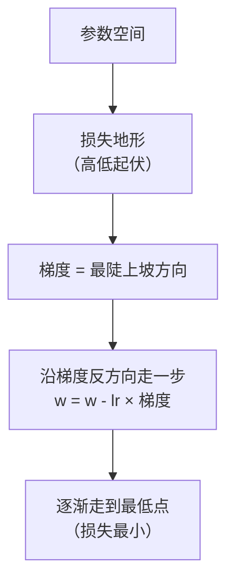

```python
import torch
import torch.nn as nn
import torch.optim as optim

# 创建简单模型和优化器
model = nn.Linear(10, 2)
optimizer = optim.AdamW(model.parameters(), lr=0.001)

# 训练步骤
for data, target in dataloader:
    optimizer.zero_grad()          # 清零旧梯度
    output = model(data)           # 前向传播
    loss = F.cross_entropy(output, target)  # 计算损失
    loss.backward()                # 反向传播（计算梯度）
    optimizer.step()               # 更新参数
```

> **在 MiniMind-V 中**：`train_sft_vlm.py` 第145行使用 `AdamW` 优化器

---

## 2.3 前向传播与反向传播

### 前向传播

数据从输入到输出的流动过程。

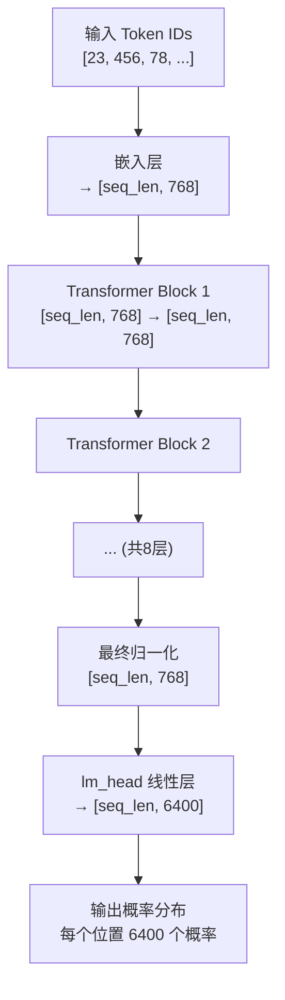

### 反向传播

反向传播就是用**链式法则**从输出向输入逐层计算梯度。

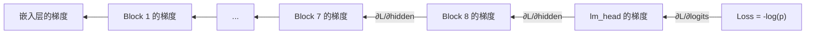

> 残差连接让梯度可以"跳过"某些层直接传到前面，这是训练深层网络的关键。

### 完整训练循环

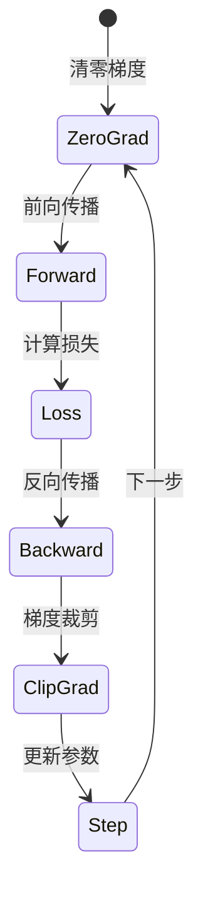

> **在 MiniMind-V 中**：`train_sft_vlm.py` 第27-50行就是完整的训练循环。

---

## 2.4 PyTorch 核心概念

### Tensor（张量）

张量是 PyTorch 的基本数据结构，可以理解为多维数组。

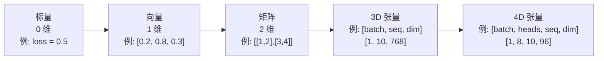

```python
import torch

# 创建张量
x = torch.tensor([1.0, 2.0, 3.0])     # 1D: (3,)
x = torch.randn(2, 3)                  # 2D: (2, 3) 随机
x = torch.zeros(1, 10, 768)           # 3D: (1, 10, 768) 零

# 常用操作
x = torch.randn(2, 3, 4)
x.shape           # torch.Size([2, 3, 4])
x.reshape(6, 4)   # 改变形状
x.transpose(0, 1)  # 交换维度 0 和 1
x.to("cuda")       # 移到 GPU
```

**MiniMind-V 中的关键张量形状**：

| 位置 | 张量 | 形状 | 含义 |
|------|------|------|------|
| 输入 | `input_ids` | `[batch, seq_len]` | Token ID 序列 |
| 嵌入后 | `hidden_states` | `[batch, seq_len, 768]` | 每个词的向量表示 |
| 注意力中 | `Q, K, V` | `[batch, num_heads, seq_len, 96]` | 查询/键/值 |
| 注意力分数 | `scores` | `[batch, heads, seq_len, seq_len]` | 词与词之间的关联度 |
| 输出 | `logits` | `[batch, seq_len, 6400]` | 每个位置的词概率 |

### nn.Module（神经网络模块）

PyTorch 中所有网络层的基类。定义网络就是两步：`__init__` 定义层，`forward` 定义计算。

```python
import torch.nn as nn

class SimpleNet(nn.Module):
    def __init__(self):
        super().__init__()              # 必须调用父类
        self.layer1 = nn.Linear(768, 768)
        self.layer2 = nn.Linear(768, 6400)

    def forward(self, x):
        x = self.layer1(x)              # 第一层
        x = F.relu(x)                   # 激活
        x = self.layer2(x)              # 第二层
        return x
```

MiniMind-V 中的模块继承关系：

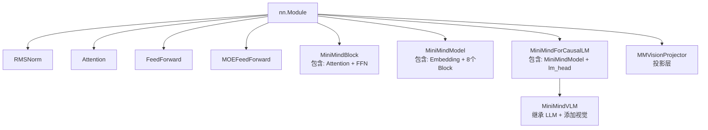

### autograd（自动求导）

PyTorch 自动追踪所有张量运算并计算梯度。

```python
import torch

# 创建需要梯度的张量
x = torch.tensor([1.0, 2.0, 3.0], requires_grad=True)

# 前向计算
y = x.sum()           # y = 1 + 2 + 3 = 6
y.backward()           # 反向传播

print(x.grad)          # tensor([1., 1., 1.])  ← 每个元素的梯度都是 1
# 因为 dy/dx_i = 1（sum 的梯度）
```

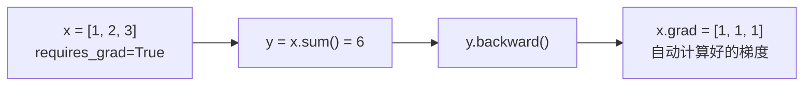

### DataLoader 和 Dataset

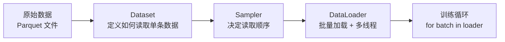

```python
from torch.utils.data import Dataset, DataLoader

class MyDataset(Dataset):
    def __len__(self):
        return 1000  # 数据总数

    def __getitem__(self, idx):
        # 返回第 idx 条数据
        return input_ids[idx], labels[idx], images[idx]

# 创建 DataLoader
dataset = MyDataset()
loader = DataLoader(dataset, batch_size=4, shuffle=True)

# 使用
for batch_idx, (inputs, labels, images) in enumerate(loader):
    # inputs 形状: [4, seq_len]  ← batch_size=4
    train_step(inputs, labels, images)
```

> **在 MiniMind-V 中**：`dataset/lm_dataset.py` 的 `VLMDataset` 类继承了 `Dataset`，
> `__getitem__` 方法返回 `(input_ids, labels, pixel_values)` 三元组。

### GPU 与 CUDA

```python
# 检查 GPU 是否可用
import torch
print(torch.cuda.is_available())  # True = 有 GPU

# 将模型和数据移到 GPU
device = "cuda:0" if torch.cuda.is_available() else "cpu"
model = model.to(device)
input_ids = input_ids.to(device)

# GPU 计算比 CPU 快 10-100 倍！
```

### 混合精度训练

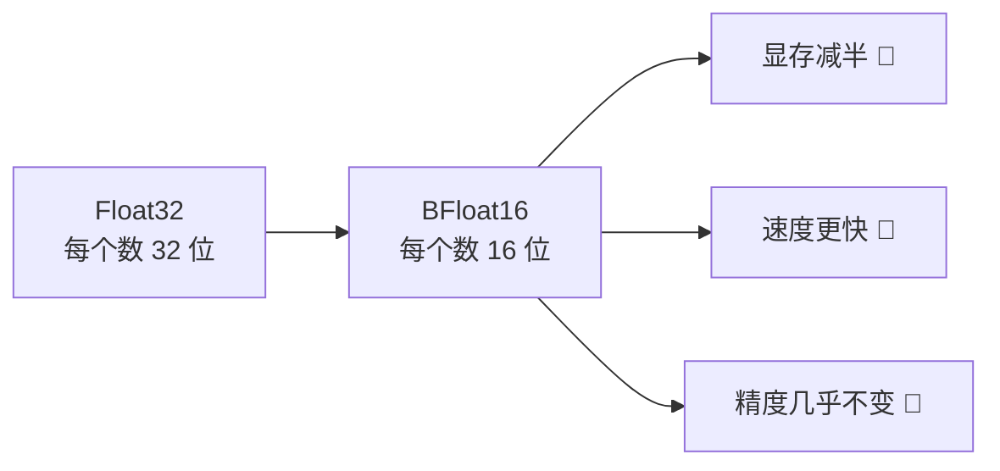

```python
# MiniMind-V 中的混合精度训练
with torch.cuda.amp.autocast(dtype=torch.bfloat16):
    # 在这个块中，计算自动使用 bfloat16
    output = model(input_ids)
    loss = compute_loss(output, labels)

# 注意：bfloat16 需要 Ampere 架构以上的 GPU（如 A100、3090、4090）
```

---

## 2.5 学习率调度

MiniMind-V 使用**余弦退火**（Cosine Annealing）策略。


```python
# trainer_utils.py 第42行
def get_lr(current_step, total_steps, lr):
    return lr * (0.1 + 0.45 * (1 + math.cos(math.pi * current_step / total_steps)))

# 学习率变化轨迹（假设 lr=5e-6, total=10000）:
# Step    0: lr ≈ 5.0e-6  （最大值）
# Step 2500: lr ≈ 4.0e-6
# Step 5000: lr ≈ 2.75e-6 （中间值）
# Step 7500: lr ≈ 1.5e-6
# Step 10000: lr ≈ 0.5e-6  （最小值，= lr * 0.1）
```

### 梯度裁剪

```python
# 防止梯度爆炸（梯度值太大导致训练不稳定）
torch.nn.utils.clip_grad_norm_(model.parameters(), max_norm=1.0)
# 如果梯度的范数 > 1.0，就按比例缩小到 1.0
```

### 梯度累积

当显存不够时，可以用小 batch 多次前向传播，累积梯度后再更新。

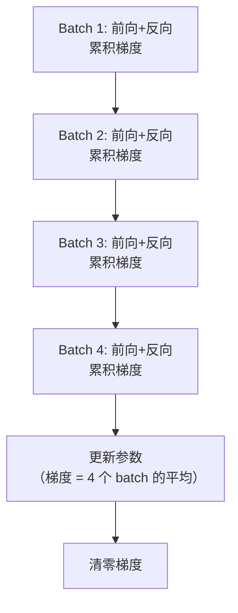

> **在 MiniMind-V 中**：`train_sft_vlm.py` 第43行的 `accumulation_steps` 控制累积步数。

---

## 2.6 动手练习

### 练习 1：用 PyTorch 实现线性回归

```python
import torch
import torch.nn as nn

# 生成数据: y = 3x + 1 + 噪声
x = torch.randn(100, 1)
y = 3 * x + 1 + 0.5 * torch.randn(100, 1)

# 创建模型
model = nn.Linear(1, 1)
optimizer = torch.optim.SGD(model.parameters(), lr=0.01)

# 训练
for epoch in range(100):
    pred = model(x)                    # 前向传播
    loss = ((pred - y) ** 2).mean()    # 均方误差
    optimizer.zero_grad()              # 清零梯度
    loss.backward()                    # 反向传播
    optimizer.step()                   # 更新参数

    if epoch % 20 == 0:
        print(f"Epoch {epoch}: loss={loss.item():.4f}, "
              f"w={model.weight.item():.4f}, b={model.bias.item():.4f}")
# 最终: w ≈ 3.0, b ≈ 1.0 ✅
```

### 练习 2：手写数字识别

```python
import torch
import torch.nn as nn
from torchvision import datasets, transforms

# 加载数据
train_data = datasets.MNIST('./data', train=True, download=True,
                            transform=transforms.ToTensor())
loader = torch.utils.data.DataLoader(train_data, batch_size=64, shuffle=True)

# 两层全连接网络
class SimpleNet(nn.Module):
    def __init__(self):
        super().__init__()
        self.fc1 = nn.Linear(28*28, 128)  # 输入 784 → 隐藏 128
        self.fc2 = nn.Linear(128, 10)     # 隐藏 128 → 输出 10（0-9数字）

    def forward(self, x):
        x = x.view(-1, 28*28)       # 展平图片
        x = torch.relu(self.fc1(x))  # 第一层 + ReLU
        x = self.fc2(x)              # 第二层
        return x

model = SimpleNet()
optimizer = torch.optim.Adam(model.parameters(), lr=0.001)

for epoch in range(5):
    for images, labels in loader:
        output = model(images)
        loss = nn.functional.cross_entropy(output, labels)
        optimizer.zero_grad()
        loss.backward()
        optimizer.step()
    print(f"Epoch {epoch}: loss={loss.item():.4f}")
```

---

## 2.7 自我检测

1. ✅ `nn.Linear(768, 768, bias=False)` 做了什么？（y = xW^T，768维→768维，无偏置）
2. ✅ 为什么需要激活函数？（引入非线性，否则多层=一层）
3. ✅ `loss.backward()` 做了什么？（自动计算所有参数的梯度）
4. ✅ `optimizer.step()` 做了什么？（根据梯度更新参数）
5. ✅ 为什么用 AdamW 而不是 SGD？（自适应学习率 + 权重衰减，收敛更快更稳）
6. ✅ 混合精度训练的好处？（显存减半，速度更快）
7. ✅ Tensor 形状 `[2, 8, 10, 96]` 分别代表什么？（batch=2, heads=8, seq=10, dim=96）
