# 第三阶段：自然语言处理基础

> 🎯 **目标**：理解文本如何变成数字输入给模型
> ⏰ **预计时间**：1 周
> 📌 **前提**：已完成第一、二阶段

---

## 本章知识地图

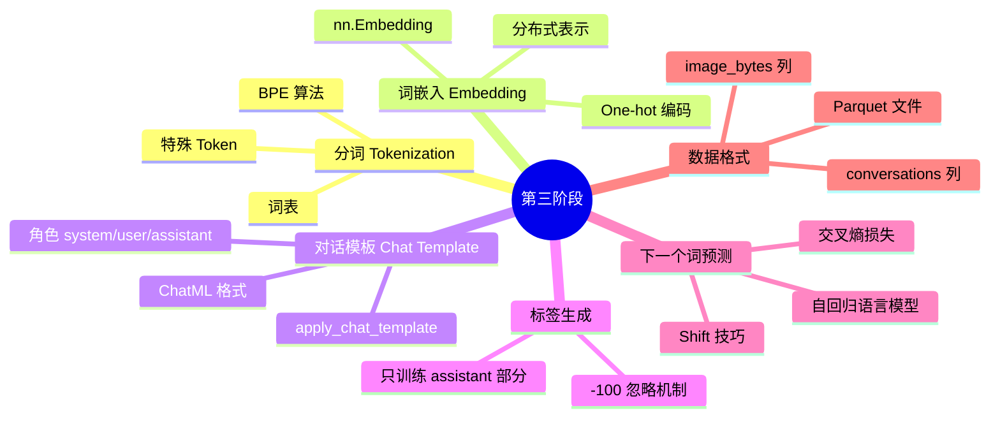

---

## 3.1 计算机如何理解文字

计算机只认识数字（0 和 1），不认识文字。所以第一步是把文字"翻译"成数字。

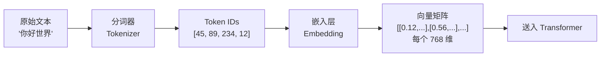

### 为什么不能直接用 Unicode/ASCII？

```
"猫" 的 Unicode: 29483
"狗" 的 Unicode: 29399
"汽车" 的 Unicode: 27773, 36710

问题：
- "猫"和"狗"在 Unicode 中差 84，没有语义关系
- 但在语义上它们非常相似（都是动物）
- 我们需要一种编码让"猫"和"狗"在向量空间中距离很近
```

---

## 3.2 分词（Tokenization）

### 三种分词策略

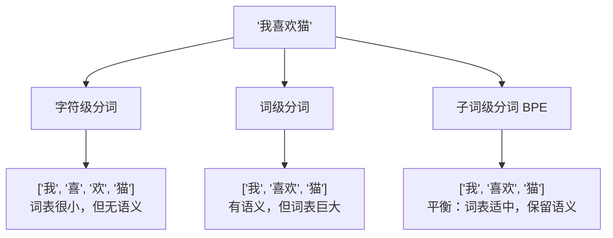

### BPE（Byte Pair Encoding）算法

MiniMind-V 使用 BPE 分词。核心思想：**把常见的字符组合合并为一个新的 token**。

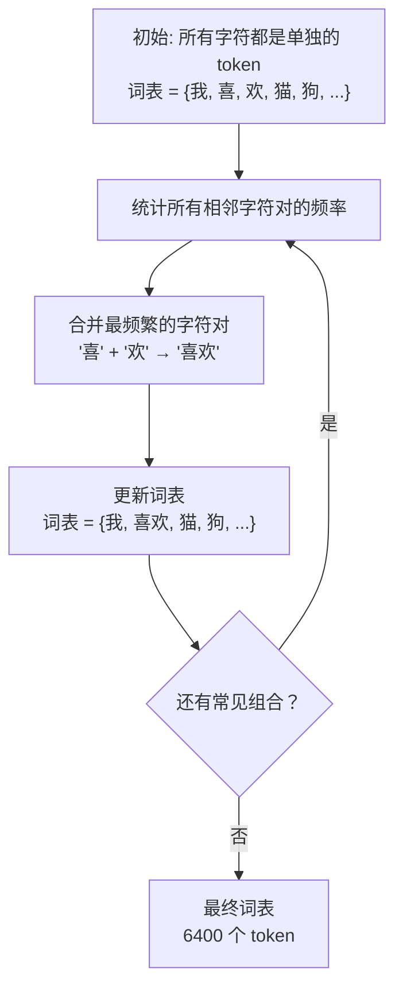

具体例子：

```
初始语料: ["低 低", "低 低", "最 最", "最 最 最"]

第1轮: "低"+"低" 最频繁 → 合并为 "低低"
  语料: ["低低", "低低", "最 最", "最 最 最"]

第2轮: "最"+"最" 最频繁 → 合并为 "最最"
  语料: ["低低", "低低", "最最", "最最 最"]

第3轮: "最最"+"最" 最频繁 → 合并为 "最最最"
  语料: ["低低", "低低", "最最", "最最最"]
```

### MiniMind-V 中的分词器

```
文件: model/tokenizer.json     ← 6400 个 token 的词表
文件: model/tokenizer_config.json  ← 分词器配置
```

### 特殊 Token

MiniMind-V 定义了几个特殊的 token：

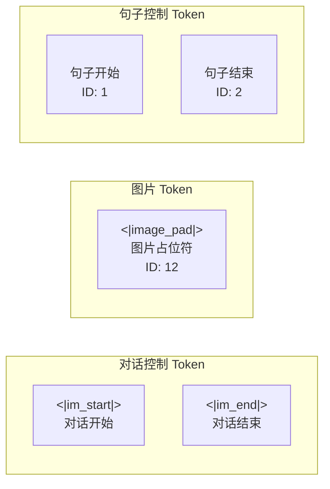

图片占位符特别重要：每张图片用 **64 个连续的 `<|image_pad|>`** 表示：

```
原始文本: "<image>\n请描述这张图片"
替换后:   "<|image_pad|><|image_pad|>...(×64)\n请描述这张图片"
```

> 为什么要 64 个？因为 SigLIP2 视觉编码器把 256×256 的图片切成 8×8=64 个小块，
> 每个小块产生一个 token，总共 64 个 token。

---

## 3.3 词嵌入（Embedding）

### 从 Token ID 到向量

Token ID 只是一个整数，没有语义信息。嵌入层把每个 ID 映射为一个高维向量。

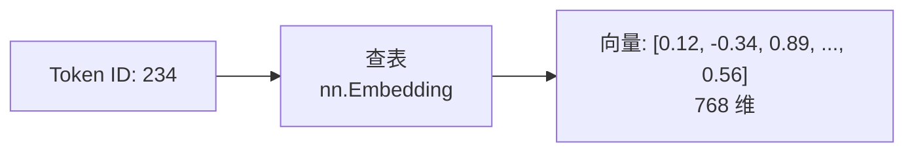

### One-hot vs 嵌入

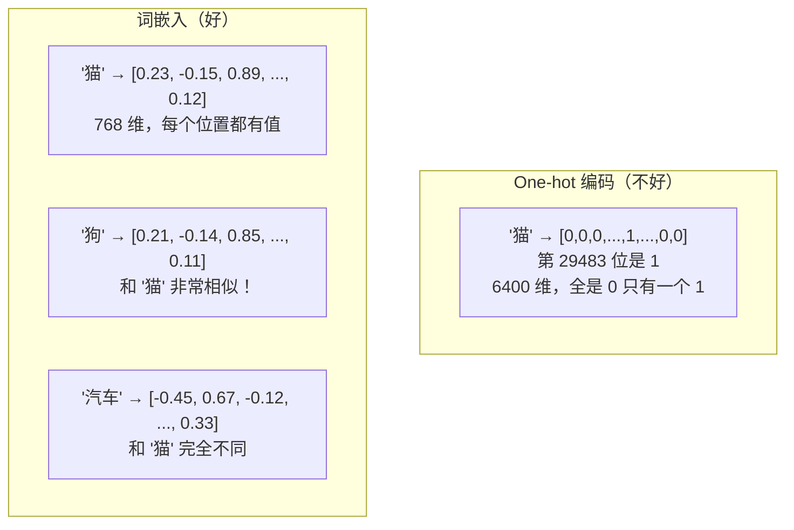

```python
# PyTorch 中的嵌入层
import torch.nn as nn

# 创建嵌入层：6400 个 token，每个 768 维
embedding = nn.Embedding(num_embeddings=6400, embedding_dim=768)

# 查表：把 token ID 转为向量
token_ids = torch.tensor([234, 567, 12])   # 3 个 token ID
vectors = embedding(token_ids)              # 形状: [3, 768]
# vectors[0] = token 234 的 768 维向量
# vectors[1] = token 567 的 768 维向量
# vectors[2] = token 12 (<|image_pad|>) 的 768 维向量
```

> **在 MiniMind-V 中**：`model_minimind.py` 第201行
> ```python
> self.embed_tokens = nn.Embedding(config.vocab_size, config.hidden_size)
> # = nn.Embedding(6400, 768)  → 一个 6400 行 × 768 列的查找表
> ```

### 权重共享（Tied Weights）

MiniMind-V 使用了权重共享：嵌入矩阵和输出层的权重是同一个矩阵。

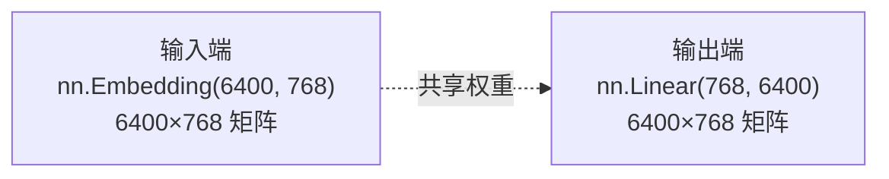

> **在 MiniMind-V 中**：`model_minimind.py` 第242行
> ```python
> self.model.embed_tokens.weight = self.lm_head.weight  # 共享权重
> ```

好处：减少参数量，且输入和输出使用同一语义空间。

---

## 3.4 对话模板（Chat Template）

### 为什么需要对话模板？

模型需要知道哪部分是用户的提问，哪部分是AI的回答。对话模板用特殊标记分隔不同角色。

### ChatML 格式

MiniMind-V 使用 ChatML 格式：

```
<|im_start|>system
你是一个知识丰富的AI，尽力为用户提供准确的信息。<|im_end|>
<|im_start|>user
<|image_pad|><|image_pad|>...(×64)
请描述这张图中的主要物体和场景。<|im_end|>
<|im_start|>assistant
这张图片展示了...<|im_end|>
```

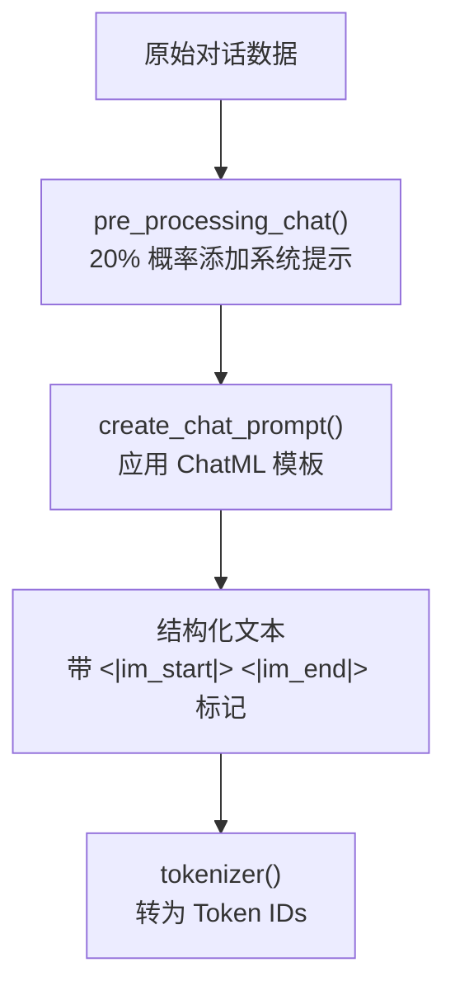

> **在 MiniMind-V 中**：`dataset/lm_dataset.py` 第18-38行处理对话数据，
> 第61-72行的 `create_chat_prompt()` 应用模板。

### 多轮对话

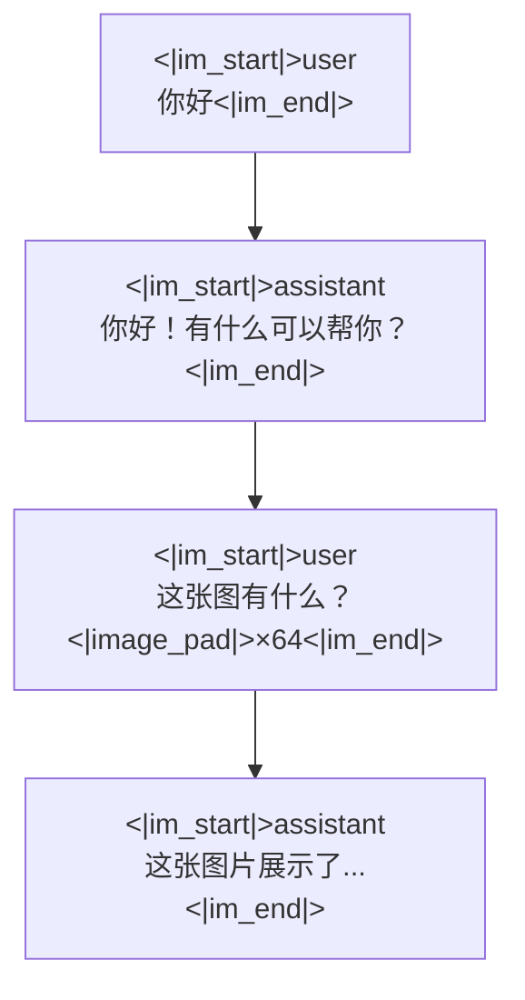

每轮对话都用 `<|im_start|>` 开始，`<|im_end|>` 结束，角色可以是 `system`、`user` 或 `assistant`。

---

## 3.5 标签生成规则

### 核心概念：只训练模型生成"assistant"的回复

模型不需要学习如何复制用户的提问，只需要学习如何生成回答。

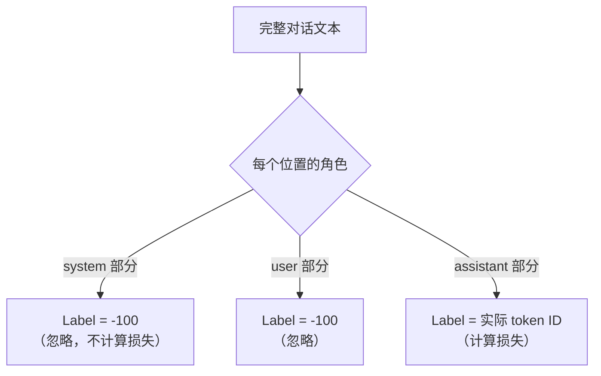

具体例子：

```
位置:    0    1    2    3    4    5    6    7    8    9   10   11   12
Token:  im_s system 你好 im_e im_s user  图  描述 im_e im_s asst 这张 图
角色:   |-- system --|  |--- user ---|  |-- assistant -|
Label: -100 -100 -100 -100 -100 -100 -100 -100 -100 -100 -100 这张 图
                                                                      ↑
                                                        只有这些位置计算损失
```

> **在 MiniMind-V 中**：`dataset/lm_dataset.py` 第74-90行的 `generate_labels()` 方法：
> 1. 扫描 input_ids，找到 `<|im_start|>assistant\n` 的位置（bos_id）
> 2. 从该位置到 `<|im_end|>`（eos_id）之间的 token，设置 label = 实际 token ID
> 3. 其他位置 label = -100

```python
def generate_labels(self, input_ids):
    labels = [-100] * len(input_ids)       # 默认全部忽略
    i = 0
    while i < len(input_ids):
        if input_ids[i:i + len(self.bos_id)] == self.bos_id:
            # 找到了 <|im_start|>assistant\n
            start = i + len(self.bos_id)     # assistant 内容的开始
            end = start
            while end < len(input_ids):
                if input_ids[end:end + len(self.eos_id)] == self.eos_id:
                    break                    # 找到了 <|im_end|>
                end += 1
            # 标记 assistant 部分为真实 token
            for j in range(start, min(end + len(self.eos_id), self.max_length)):
                labels[j] = input_ids[j]
            i = end + len(self.eos_id)
        else:
            i += 1
    return labels
```

---

## 3.6 下一个词预测（Next-Token Prediction）

这是所有 GPT 风格语言模型的核心训练目标。

### 直觉理解

就像写作文时的"填空"：

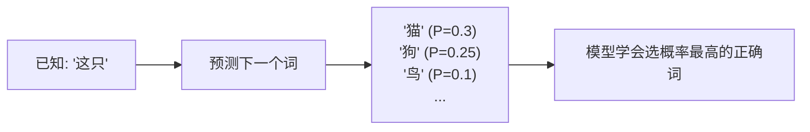

### 训练过程

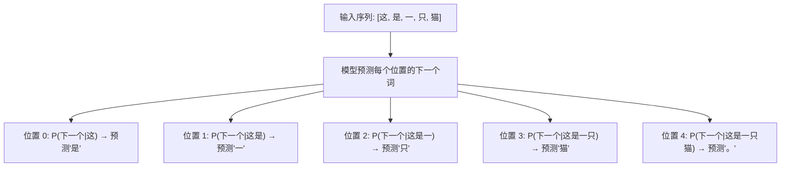

### Shift 技巧

代码中用 "shift" 实现同时预测所有位置：

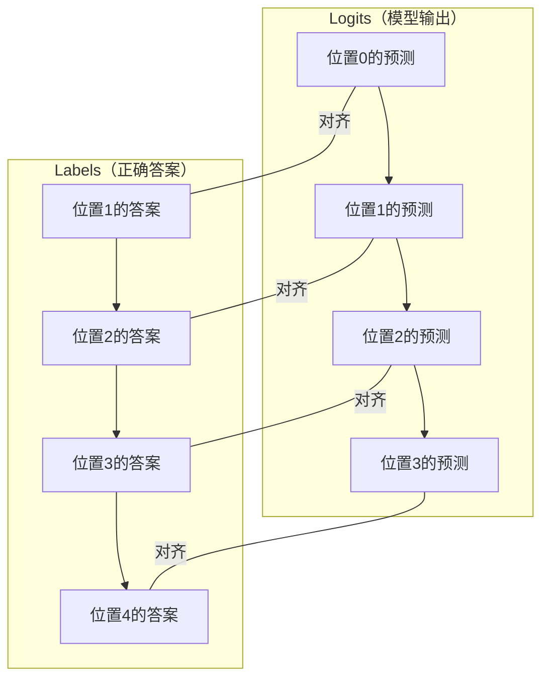

```python
# model_minimind.py 第250-252行
shift_logits = logits[..., :-1, :].contiguous()  # 去掉最后一个位置
shift_labels = labels[..., 1:].contiguous()       # 去掉第一个位置
loss = F.cross_entropy(shift_logits, shift_labels, ignore_index=-100)

# 举例:
# logits: [pos0_pred, pos1_pred, pos2_pred, pos3_pred, pos4_pred]
# 去掉最后: [pos0_pred, pos1_pred, pos2_pred, pos3_pred]
#
# labels: [pos0_ans, pos1_ans, pos2_ans, pos3_ans, pos4_ans]
# 去掉第一: [pos1_ans, pos2_ans, pos3_ans, pos4_ans]
#
# 现在 pos0_pred 对比 pos1_ans（用位置0的预测来对比位置1的答案）
# 这就是"用前面的词预测下一个词"
```

---

## 3.7 数据格式：Parquet 文件

### 什么是 Parquet

Parquet 是一种列式存储格式，类似于 Excel 表格，但更高效。

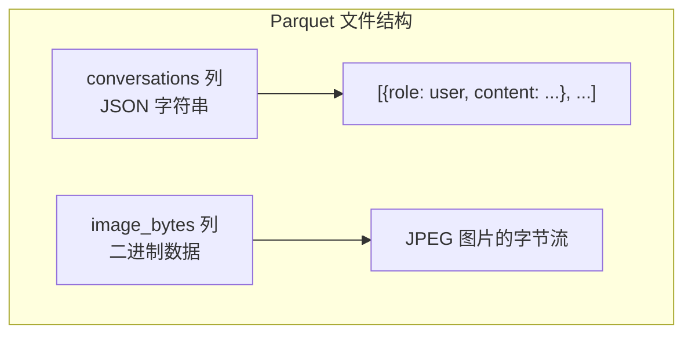

### 数据示例

```
| conversations (JSON)                              | image_bytes (binary)     |
|---------------------------------------------------|--------------------------|
| [{"role":"user","content":"<image>\n描述图片"},    | <JPEG 二进制数据>         |
|  {"role":"assistant","content":"这是一只金毛..."}] |                          |
```

### 为什么用 Parquet？

```
旧方案: 50万个零散的图片文件 + 一个 JSON 索引文件
  问题: 下载慢、读取慢、磁盘压力大

新方案: 1个 Parquet 文件，包含所有图文数据
  好处: 体积小（压缩）、读取快、一体化管理
```

> **在 MiniMind-V 中**：`dataset/lm_dataset.py` 第50行
> ```python
> self.table = pa.Table.from_batches(pq.ParquetFile(parquet_path).iter_batches())
> ```

---

## 3.8 总结

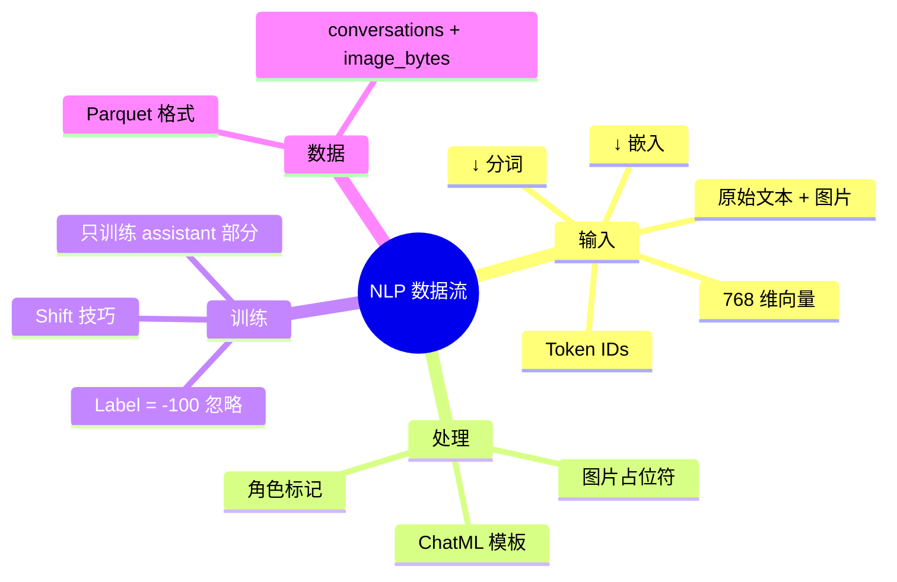

---

## 3.9 自我检测

1. ✅ 为什么需要分词？（计算机只认识数字）
2. ✅ BPE 的核心思想是什么？（合并常见的字符组合）
3. ✅ `<|image_pad|>` 为什么需要 64 个？（一张图切成 8×8=64 个 patch）
4. ✅ 为什么嵌入比 one-hot 好？（语义相似的词在向量空间中距离近）
5. ✅ Label 为什么要设 -100？（让模型只学习生成 assistant 的回答）
6. ✅ "Shift 技巧"解决了什么问题？（让一个序列同时训练所有位置的预测）
