# 第四阶段：Transformer 架构详解

> 🎯 **目标**：深入理解 Transformer 的每个组件——这是整个项目最核心的部分
> ⏰ **预计时间**：2-3 周
> 📌 **前提**：已完成第一至第三阶段

---

## 本章知识地图

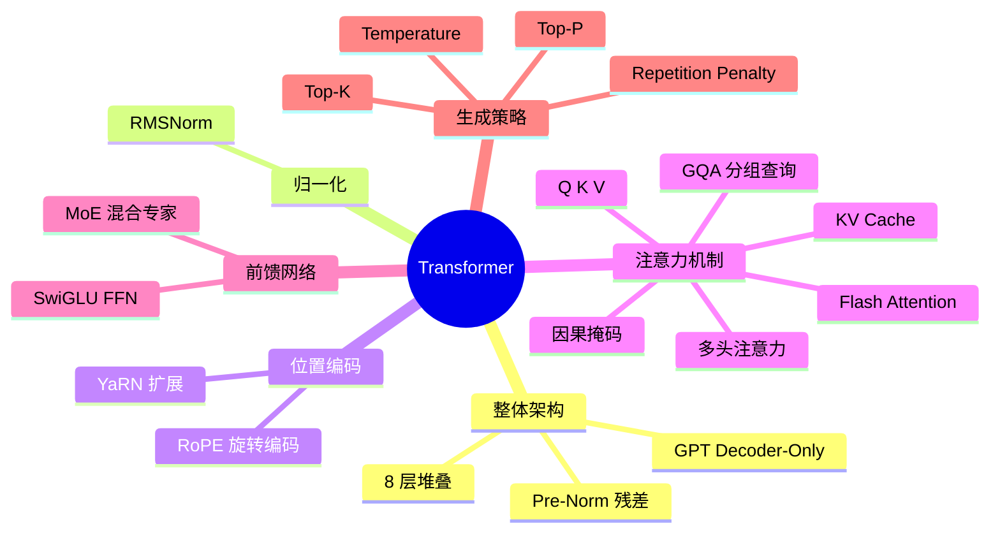

---

## 4.1 Transformer 的直觉

### 为什么需要注意力？

考虑这句话：**"这只猫坐在垫子上，它很开心"**

"它"指代什么？人类一眼就知道是"猫"。但计算机怎么知道？

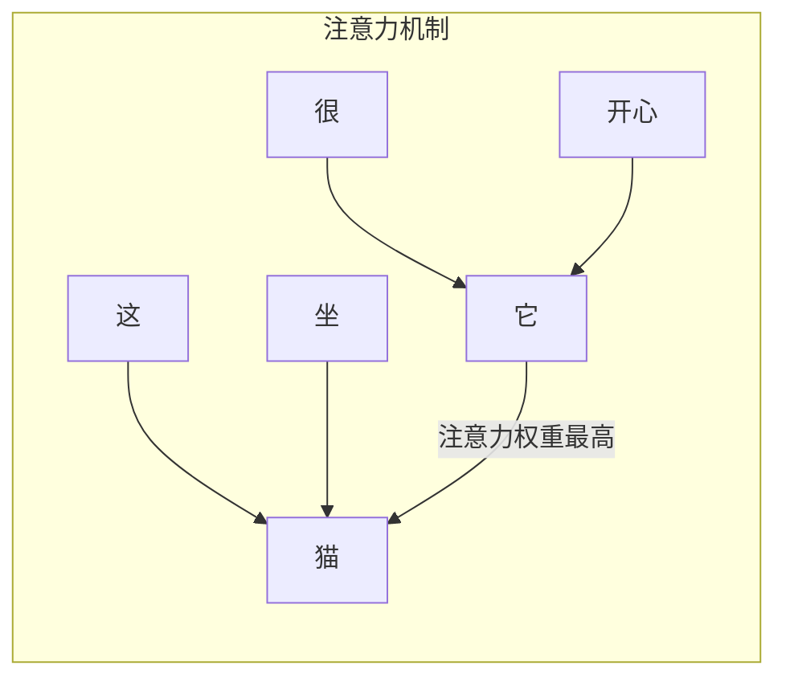

**注意力的核心思想**：让每个词"看"所有其他词，计算"我应该关注谁"。

### 为什么 Transformer 替代了 RNN？

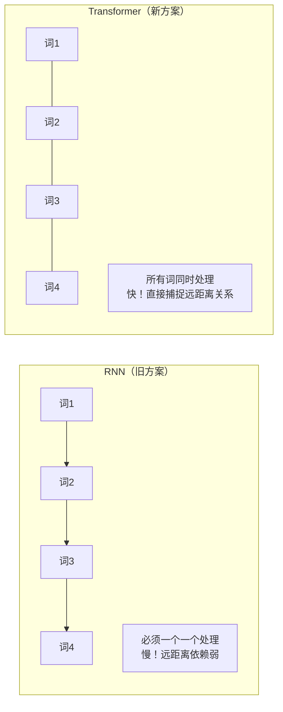

---

## 4.2 整体架构

MiniMind-V 使用 **GPT 风格的 Decoder-Only Transformer**：

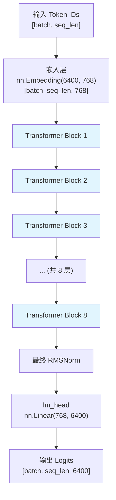

### 单个 Transformer Block 的结构

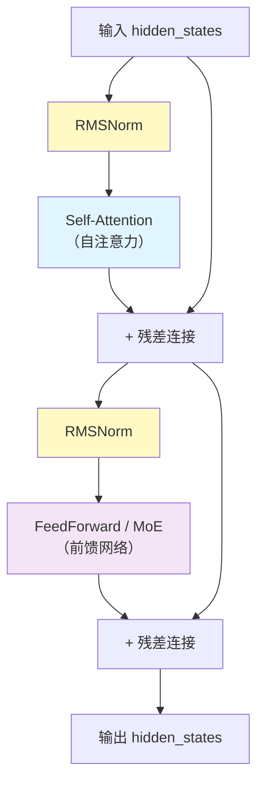

> 这种"先归一化再计算"的方式叫 **Pre-Norm**，比 Post-Norm 更稳定。

---

## 4.3 RMSNorm（Root Mean Square Normalization）

### 为什么需要归一化？

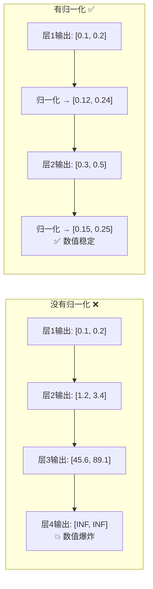

### RMSNorm vs LayerNorm

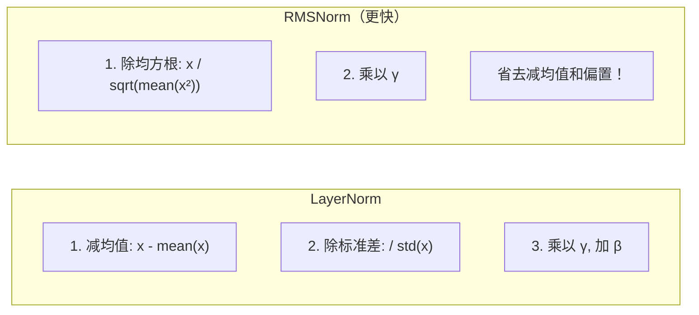

### 代码解读

```python
# model_minimind.py 第50-60行
class RMSNorm(torch.nn.Module):
    def __init__(self, dim: int, eps: float = 1e-5):
        super().__init__()
        self.eps = eps
        self.weight = nn.Parameter(torch.ones(dim))  # 可学习的缩放参数 γ

    def norm(self, x):
        return x * torch.rsqrt(x.pow(2).mean(-1, keepdim=True) + self.eps)
        # x.pow(2)          → 每个元素平方
        # .mean(-1, keepdim) → 求最后一个维度的平均值（均方）
        # torch.rsqrt        → 取倒数平方根（1/√x）
        # 最终: x / √(mean(x²) + ε)

    def forward(self, x):
        return (self.weight * self.norm(x.float())).type_as(x)
        # 1. 先转 float32 计算保证精度
        # 2. 乘以可学习参数 weight
        # 3. 转回原类型
```

### 手动计算示例

```
输入 x = [1.0, 2.0, 3.0, 4.0]

Step 1: 平方
  x² = [1.0, 4.0, 9.0, 16.0]

Step 2: 均值
  mean(x²) = (1+4+9+16)/4 = 7.5

Step 3: rsqrt
  1/√(7.5 + 0.00001) ≈ 0.3651

Step 4: 缩放
  output = [1.0×0.3651, 2.0×0.3651, 3.0×0.3651, 4.0×0.3651]
         = [0.365, 0.730, 1.095, 1.460]
```

---

## 4.4 RoPE（旋转位置编码）

### 问题：Transformer 不知道词的顺序

自注意力是"对称的"——打乱词序，注意力的计算结果只是行顺序变了，语义完全丢失。

### RoPE 的解决方案

RoPE 通过**旋转向量**来编码位置信息。每个位置的向量被旋转不同的角度。

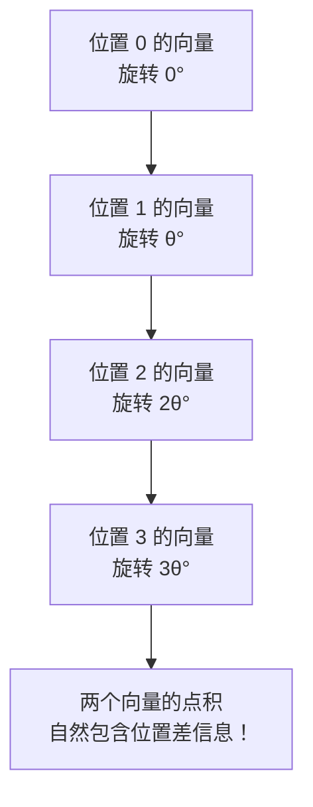

### 代码解读

```python
# model_minimind.py 第62-78行
def precompute_freqs_cis(dim, end=32768, rope_base=1e6):
    # Step 1: 计算每个维度的旋转频率
    freqs = 1.0 / (rope_base ** (torch.arange(0, dim, 2).float() / dim))
    # freqs[i] = 1 / (1000000 ^ (2i/dim))
    # 低维度 → 高频率（旋转快） → 捕捉局部位置关系
    # 高维度 → 低频率（旋转慢） → 捕捉远距离位置关系

    # Step 2: 计算每个位置的旋转角度
    t = torch.arange(end)                # 位置序列 [0, 1, 2, ..., max_len]
    freqs = torch.outer(t, freqs)        # 角度矩阵 [max_len, dim/2]
    # angles[pos, dim] = pos × freq[dim]

    # Step 3: 计算 cos 和 sin 表
    freqs_cos = torch.cat([torch.cos(freqs), torch.cos(freqs)], dim=-1)
    freqs_sin = torch.cat([torch.sin(freqs), torch.sin(freqs)], dim=-1)
    return freqs_cos, freqs_sin
```

```python
# model_minimind.py 第80-84行
def apply_rotary_pos_emb(q, k, cos, sin):
    def rotate_half(x):
        # 把向量拆成两半，交换并取反
        return torch.cat((-x[...,后半], x[...,前半]), dim=-1)

    q_embed = q * cos + rotate_half(q) * sin    # 旋转 Query
    k_embed = k * cos + rotate_half(k) * sin    # 旋转 Key
    return q_embed, k_embed
```

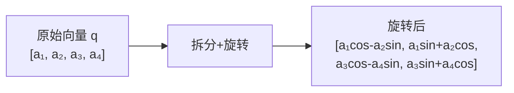

> **为什么有效**：旋转后的两个向量做点积，结果只取决于它们的**位置差**，
> 而不取决于绝对位置。这正是我们想要的相对位置编码。

---

## 4.5 自注意力机制（Self-Attention）——最核心的组件

### 整体流程

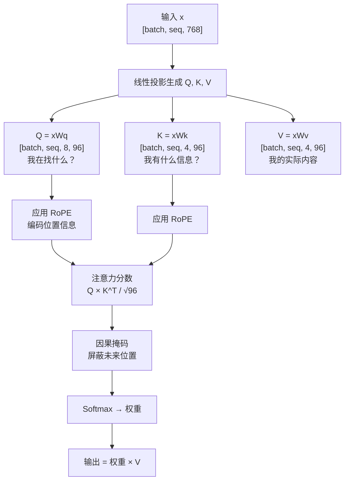

### Step 1: 生成 Q, K, V

每个词通过三个不同的线性变换，变成三种角色：

```python
# model_minimind.py 第113-116行
xq = self.q_proj(x)    # Query: "我想知道什么"    [batch, seq, 768]
xk = self.k_proj(x)    # Key:   "我有什么特征"    [batch, seq, 384]
xv = self.v_proj(x)    # Value: "我的实际内容"    [batch, seq, 384]

# 重塑为多头形式
xq = xq.view(bsz, seq_len, 8, 96)   # 8 个 Q 头，每头 96 维
xk = xk.view(bsz, seq_len, 4, 96)   # 4 个 K 头（GQA）
xv = xv.view(bsz, seq_len, 4, 96)   # 4 个 V 头（GQA）
```

### Step 2: 计算注意力分数

```python
# Q 和 K 做点积，得到每个词对其他词的"关注程度"
scores = Q @ K^T / √(head_dim)
# 形状: [batch, heads, seq, seq]
# scores[b, h, i, j] = 第 b 个样本, 第 h 个头, 第 i 个词对第 j 个词的关注度
```

```mermaid
graph TD
    subgraph "注意力分数矩阵（4×4 示例）"
        direction LR
        S[""] --- S0["我"]
        S --- S1["爱"]
        S --- S2["北京"]
        S --- S3["天安门"]
        S0_["我"] --- V00["0.8"]
        S0_ --- V01["0.3"]
        S0_ --- V02["0.1"]
        S0_ --- V03["0.0"]
        S1_["爱"] --- V10["0.5"]
        S1_ --- V11["0.9"]
        S1_ --- V12["0.2"]
        S1_ --- V13["0.1"]
        S2_["北京"] --- V20["0.3"]
        S2_ --- V21["0.4"]
        S2_ --- V22["0.7"]
        S2_ --- V23["0.6"]
        S3_["天安门"] --- V30["0.1"]
        S3_ --- V31["0.2"]
        S3_ --- V32["0.5"]
        S3_ --- V33["0.8"]
    end
```

### Step 3: 因果掩码（Causal Mask）

语言模型不能"偷看"未来的词。因果掩码把未来位置的分数设为负无穷。

```mermaid
graph TD
    subgraph "掩码矩阵"
        direction LR
        M[""] --- M0["词0"]
        M --- M1["词1"]
        M --- M2["词2"]
        M --- M3["词3"]
        M0_["词0"] --- N00["✅ 0"]
        M0_ --- N01["❌ -inf"]
        M0_ --- N02["❌ -inf"]
        M0_ --- N03["❌ -inf"]
        M1_["词1"] --- N10["✅ 0"]
        M1_ --- N11["✅ 0"]
        M1_ --- N12["❌ -inf"]
        M1_ --- N13["❌ -inf"]
        M2_["词2"] --- N20["✅ 0"]
        M2_ --- N21["✅ 0"]
        M2_ --- N22["✅ 0"]
        M2_ --- N23["❌ -inf"]
        M3_["词3"] --- N30["✅ 0"]
        M3_ --- N31["✅ 0"]
        M3_ --- N32["✅ 0"]
        M3_ --- N33["✅ 0"]
    end
```

> Softmax(-inf) = 0，所以未来位置的权重变成 0，完全不影响当前词。

### Step 4: 多头注意力

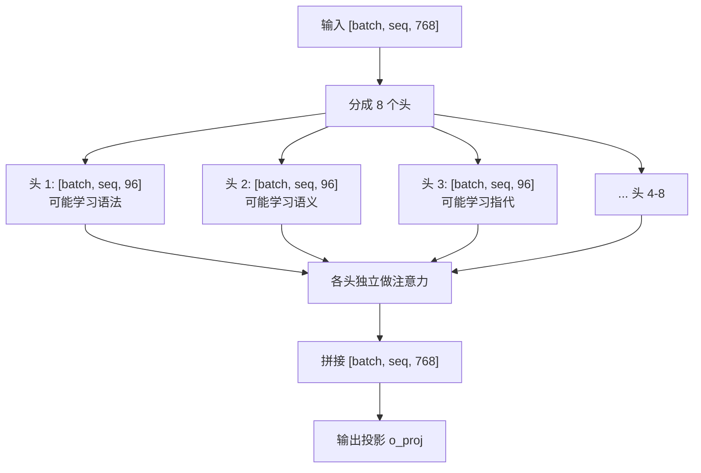

### Step 5: Grouped-Query Attention (GQA)

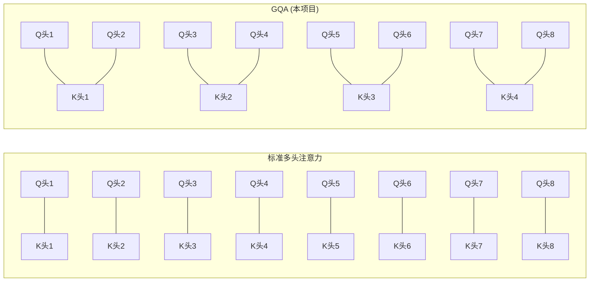

GQA 让 8 个 Q 头共享 4 组 K/V 头。好处：**减少内存、加快推理速度**，效果几乎不变。

### Step 6: KV Cache

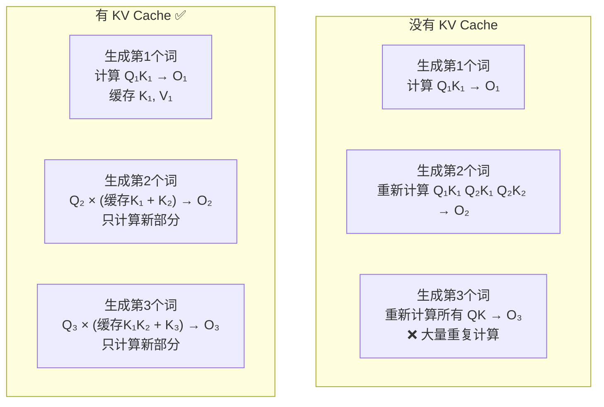

---

## 4.6 FeedForward（前馈网络）

### SwiGLU 架构

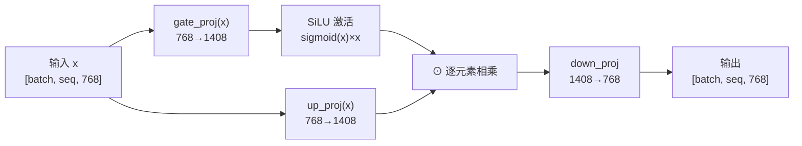

```python
# model_minimind.py 第136-146行
class FeedForward(nn.Module):
    def forward(self, x):
        return self.down_proj(self.act_fn(self.gate_proj(x)) * self.up_proj(x))
        #                ↑ 降维            ↑ SiLU激活       ↑ 升维     ↑ 升维
        #                1408→768          1408→1408         768→1408   768→1408
```

> 如果说注意力是在"收集信息"，那么 FFN 就是在"思考和处理信息"。
> 升维到 1408（几乎 2 倍），是为了给模型更多的"思考空间"。

---

## 4.7 MoE（混合专家模型）

### 核心思想

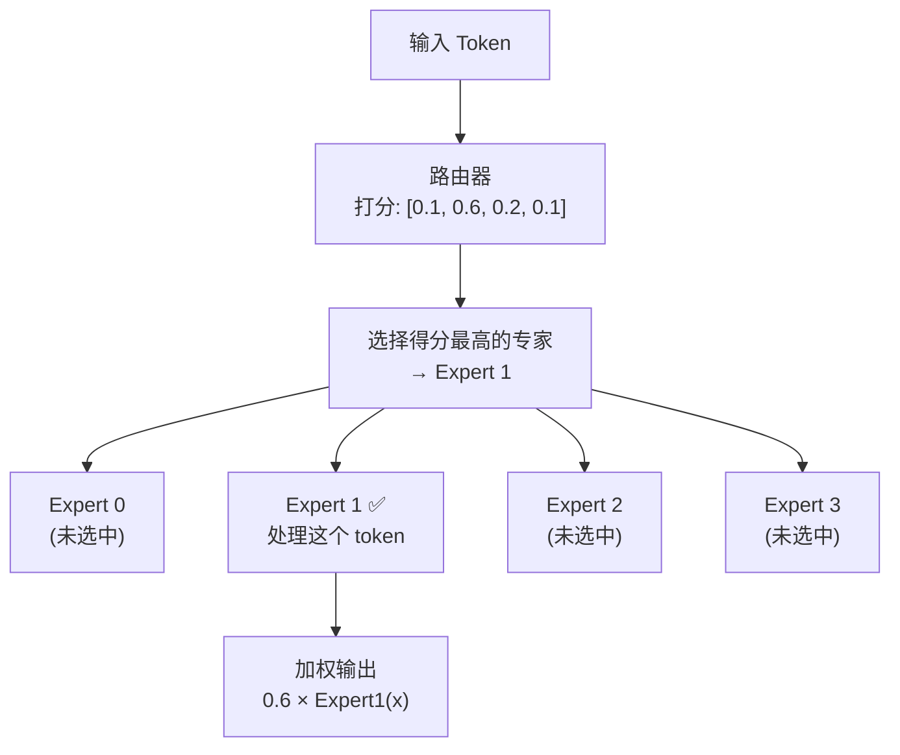

### 为什么用 MoE

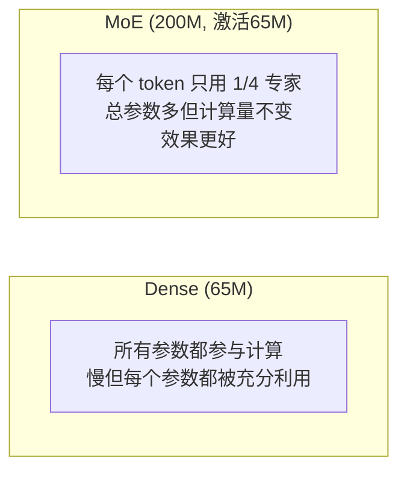

### 负载均衡损失

```python
# model_minimind.py 第171-175行
# 问题: Router 可能总是选同一个专家，其他专家浪费了
# 解决: 添加辅助损失，惩罚不均匀的专家使用

load = F.one_hot(topk_idx, num_experts).float().mean(0)  # 每个专家被选中的频率
aux_loss = (load * scores.mean(0)).sum() * num_experts * coef
# 如果所有专家被均匀选中 → aux_loss 小 ✅
# 如果某个专家总是被选中 → aux_loss 大 ❌ → 反向传播会惩罚这种行为
```

---

## 4.8 完整 Transformer Block

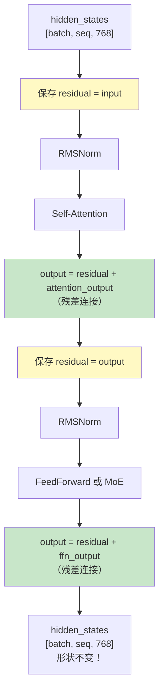

> **残差连接的关键作用**：让梯度可以直接"跳过"某些层传回去，
> 使 8 层甚至更深的网络也能正常训练。没有它，梯度会在反向传播中逐层衰减。

---

## 4.9 自回归生成

### 生成过程

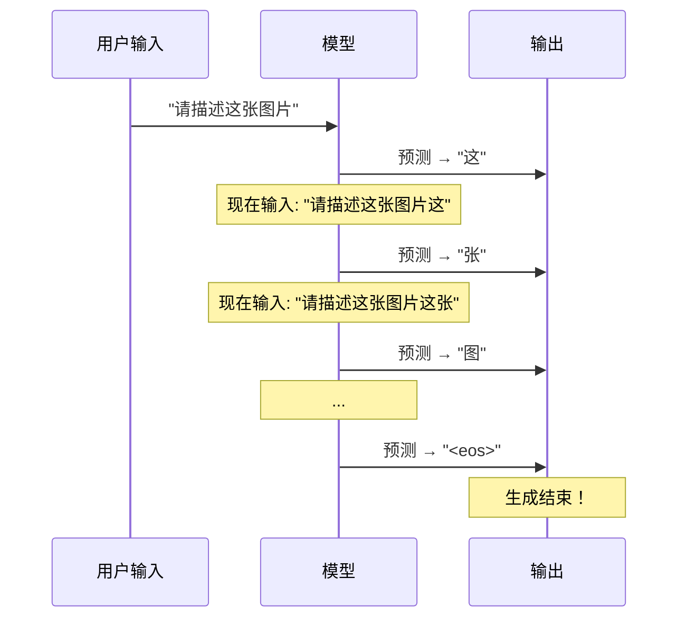

### 采样策略

#### Temperature（温度）

```mermaid
graph LR
    subgraph "T = 0.5（冷）"
        A["概率分布更尖锐<br/>更确定性的输出"]
    end
    subgraph "T = 1.0（正常）"
        B["原始概率分布"]
    end
    subgraph "T = 2.0（热）"
        C["概率分布更平坦<br/>更随机的输出"]
    end
```

#### Top-K 采样

```mermaid
flowchart LR
    A["6400 个词的概率"] --> B["只保留概率最高的 K=50 个"]
    B --> C["其余设为 0"]
    C --> D["从 50 个候选中<br/>按概率采样"]
```

#### Top-P（核采样）

```mermaid
flowchart LR
    A["按概率从高到低排序"] --> B["累加概率"]
    B --> C{"累加 > P=0.85?"}
    C -->|"否"| B
    C -->|"是"| D["截断：只保留<br/>累计概率 ≤ 0.85 的词"]
    D --> E["从候选词中采样"]
```

---

## 4.10 总结：完整数据流

```mermaid
flowchart TD
    Input["Token IDs<br/>[1, 10, 768]"] --> Emb["Embedding<br/>[1, 10, 768]"]
    Emb --> Block["× 8 Transformer Blocks"]
    Block --> Final["RMSNorm<br/>[1, 10, 768]"]
    Final --> Head["lm_head<br/>[1, 10, 6400]"]
    Head --> Prob["Softmax → 概率"]
    Prob --> Sample["采样下一个词"]

    subgraph "每个 Block 内部"
        B1["RMSNorm → Attention → 残差"] --> B2["RMSNorm → FFN → 残差"]
    end

    subgraph "Attention 内部"
        A1["Q, K, V 投影"] --> A2["RoPE 位置编码"]
        A2 --> A3["Q×K^T / √d"]
        A3 --> A4["因果掩码"]
        A4 --> A5["Softmax"]
        A5 --> A6["× V"]
    end
```

---

## 4.11 自我检测

1. ✅ 为什么 Transformer 比 RNN 好？（并行计算、长距离依赖）
2. ✅ Q、K、V 分别代表什么？（Query=我在找什么，Key=我有什么，Value=我的内容）
3. ✅ 因果掩码为什么是上三角为 -inf？（不能看到未来的词）
4. ✅ GQA 和标准多头注意力有什么区别？（K/V 头更少，节省内存）
5. ✅ RoPE 是如何编码位置的？（旋转 Q 和 K，点积自然包含相对位置）
6. ✅ MoE 的好处是什么？（总参数多但激活参数少，效果好计算量不变）
7. ✅ Temperature > 1 会让输出更随机还是更确定？（更随机）
8. ✅ 残差连接为什么重要？（让梯度直接传播，训练更稳定）
