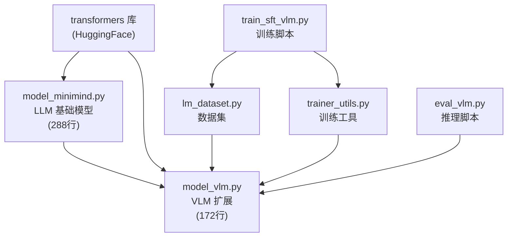
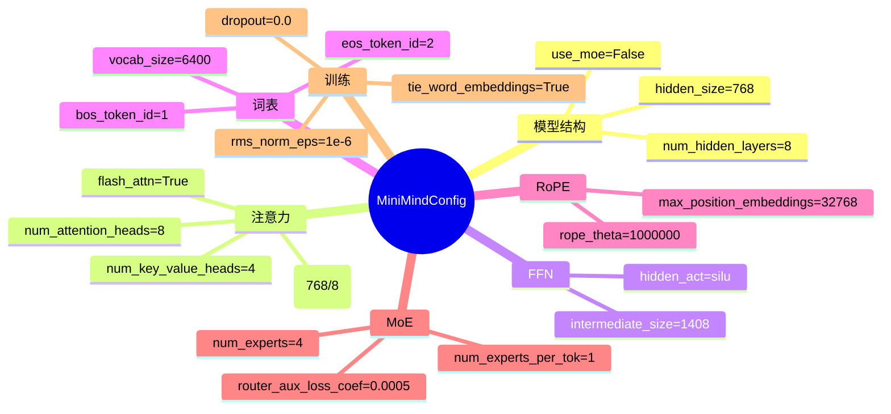
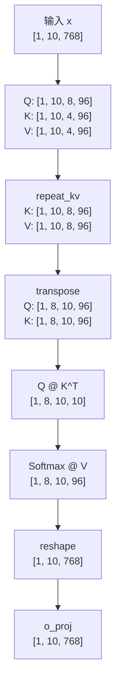
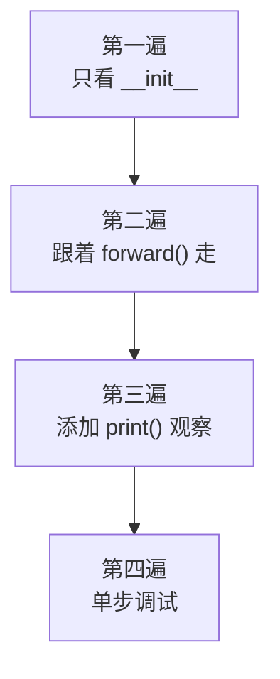

# 第五阶段：阅读 MiniMind LLM 源码

> 🎯 **目标**：逐行精读语言模型源码，将理论知识与代码对应
> ⏰ **预计时间**：1 周
> 📌 **前提**：已完成第一至第四阶段

---

## 5.1 文件依赖关系



---

## 5.2 逐类精读 model_minimind.py

### MiniMindConfig（第10-45行）

```python
class MiniMindConfig(PretrainedConfig):
    model_type = "minimind"
    def __init__(self, hidden_size=768, num_hidden_layers=8, use_moe=False, **kwargs):
```

所有参数一览：



### RMSNorm（第50-60行）

```python
class RMSNorm(torch.nn.Module):
    def __init__(self, dim: int, eps: float = 1e-5):
        super().__init__()
        self.eps = eps
        self.weight = nn.Parameter(torch.ones(dim))  # [768] 可学习参数

    def norm(self, x):
        # x: [batch, seq, 768]
        # x.pow(2): [batch, seq, 768] 每个元素平方
        # .mean(-1, keepdim=True): [batch, seq, 1] 求最后一维的平均
        # torch.rsqrt: 1/√(均值+eps)
        # x * ...: [batch, seq, 768] 广播乘法
        return x * torch.rsqrt(x.pow(2).mean(-1, keepdim=True) + self.eps)

    def forward(self, x):
        return (self.weight * self.norm(x.float())).type_as(x)
        # weight: [768] 逐元素缩放
        # x.float(): 转 float32 保证精度
        # .type_as(x): 转回原类型（如 bfloat16）
```

### precompute_freqs_cis（第62-78行）

```python
def precompute_freqs_cis(dim: int, end: int = 32768, rope_base: float = 1e6):
    # dim = 96 (head_dim), end = 32768 (max_position_embeddings)

    # Step 1: 频率表 [dim/2] = [48]
    freqs = 1.0 / (rope_base ** (torch.arange(0, dim, 2)[:dim//2].float() / dim))
    # freqs[i] = 1 / (1000000 ^ (2i/96))
    # i=0: freq = 1.0        (高频，捕捉相邻位置)
    # i=47: freq ≈ 0.00001   (低频，捕捉远距离位置)

    # YaRN 扩展（如果启用）
    if rope_scaling is not None:
        # 对频率做线性插值，支持更长的上下文
        ramp = ...
        freqs = freqs * (1 - ramp + ramp / factor)

    # Step 2: 位置 × 频率 = 角度矩阵 [32768, 48]
    t = torch.arange(end)
    freqs = torch.outer(t, freqs)

    # Step 3: cos/sin 表 [32768, 96]
    freqs_cos = torch.cat([torch.cos(freqs), torch.cos(freqs)], dim=-1)
    freqs_sin = torch.cat([torch.sin(freqs), torch.sin(freqs)], dim=-1)
    return freqs_cos, freqs_sin
```

### Attention（第91-134行）

这是最重要的类。逐行解析 `forward()`：

```python
def forward(self, x, position_embeddings, past_key_value=None, use_cache=False):
    bsz, seq_len, _ = x.shape    # [batch, seq, 768]

    # 1. 线性投影生成 Q, K, V
    xq = self.q_proj(x)          # [batch, seq, 768] → [batch, seq, 768]
    xk = self.k_proj(x)          # [batch, seq, 384] (GQA: 4个KV头 × 96维)
    xv = self.v_proj(x)          # [batch, seq, 384]

    # 2. 重塑为多头格式
    xq = xq.view(bsz, seq_len, 8, 96)   # [batch, seq, 8_Q_heads, 96]
    xk = xk.view(bsz, seq_len, 4, 96)   # [batch, seq, 4_KV_heads, 96]
    xv = xv.view(bsz, seq_len, 4, 96)

    # 3. QK 归一化（提升训练稳定性）
    xq, xk = self.q_norm(xq), self.k_norm(xk)

    # 4. 应用 RoPE 位置编码
    cos, sin = position_embeddings
    xq, xk = apply_rotary_pos_emb(xq, xk, cos, sin)

    # 5. KV Cache: 拼接过去的 K, V
    if past_key_value is not None:
        xk = torch.cat([past_key_value[0], xk], dim=1)   # 沿序列维度拼接
        xv = torch.cat([past_key_value[1], xv], dim=1)
    past_kv = (xk, xv) if use_cache else None

    # 6. 转置 + repeat_kv 为注意力计算做准备
    xq = xq.transpose(1, 2)                          # [batch, 8, seq, 96]
    xk = repeat_kv(xk.transpose(1, 2), self.n_rep)   # [batch, 8, total_seq, 96]
    xv = repeat_kv(xv.transpose(1, 2), self.n_rep)   # [batch, 8, total_seq, 96]

    # 7. 计算注意力
    if self.flash:
        # Flash Attention 路径（更快）
        output = F.scaled_dot_product_attention(xq, xk, xv, is_causal=True)
    else:
        # 手动计算路径
        scores = (xq @ xk.transpose(-2, -1)) / math.sqrt(96)  # [batch, 8, seq, total_seq]
        scores[:, :, :, -seq_len:] += causal_mask                 # 因果掩码
        output = F.softmax(scores, dim=-1) @ xv                  # Softmax + 乘V

    # 8. 输出投影
    output = output.transpose(1, 2).reshape(bsz, seq_len, -1)  # [batch, seq, 768]
    output = self.o_proj(output)                                 # [batch, seq, 768]
    return output, past_kv
```

维度变化完整追踪：



### FeedForward（第136-146行）

```python
class FeedForward(nn.Module):
    def __init__(self, config):
        # gate_proj: 768 → 1408  (升维)
        # up_proj:   768 → 1408  (升维，与 gate 配合)
        # down_proj: 1408 → 768  (降维)
        # act_fn: SiLU (sigmoid(x) * x)
        self.gate_proj = nn.Linear(config.hidden_size, intermediate_size, bias=False)
        self.down_proj = nn.Linear(intermediate_size, config.hidden_size, bias=False)
        self.up_proj = nn.Linear(config.hidden_size, intermediate_size, bias=False)
        self.act_fn = ACT2FN[config.hidden_act]  # SiLU

    def forward(self, x):
        return self.down_proj(self.act_fn(self.gate_proj(x)) * self.up_proj(x))
        #               1408→768     SiLU激活       768→1408         768→1408
```

### MiniMindBlock（第178-194行）

```python
class MiniMindBlock(nn.Module):
    def __init__(self, layer_id, config):
        self.self_attn = Attention(config)                           # 注意力
        self.input_layernorm = RMSNorm(config.hidden_size)          # 注意力前的归一化
        self.post_attention_layernorm = RMSNorm(config.hidden_size) # FFN前的归一化
        self.mlp = FeedForward(config) if not config.use_moe \
              else MOEFeedForward(config)                           # FFN 或 MoE

    def forward(self, hidden_states, position_embeddings, ...):
        residual = hidden_states                                    # 保存输入
        hidden_states, present = self.self_attn(                    # 注意力
            self.input_layernorm(hidden_states),                    # ← 先归一化
            position_embeddings, past_key_value, use_cache)
        hidden_states += residual                                   # ← 残差连接

        residual = hidden_states                                    # 保存
        hidden_states = self.mlp(                                   # FFN
            self.post_attention_layernorm(hidden_states))           # ← 先归一化
        hidden_states += residual                                   # ← 残差连接

        return hidden_states, present
```

### MiniMindForCausalLM（第234-288行）

```python
class MiniMindForCausalLM(PreTrainedModel, GenerationMixin):
    def __init__(self, config):
        self.model = MiniMindModel(config)                # Transformer 主体
        self.lm_head = nn.Linear(768, 6400, bias=False)   # 输出映射到词表
        if config.tie_word_embeddings:
            self.model.embed_tokens.weight = self.lm_head.weight  # 共享权重

    def forward(self, input_ids, labels=None, ...):
        hidden_states, past_kv, aux_loss = self.model(input_ids, ...)  # Transformer
        logits = self.lm_head(hidden_states)                             # [batch, seq, 6400]
        if labels is not None:
            # Shift + 交叉熵损失
            loss = F.cross_entropy(logits[..., :-1, :], labels[..., 1:], ignore_index=-100)
        return MoeCausalLMOutputWithPast(loss=loss, logits=logits, ...)
```

---

## 5.3 阅读方法建议



**实用技巧**：在关键位置添加 print 查看张量形状：

```python
def forward(self, input_ids, ...):
    print(f"1. input_ids: {input_ids.shape}")
    hidden_states = self.model.embed_tokens(input_ids)
    print(f"2. after embedding: {hidden_states.shape}")
    hidden_states = self.model.norm(hidden_states)
    print(f"3. after transformer: {hidden_states.shape}")
    logits = self.lm_head(hidden_states)
    print(f"4. logits: {logits.shape}")
```

---

## 5.4 关键维度速查表

| 位置 | 变量 | 形状 |
|------|------|------|
| 输入 | `input_ids` | `[batch, seq_len]` |
| 嵌入后 | `hidden_states` | `[batch, seq_len, 768]` |
| Q 投影后 | `xq` | `[batch, seq_len, 8, 96]` |
| K 投影后 | `xk` | `[batch, seq_len, 4, 96]` |
| repeat_kv 后 | `xk` | `[batch, seq_len, 8, 96]` |
| 转置后 | `xq` | `[batch, 8, seq_len, 96]` |
| 注意力分数 | `scores` | `[batch, 8, seq_len, seq_len]` |
| 注意力输出 | `output` | `[batch, seq_len, 768]` |
| FFN 中间 | `gate/up` | `[batch, seq_len, 1408]` |
| FFN 输出 | `down` | `[batch, seq_len, 768]` |
| lm_head 后 | `logits` | `[batch, seq_len, 6400]` |
