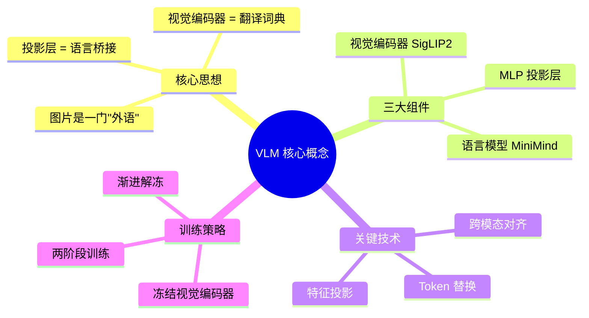
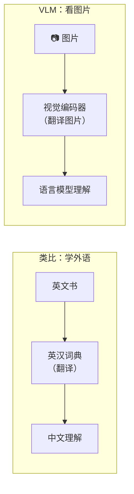
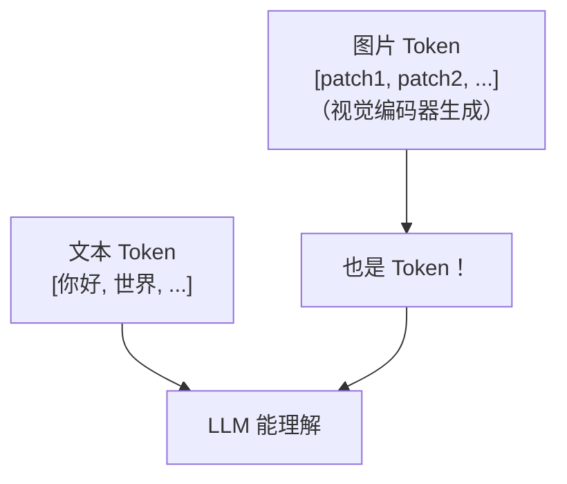
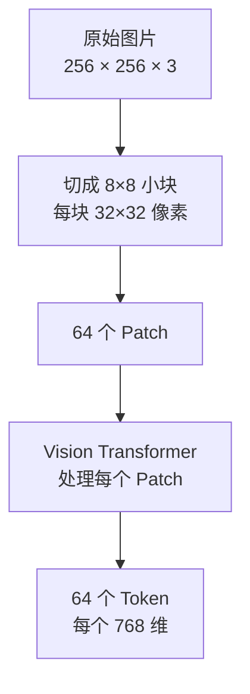
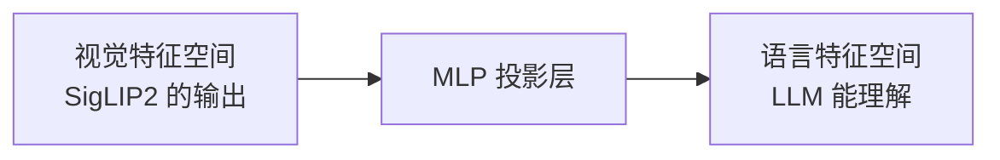
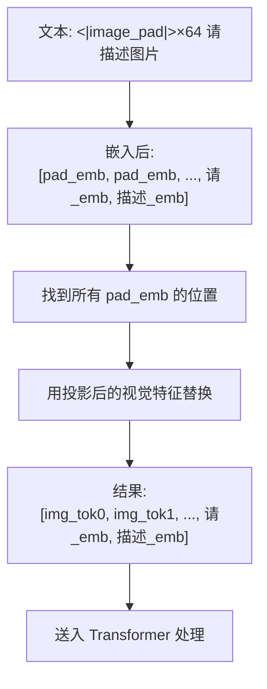
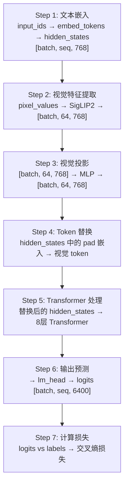
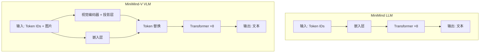
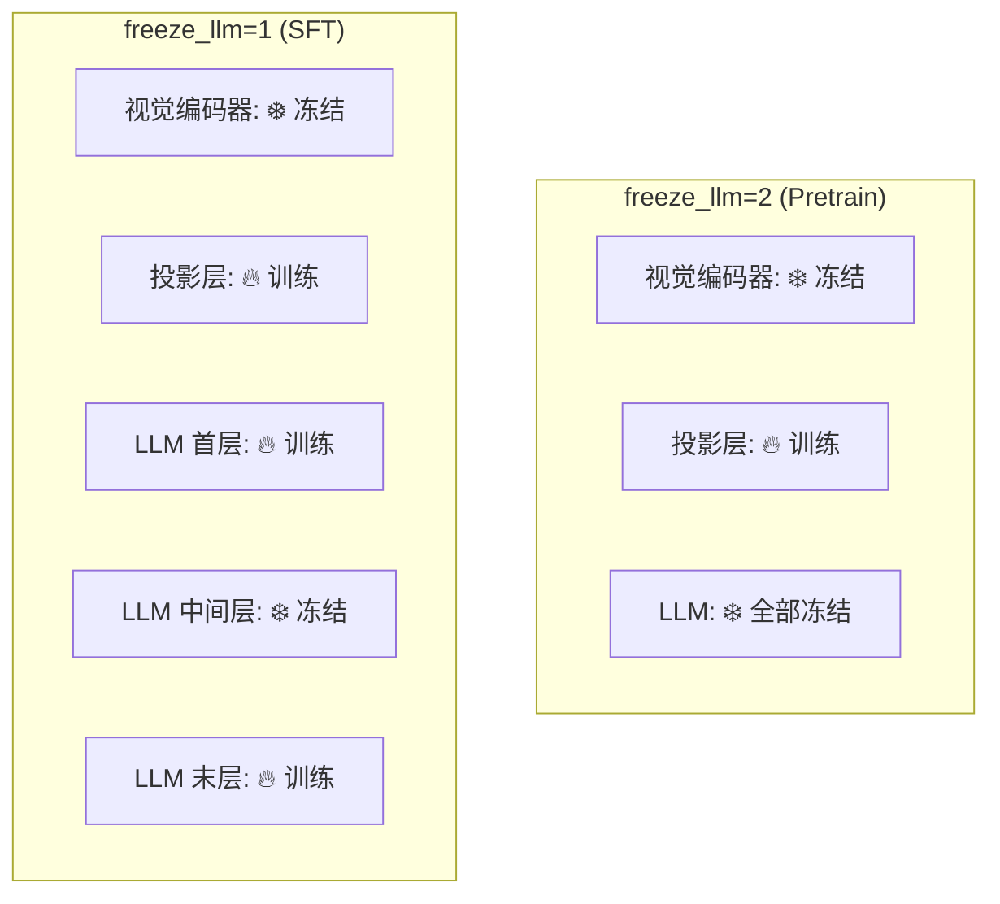

# 第六阶段：视觉语言模型（VLM）核心概念

> 🎯 **目标**：理解如何让语言模型"看懂"图片
> ⏰ **预计时间**：1-2 周
> 📌 **前提**：已完成第一至第五阶段

---

## 本章知识地图



---

## 6.1 VLM 的核心思想

### 一句话总结

> **图片就是一门"外语"，视觉编码器就是"翻译词典"，把图片翻译成语言模型能理解的"语言"。**



### 为什么这样可以工作？

语言模型（LLM）本质上是处理 **token 序列**的工具。如果能把图片变成一系列 token，LLM 就能处理它。



---

## 6.2 三大组件详解

### 整体架构

```mermaid
flowchart TD
    Img["📷 图片<br/>256×256"] --> VE["视觉编码器<br/>SigLIP2<br/>(~95M 参数, 冻结)"]
    VE --> VF["64 个视觉 Token<br/>每个 768 维"]
    VF --> Proj["MLP 投影层<br/>(~1M 参数, 训练)"]
    Proj --> Aligned["64 个对齐 Token<br/>每个 768 维"]

    Txt["📝 文本<br/>请描述这张图"] --> Tok["分词器"]
    Tok --> Emb["嵌入层<br/>文本 Token 嵌入"]

    Aligned --> Merge["Token 合并<br/>图片 Token 替换占位符"]
    Emb --> Merge
    Merge --> LLM["Transformer ×8<br/>(~64M 参数, 部分训练)"]
    LLM -> Output["输出文本"]

    style VE fill:#ffebee
    style Proj fill:#e8f5e9
    style LLM fill:#e3f2fd
```

---

### 组件1：视觉编码器（SigLIP2）

**做什么**：把 256×256 的图片变成 64 个 768 维的向量



```python
# model_vlm.py 第46-59行
@staticmethod
def get_vision_model(model_path):
    model = SiglipVisionModel.from_pretrained(model_path)  # 加载预训练模型
    processor = SiglipImageProcessor.from_pretrained(model_path)

    # 关键：冻结所有参数！
    for param in model.parameters():
        param.requires_grad = False   # 不计算梯度，不更新权重

    return model.eval(), processor    # 设为评估模式
```

**为什么要冻结？**

```mermaid
graph LR
    A["SigLIP2 已在数亿图文对上<br/>训练过"] --> B["已经很擅长提取<br/>图片特征了"]
    B --> C["我们不需要重新教它<br/>怎么"看"图片"]
    C --> D["冻结 = 直接拿来用<br/>省时间 + 省显存"]
```

**图片预处理**：

```python
# model_vlm.py 第62-65行
@staticmethod
def image2tensor(image, processor):
    if image.mode in ['RGBA', 'LA']:
        image = image.convert('RGB')       # 确保是 RGB 格式
    inputs = processor(images=image, return_tensors="pt")  # 预处理
    return inputs
    # 返回: {pixel_values: [1, 3, 256, 256], pixel_mask: [1, 256, 256]}
```

**提取视觉特征**：

```python
# model_vlm.py 第68-73行
@staticmethod
def get_image_embeddings(image_inputs, vision_model):
    with torch.no_grad():                           # 不计算梯度
        outputs = vision_model(**image_inputs)      # 前向传播
    return outputs.last_hidden_state                 # [1, 64, 768]
```

---

### 组件2：MLP 投影层

**做什么**：把视觉特征"翻译"到语言模型的语义空间



```python
# model_vlm.py 第23-33行
class MMVisionProjector(nn.Module):
    def __init__(self, in_dim, out_dim):
        self.mlp = nn.Sequential(
            nn.LayerNorm(in_dim),          # 归一化 [768 → 768]
            nn.Linear(in_dim, out_dim),    # 线性变换 [768 → 768]
            nn.GELU(),                     # 激活函数
            nn.Linear(out_dim, out_dim),   # 线性变换 [768 → 768]
        )

    def forward(self, x):
        return self.mlp(x)
        # 输入: [batch, 64, 768] → 输出: [batch, 64, 768]
        # 维度没变，但语义空间变了！
```

**为什么需要投影层？**

```mermaid
graph TD
    subgraph "没有投影层 ❌"
        A["视觉特征和文本特征<br/>在不同的空间"]
        B["LLM 无法理解<br/>视觉特征的含义"]
    end
    subgraph "有投影层 ✅"
        C["视觉特征被"翻译"<br/>到文本特征空间"]
        D["LLM 把视觉 token<br/>当作"另一种文字"处理"]
    end
```

---

### 组件3：Token 替换（核心技巧）

**这是 VLM 最关键的一步**：把图片特征"塞进"文本序列中。



```python
# model_vlm.py 第75-96行 (简化版)
def count_vision_proj(self, tokens, h, vision_tensors):
    marker = self.config.image_ids[0]   # <|image_pad|> 的 ID = 12
    out = []
    for b in range(batch_size):
        hb = h[b]                       # 当前样本的嵌入 [seq, 768]
        seq = tokens[b].tolist()        # 当前样本的 token ID 列表
        k = 0                           # 第几张图
        i = 0                           # 当前位置
        while i < len(seq):
            if seq[i] == marker:        # 找到了 <|image_pad|>
                start = i
                while i < len(seq) and seq[i] == marker:
                    i += 1              # 跳过所有连续的占位符
                # 用视觉特征替换这段占位符
                hb = torch.cat((hb[:start], vf[b][k][:i-start], hb[i:]))
                k += 1
            else:
                i += 1
        out.append(hb)
    return torch.stack(out)
```

---

## 6.3 VLM forward() 完整流程



---

## 6.4 LLM vs VLM 的区别



**改动量极小**：VLM 在 LLM 基础上只新增了约 50 行核心代码：
- `VLMConfig`：9 行（添加图片配置）
- `MMVisionProjector`：10 行（投影层）
- `count_vision_proj()`：20 行（Token 替换）
- `forward()` 修改：约 30 行（视觉处理）

---

## 6.5 冻结策略



---

## 6.6 自我检测

1. ✅ VLM 的核心思想是什么？（图片=外语，视觉编码器=词典）
2. ✅ 为什么要冻结视觉编码器？（已经训练好了，不需要重新训练）
3. ✅ 投影层的作用是什么？（把视觉特征翻译到语言模型的语义空间）
4. ✅ Token 替换是怎么工作的？（用视觉特征替换文本中的图片占位符嵌入）
5. ✅ 为什么 SFT 要解冻首末层？（首层处理视觉融合，末层影响输出格式）
