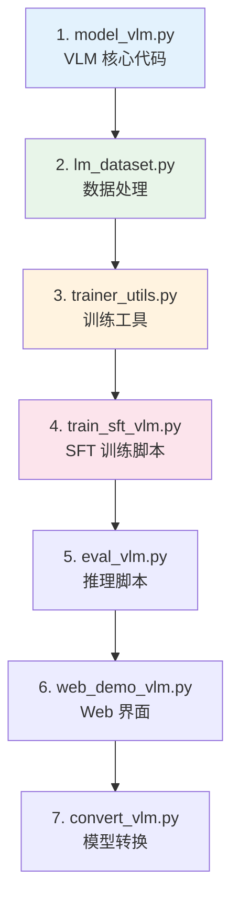
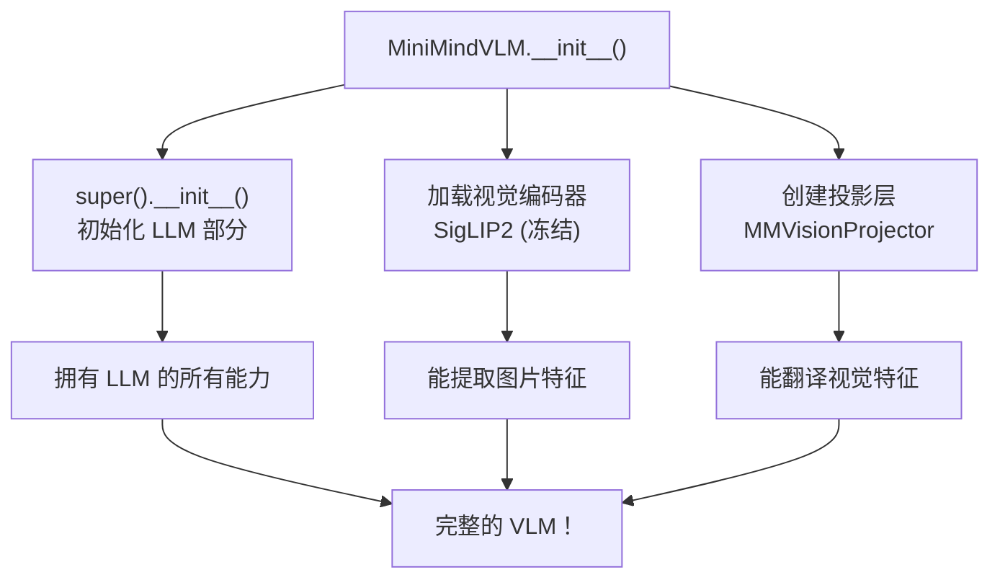
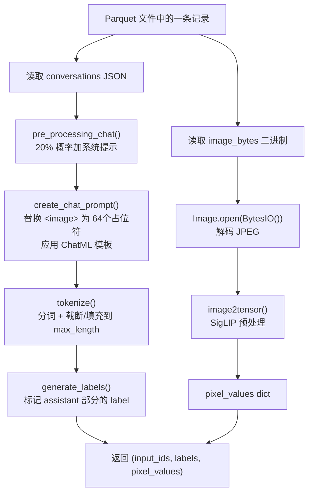
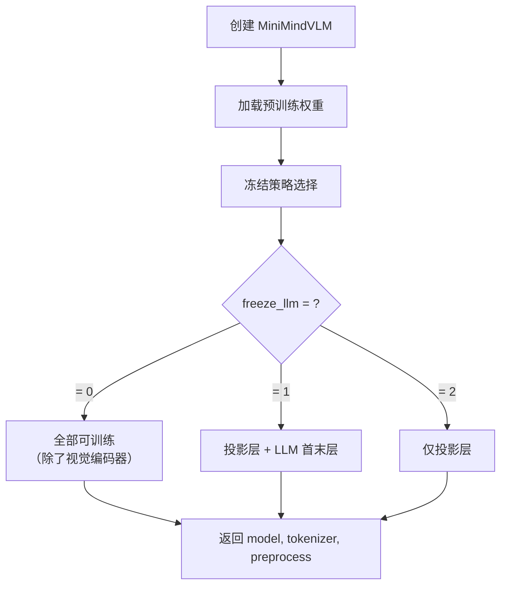
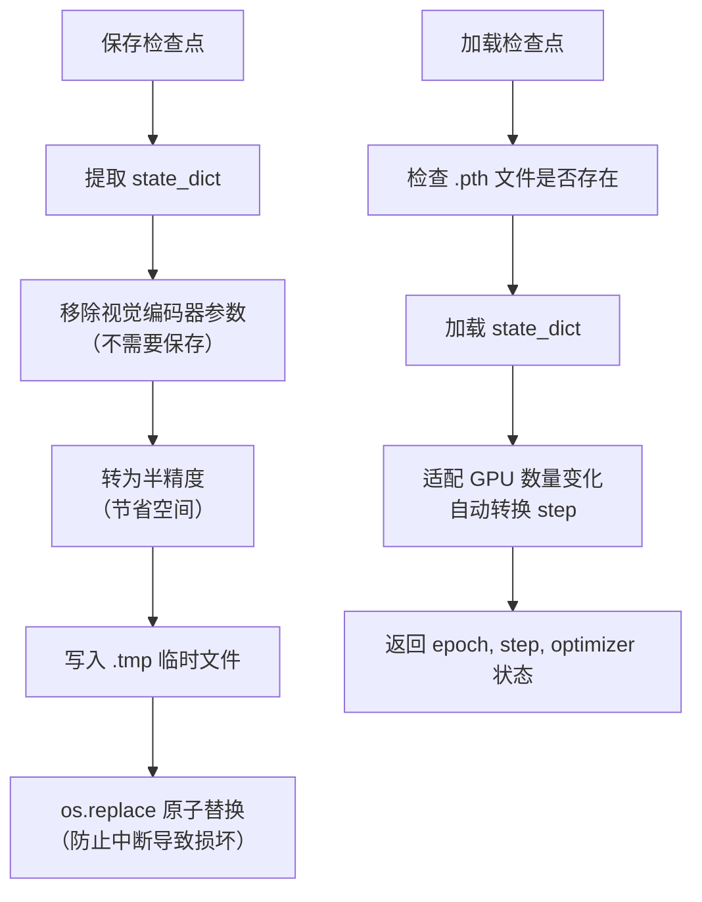
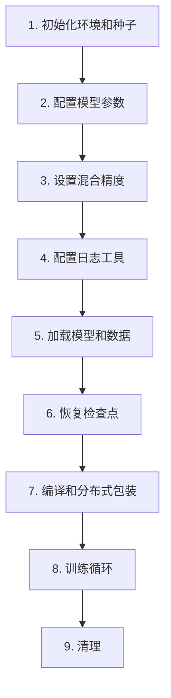
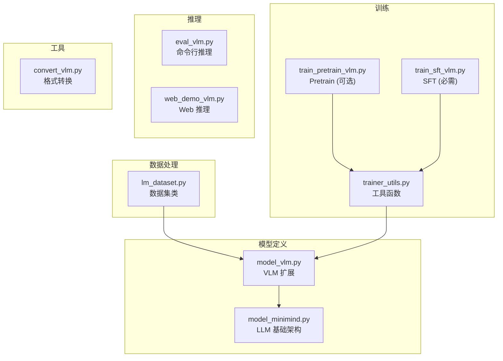

# 第七阶段：阅读 MiniMind-V 源码

> 🎯 **目标**：按正确顺序阅读 VLM 扩展部分的全部代码
> ⏰ **预计时间**：1 周
> 📌 **前提**：已完成第一至第六阶段

---

## 7.1 代码阅读路线



---

## 7.2 精读 model_vlm.py

### VLMConfig（第13-21行）

```python
class VLMConfig(MiniMindConfig):      # 继承 LLM 的配置
    model_type = "minimind-v"

    def __init__(self,
        image_special_token='<|image_pad|>',   # 图片占位符
        image_ids=[12],                         # 占位符的 token ID
        image_hidden_size=768,                  # 视觉特征维度
        image_token_len=64,                     # 每张图的 token 数
        **kwargs):
        self.image_special_token = image_special_token
        self.image_ids = image_ids
        self.image_hidden_size = image_hidden_size
        self.image_token_len = image_token_len
        super().__init__(**kwargs)              # 传递其余参数给父类
```

### MiniMindVLM 类（第36-172行）

```python
class MiniMindVLM(MiniMindForCausalLM):    # 继承 LLM！
    config_class = VLMConfig

    def __init__(self, config, vision_model_path="./model/siglip2-base-p32-256-ve"):
        self.config = config or VLMConfig()
        super().__init__(self.config)                     # 初始化 LLM 部分
        self.vision_encoder, self.processor = \           # 加载视觉编码器
            self.__class__.get_vision_model(vision_model_path)
        self.vision_proj = MMVisionProjector(             # 创建投影层
            self.config.image_hidden_size,                # 输入: 768 (视觉特征)
            self.config.hidden_size)                      # 输出: 768 (LLM 隐藏维度)
```



### forward() 方法（第98-163行）

逐段解析：

```python
def forward(self, input_ids, labels=None, pixel_values=None, **args):
    batch_size, seq_length = input_ids.shape

    # === Step 1: 文本嵌入 ===
    hidden_states = self.model.dropout(self.model.embed_tokens(input_ids))
    # [batch, seq, 768]

    # === Step 2: 处理视觉输入 ===
    if pixel_values is not None and start_pos == 0:
        # 2a: 提取视觉特征
        if hasattr(pixel_values, 'keys'):  # 字典格式 (SigLIP 输出)
            vision_tensors = self.vision_proj(
                MiniMindVLM.get_image_embeddings(pixel_values, self.vision_encoder))
        # 2b: Token 替换
        hidden_states = self.count_vision_proj(
            tokens=input_ids, h=hidden_states,
            vision_tensors=vision_tensors, seqlen=seq_length)

    # === Step 3: Transformer 处理 ===
    for layer_idx, (layer, past_key_value) in enumerate(
            zip(self.model.layers, past_key_values)):
        hidden_states, present = layer(
            hidden_states, position_embeddings,
            past_key_value=past_key_value, use_cache=use_cache)
        presents.append(present)

    # === Step 4: 输出 ===
    hidden_states = self.model.norm(hidden_states)
    logits = self.lm_head(hidden_states[:, slice_indices, :])

    # === Step 5: 计算损失 ===
    if labels is not None:
        loss = F.cross_entropy(
            logits[..., :-1, :].contiguous(),
            labels[..., 1:].contiguous(),
            ignore_index=-100)
```

### generate() 方法（第165-172行）

```python
def generate(self, *args, num_return_sequences=1, **kwargs):
    # 支持多图：如果有 pixel_values，复制多份
    if num_return_sequences > 1 and 'pixel_values' in kwargs:
        pv = kwargs['pixel_values']
        kwargs['pixel_values'] = {k: v.repeat(num_return_sequences, ...)
                                  for k, v in pv.items()}
    # 调用父类 (LLM) 的 generate 方法
    return super().generate(*args, num_return_sequences=num_return_sequences, **kwargs)
```

---

## 7.3 精读 lm_dataset.py

### 数据处理流程



```python
# lm_dataset.py 第92-115行 (简化版)
def __getitem__(self, index):
    # 1. 读取数据
    conversations = json.loads(self.table['conversations'][index].as_py())
    image_bytes = self.table['image_bytes'][index].as_py()

    # 2. 处理文本
    conversations = pre_processing_chat(conversations)  # 随机加系统提示
    prompt = self.create_chat_prompt(conversations)      # 应用模板
    input_ids = self.tokenizer(prompt).input_ids[:768]   # 分词 + 截断
    input_ids += [pad_token_id] * (768 - len(input_ids)) # 填充
    labels = self.generate_labels(input_ids)             # 生成标签

    # 3. 处理图片
    image = Image.open(io.BytesIO(image_bytes))
    image_data = MiniMindVLM.image2tensor(image, self.preprocess)

    return torch.tensor(input_ids), torch.tensor(labels), image_data
```

---

## 7.4 精读 trainer_utils.py

### init_vlm_model（第66-97行）



```python
def init_vlm_model(vlm_config, from_weight='pretrain_vlm', freeze_llm=0):
    tokenizer = AutoTokenizer.from_pretrained(tokenizer_path)
    model = MiniMindVLM(vlm_config)

    # 加载权重
    if from_weight != 'none':
        weights = torch.load(weight_path)
        model.load_state_dict(weights, strict=False)

    # Step 1: 先冻结一切（除了 vision_proj）
    for name, param in model.named_parameters():
        if 'vision_proj' not in name:
            param.requires_grad = False

    # Step 2: 根据 freeze_llm 策略解冻
    if freeze_llm == 0:      # 全参训练
        for name, param in model.named_parameters():
            if 'vision_encoder' not in name:
                param.requires_grad = True
    elif freeze_llm == 1:    # 首末层
        for name, param in model.model.named_parameters():
            if 'layers.0.' in name or f'layers.{last_idx}.' in name:
                param.requires_grad = True
    elif freeze_llm == 2:    # 仅投影层
        pass  # 已经只有 vision_proj 是可训练的

    return model.to(device), tokenizer, preprocess
```

### vlm_checkpoint（第100-155行）



---

## 7.5 精读 train_sft_vlm.py

### 训练入口（第89-178行）



### 训练循环详解（第24-86行）

```python
def train_epoch(epoch, loader, iters, start_step=0):
    for step, (input_ids, labels, pixel_values) in enumerate(loader):
        # 1. 数据移到 GPU
        input_ids = input_ids.to(device)
        labels = labels.to(device)
        pixel_values = pixel_values.to(device)

        # 2. 更新学习率（余弦退火）
        lr = get_lr(epoch * iters + step, total_steps, learning_rate)

        # 3. 前向传播（混合精度）
        with autocast_ctx:
            res = model(input_ids, labels=labels, pixel_values=pixel_values)
            loss = (res.loss + res.aux_loss) / accumulation_steps

        # 4. 反向传播
        scaler.scale(loss).backward()

        # 5. 梯度累积 + 裁剪 + 更新
        if step % accumulation_steps == 0:
            scaler.unscale_(optimizer)
            torch.nn.utils.clip_grad_norm_(model.parameters(), 1.0)
            scaler.step(optimizer)
            scaler.update()
            optimizer.zero_grad(set_to_none=True)

        # 6. 定期保存
        if step % save_interval == 0:
            torch.save(model.state_dict(), ckp_path)
```

---

## 7.6 精读 eval_vlm.py

```python
# eval_vlm.py 完整流程
# 1. 加载模型
model = MiniMindVLM(VLMConfig())
model.load_state_dict(torch.load(weight_path))

# 2. 对每张评估图片
for image_path in eval_images:
    image = Image.open(image_path)
    pixel_values = MiniMindVLM.image2tensor(image, processor)

    # 3. 构造 prompt
    prompt = "<|image_pad|>" * 64 + "\n请描述这张图中的主要物体和场景。"

    # 4. 应用对话模板 + 分词
    input_ids = tokenizer(apply_chat_template(prompt))

    # 5. 自回归生成
    output_ids = model.generate(input_ids, pixel_values=pixel_values,
                                 max_new_tokens=500, temperature=0.7)

    # 6. 解码输出
    response = tokenizer.decode(output_ids)
    print(response)
```

---

## 7.7 文件功能速查



---

## 7.8 自我检测

1. ✅ `MiniMindVLM` 继承了哪个类？新增了哪些组件？（MiniMindForCausalLM，新增视觉编码器和投影层）
2. ✅ `count_vision_proj()` 做了什么？（用视觉特征替换文本中的图片占位符嵌入）
3. ✅ `generate_labels()` 如何标记训练标签？（assistant 部分用真实 token ID，其他用 -100）
4. ✅ 三种冻结策略各适合什么场景？（0=数据足够多，1=SFT默认，2=Pretrain默认）
5. ✅ 为什么检查点保存要用 `.tmp + os.replace`？（原子操作，防止中断导致文件损坏）
