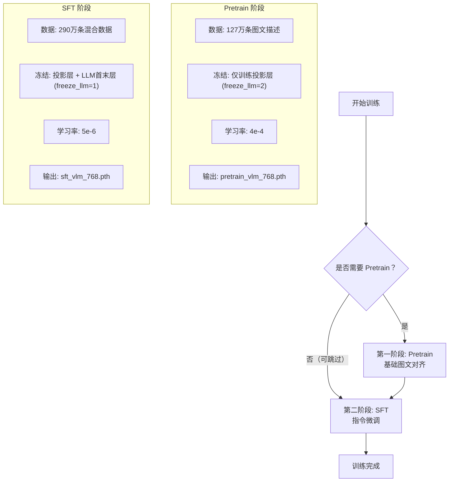
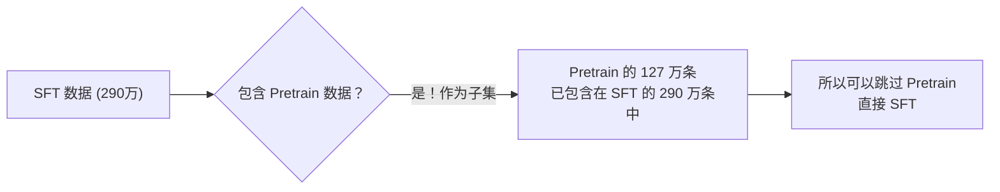
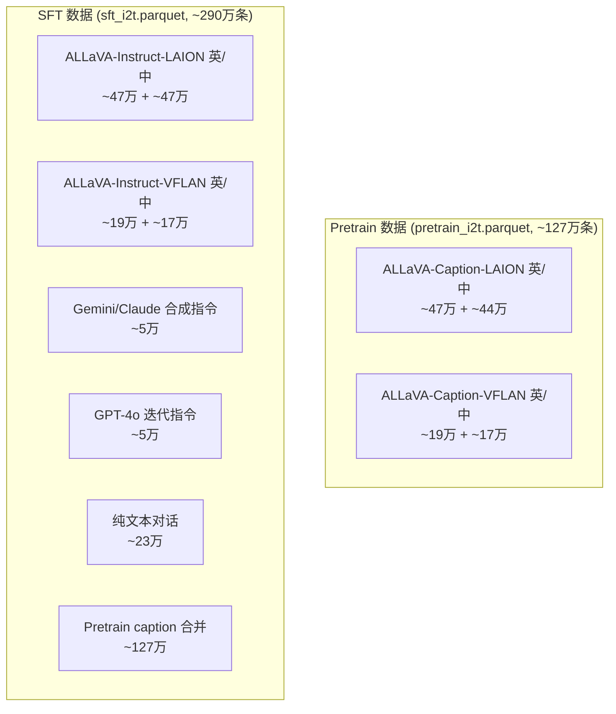
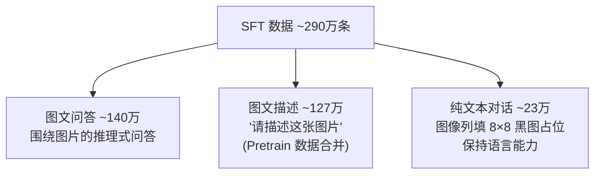
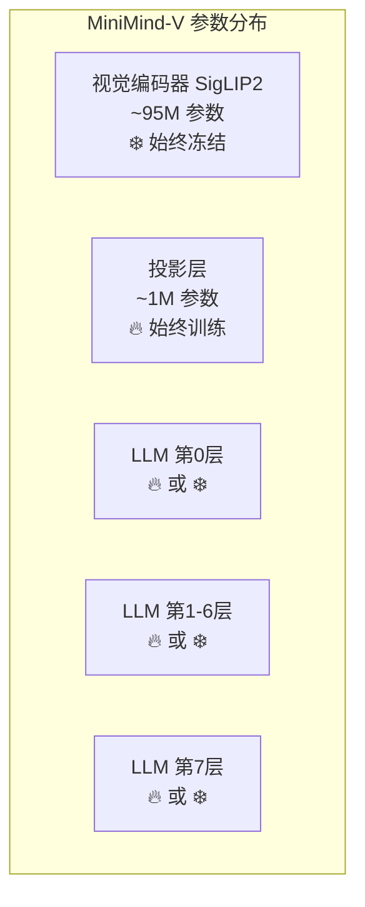
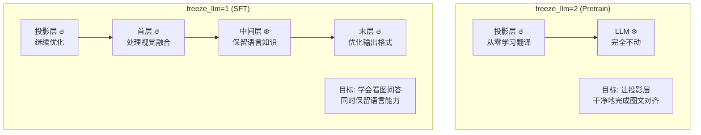
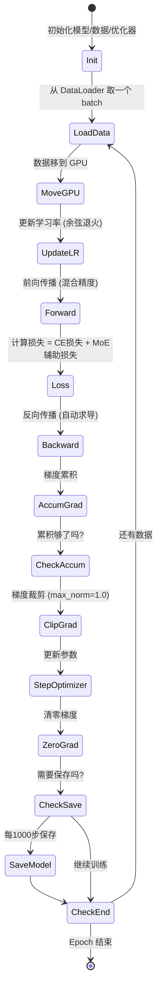
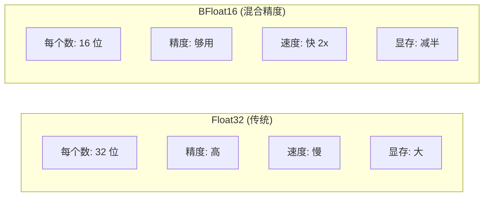
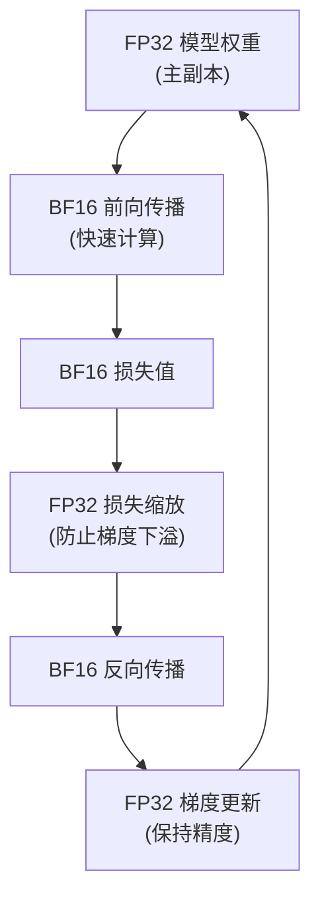
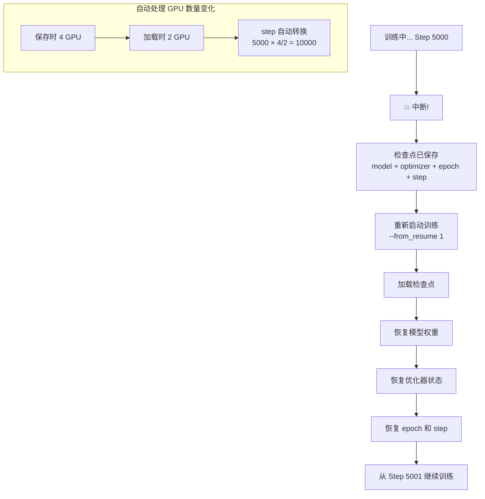

# 第八阶段：训练流程详解

> 🎯 **目标**：理解从数据准备到模型训练的完整流程
> ⏰ **预计时间**：1 周
> 📌 **前提**：已完成第一至第七阶段

---

## 8.1 两阶段训练总览



### 为什么 SFT 可以跳过 Pretrain？



---

## 8.2 数据详解

### 数据来源

所有数据来自 [ALLaVA-4V](https://huggingface.co/datasets/FreedomIntelligence/ALLaVA-4V) 系列：



### 数据格式

```
Parquet 文件列:
├── conversations: JSON 字符串
│   例: [{"role":"user","content":"<image>\n描述图片"},
│         {"role":"assistant","content":"这是一只金毛..."}]
│
└── image_bytes: 二进制 JPEG 数据
    例: <255, 216, 255, 224, ...>  (JPEG 文件头)
```

### 三种数据类型



> 为什么要混入纯文本对话？因为 SFT 数据中 92% 与图像有关，
> 如果没有纯文本数据，模型可能会"忘记"怎么做纯文本对话。

---

## 8.3 冻结策略详解



| 策略 | 投影层 | LLM 首层 | LLM 中间层 | LLM 末层 | 用途 |
|------|--------|---------|-----------|---------|------|
| freeze_llm=0 | 🔥 | 🔥 | 🔥 | 🔥 | 全参训练 |
| freeze_llm=1 | 🔥 | 🔥 | ❄️ | 🔥 | **SFT 默认** |
| freeze_llm=2 | 🔥 | ❄️ | ❄️ | ❄️ | **Pretrain 默认** |



---

## 8.4 训练超参数对比

| 参数 | Pretrain | SFT | 为什么不同 |
|------|----------|-----|-----------|
| **learning_rate** | 4e-4 | 5e-6 | Pretrain 投影层随机初始化，需要大学习率；SFT 微调已有权重，需要小学习率 |
| **batch_size** | 16 | 4 | Pretrain 任务简单，可以大 batch；SFT 任务复杂（问答），需要小 batch |
| **max_seq_len** | 450 | 768 | Pretrain 主要是短描述；SFT 包含长对话 |
| **freeze_llm** | 2 | 1 | Pretrain 只对齐；SFT 需要微调部分 LLM |
| **数据量** | ~127万 | ~290万 | SFT 数据已包含 Pretrain |

---

## 8.5 训练循环逐步解析



### 关键代码对应

```python
# 对应: train_sft_vlm.py 第27-79行
for step, (input_ids, labels, pixel_values) in enumerate(loader):
    # Step 1: 数据 → GPU
    input_ids = input_ids.to(device)                                    # 第28行
    labels = labels.to(device)                                          # 第29行
    pixel_values = pixel_values.to(device)                              # 第30行

    # Step 2: 余弦学习率
    lr = get_lr(epoch * iters + step, args.epochs * iters, learning_rate)
    for param_group in optimizer.param_groups:
        param_group['lr'] = lr                                          # 第33-34行

    # Step 3: 前向传播（混合精度）
    with autocast_ctx:                                                  # 第36行
        res = model(input_ids, labels=labels, pixel_values=pixel_values)
        loss = (res.loss + res.aux_loss) / accumulation_steps           # 第38-39行

    # Step 4: 反向传播
    scaler.scale(loss).backward()                                       # 第41行

    # Step 5: 梯度累积 + 裁剪 + 更新
    if step % accumulation_steps == 0:
        scaler.unscale_(optimizer)                                      # 第44行
        torch.nn.utils.clip_grad_norm_(model.parameters(), 1.0)        # 第45行
        scaler.step(optimizer)                                          # 第47行
        scaler.update()                                                 # 第48行
        optimizer.zero_grad(set_to_none=True)                           # 第50行

    # Step 6: 日志
    if step % log_interval == 0:
        Logger(f'Epoch:[{epoch+1}/{epochs}]({step}/{iters}), loss: {loss:.4f}')

    # Step 7: 保存模型
    if step % save_interval == 0:
        torch.save(model.state_dict(), ckp_path)                        # 第73行
```

---

## 8.6 混合精度训练



工作原理：



---

## 8.7 断点续训



---

## 8.8 自我检测

1. ✅ 为什么 Pretrain 的学习率比 SFT 大 80 倍？（投影层随机初始化 vs 微调已有权重）
2. ✅ SFT 数据为什么混入纯文本？（防止图文数据冲掉语言能力）
3. ✅ `freeze_llm=1` 解冻了哪些层？（投影层 + LLM 首末层）
4. ✅ 为什么要梯度裁剪？（防止梯度爆炸导致训练不稳定）
5. ✅ 断点续训保存了什么？（模型权重 + 优化器状态 + epoch/step + scaler）
