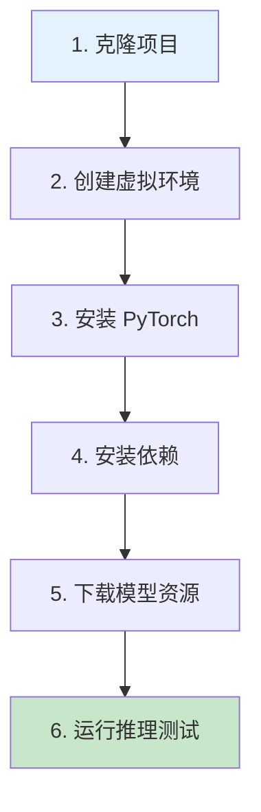
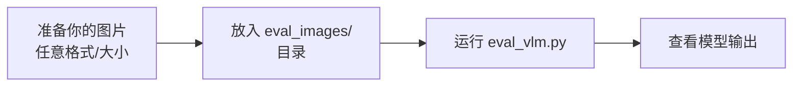
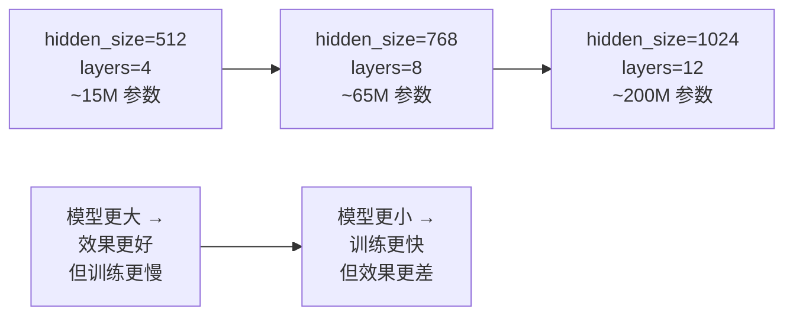
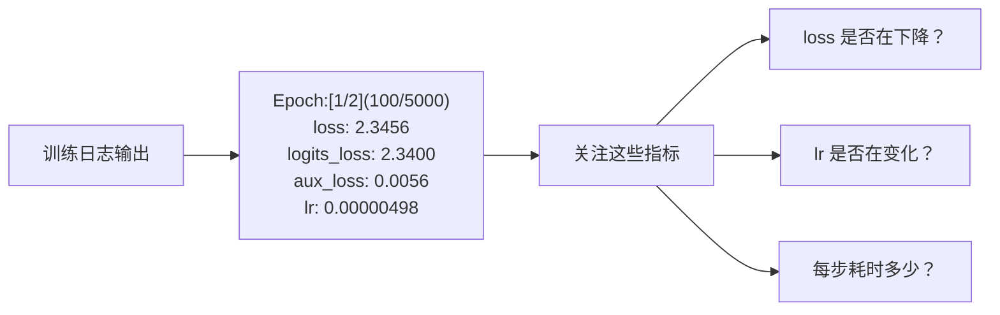

# 第九阶段：动手实践

> 🎯 **目标**：通过实际操作加深理解
> ⏰ **预计时间**：2-3 周
> 📌 **前提**：已完成第一至第八阶段，有 GPU 环境

---

## 9.1 环境搭建

### 安装步骤



```bash
# 1. 克隆项目
git clone https://github.com/jingyaogong/minimind-v
cd minimind-v

# 2. 创建虚拟环境
conda create -n minimind-v python=3.10 -y
conda activate minimind-v

# 3. 安装 PyTorch (根据 CUDA 版本选择)
# CUDA 12.1:
pip install torch torchvision --index-url https://download.pytorch.org/whl/cu121
# CUDA 11.8:
pip install torch torchvision --index-url https://download.pytorch.org/whl/cu118

# 4. 安装依赖
pip install -r requirements.txt -i https://pypi.tuna.tsinghua.edu.cn/simple

# 5. 验证 PyTorch + CUDA
python -c "import torch; print(f'PyTorch: {torch.__version__}'); print(f'CUDA: {torch.cuda.is_available()}')"
```

### 下载资源

```bash
# 下载视觉编码器
modelscope download --model gongjy/siglip2-base-p32-256-ve --local_dir ./model/siglip2-base-p32-256-ve

# 下载 LLM 基座权重
modelscope download --model gongjy/minimind-3v-pytorch llm_768.pth --local_dir ./out

# 下载训练好的 SFT 权重（用于推理）
modelscope download --model gongjy/minimind-3v-pytorch --local_dir ./out

# 下载训练数据
# 从 https://huggingface.co/datasets/jingyaogong/minimind-v_dataset 下载 sft_i2t.parquet
# 放到 ./dataset/ 目录下
```

### 验证目录结构

```
minimind-v/
├── model/
│   ├── siglip2-base-p32-256-ve/    ← 视觉编码器
│   ├── tokenizer.json
│   └── tokenizer_config.json
├── out/
│   └── llm_768.pth                 ← LLM 权重
├── dataset/
│   └── sft_i2t.parquet             ← 训练数据
└── ...
```

---

## 9.2 实验1：观察模型推理

```bash
# 运行推理脚本
python eval_vlm.py --load_from model --weight sft_vlm
```

**预期输出**：模型会逐一描述 `dataset/eval_images/` 中的 6 张图片。

### 尝试不同的提示语

修改 `eval_vlm.py` 中的 prompt 变量：

```python
# 原始
prompt = "<image>\n请描述这张图中的主要物体和场景。"

# 尝试这些变体
prompt = "<image>\n图片里有什么颜色的物体？"       # 关注颜色
prompt = "<image>\n用一句话描述这张图片。"         # 简短描述
prompt = "<image>\nWhat is in this image?"          # 英文提问
prompt = "<image>\n这张图片给你什么感觉？为什么？"  # 情感分析
```

### 调整生成参数

```bash
# 更确定性的输出 (temperature 低)
python eval_vlm.py --temperature 0.3 --top_p 0.9

# 更随机的输出 (temperature 高)
python eval_vlm.py --temperature 1.5 --top_p 0.95
```

---

## 9.3 实验2：观察张量形状

在模型代码中添加 print 语句，观察数据在模型中的流动：

### 方法：在 model_vlm.py 的 forward() 中添加调试代码

```python
# 在 model_vlm.py 的 forward() 方法中添加以下代码
def forward(self, input_ids, labels=None, pixel_values=None, **args):
    batch_size, seq_length = input_ids.shape
    print(f"═══ forward() 调试 ═══")
    print(f"1. input_ids: {input_ids.shape}")           # [1, seq_len]

    hidden_states = self.model.dropout(self.model.embed_tokens(input_ids))
    print(f"2. 嵌入后: {hidden_states.shape}")          # [1, seq_len, 768]

    if pixel_values is not None:
        vision_tensors = self.vision_proj(
            MiniMindVLM.get_image_embeddings(pixel_values, self.vision_encoder))
        print(f"3. 视觉特征: {vision_tensors.shape}")   # [1, 64, 768]

        hidden_states = self.count_vision_proj(
            tokens=input_ids, h=hidden_states, vision_tensors=vision_tensors)
        print(f"4. Token替换后: {hidden_states.shape}") # [1, seq_len, 768]

    # ... Transformer 处理 ...

    logits = self.lm_head(hidden_states)
    print(f"5. logits: {logits.shape}")                 # [1, seq_len, 6400]
```

**预期输出**：
```
═══ forward() 调试 ═══
1. input_ids: torch.Size([1, 75])
2. 嵌入后: torch.Size([1, 75, 768])
3. 视觉特征: torch.Size([1, 64, 768])
4. Token替换后: torch.Size([1, 75, 768])
5. logits: torch.Size([1, 75, 6400])
```

---

## 9.4 实验3：用自己的图片测试



```bash
# 1. 复制你的图片到评估目录
cp /path/to/your/photo.jpg dataset/eval_images/

# 2. 运行推理
python eval_vlm.py --load_from model --weight sft_vlm
```

也可以写一个简单的脚本来测试单张图片：

```python
import torch
from PIL import Image
from model.model_vlm import MiniMindVLM, VLMConfig
from transformers import AutoTokenizer

# 加载模型
config = VLMConfig()
model = MiniMindVLM(config)
weights = torch.load("out/sft_vlm_768.pth", map_location="cpu")
model.load_state_dict(weights, strict=False)
model = model.half().cuda().eval()

tokenizer = AutoTokenizer.from_pretrained("./model")

# 加载图片
image = Image.open("your_image.jpg")
pixel_values = MiniMindVLM.image2tensor(image, model.processor)
pixel_values = {k: v.half().cuda() for k, v in pixel_values.items()}

# 构造输入
prompt = "<|image_pad|>" * 64 + "\n请描述这张图片。"
messages = [{"role": "user", "content": prompt}]
text = tokenizer.apply_chat_template(messages, tokenize=False, add_generation_prompt=True)
input_ids = tokenizer(text).input_ids
input_ids = torch.tensor([input_ids]).cuda()

# 生成
with torch.no_grad():
    output = model.generate(input_ids, pixel_values=pixel_values,
                            max_new_tokens=200, temperature=0.7)
response = tokenizer.decode(output[0], skip_special_tokens=True)
print(response)
```

---

## 9.5 实验4：修改模型参数

尝试修改配置参数，观察模型行为变化：

```python
# 修改 VLMConfig 的参数
config = VLMConfig(
    hidden_size=768,       # 试试 512 或 1024
    num_hidden_layers=8,   # 试试 4 或 12
    num_attention_heads=8, # 注意力头数
)

# 注意：修改参数后需要重新训练，因为权重维度会不匹配
# 但你可以用修改后的配置从零初始化一个模型来观察参数量变化
model = MiniMindVLM(config)
total = sum(p.numel() for p in model.parameters()) / 1e6
print(f"模型参数量: {total:.2f}M")
```

### 参数量变化规律



---

## 9.6 实验5：尝试训练

### 快速训练测试

```bash
# 确保 sft_i2t.parquet 在 dataset/ 目录下
# 使用小 batch 测试训练是否能跑通
python trainer/train_sft_vlm.py \
    --epochs 1 \
    --from_weight llm \
    --batch_size 2 \
    --max_seq_len 256 \
    --log_interval 10 \
    --save_interval 500
```

### 监控训练过程



### 使用 WandB/SwanLab 记录训练

```bash
# 安装 SwanLab
pip install swanlab

# 启动带日志的训练
python trainer/train_sft_vlm.py \
    --epochs 2 \
    --from_weight llm \
    --use_wandb
```

---

## 9.7 实验6：启动 Web 界面

```bash
# 1. 下载 Transformers 格式模型
git clone https://huggingface.co/jingyaogong/minimind-3v

# 2. 复制到 scripts 目录
cp -r minimind-3v ./scripts/

# 3. 启动 Web 界面
cd scripts && python web_demo_vlm.py
```

然后在浏览器打开 `http://localhost:8888`，你可以：
- 上传图片
- 输入问题
- 实时看到模型回答

---

## 9.8 自我检测

1. ✅ 你能成功运行推理脚本并看到输出吗？
2. ✅ 你能解释模型输出中每个张量的形状吗？
3. ✅ 你能用自己准备的图片测试模型吗？
4. ✅ 你能成功启动训练并看到 loss 下降吗？
5. ✅ 修改 `temperature` 后你能观察到输出的差异吗？
