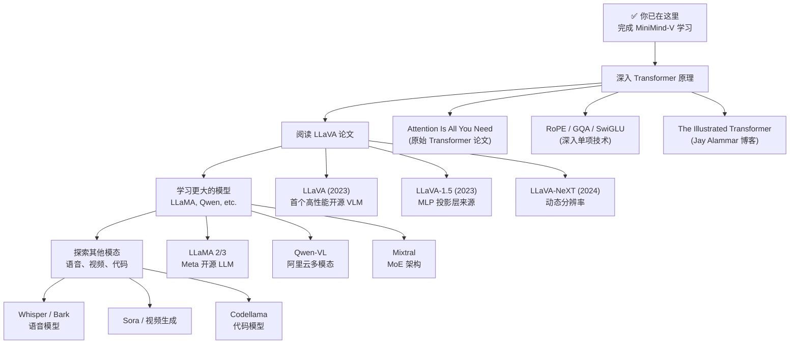
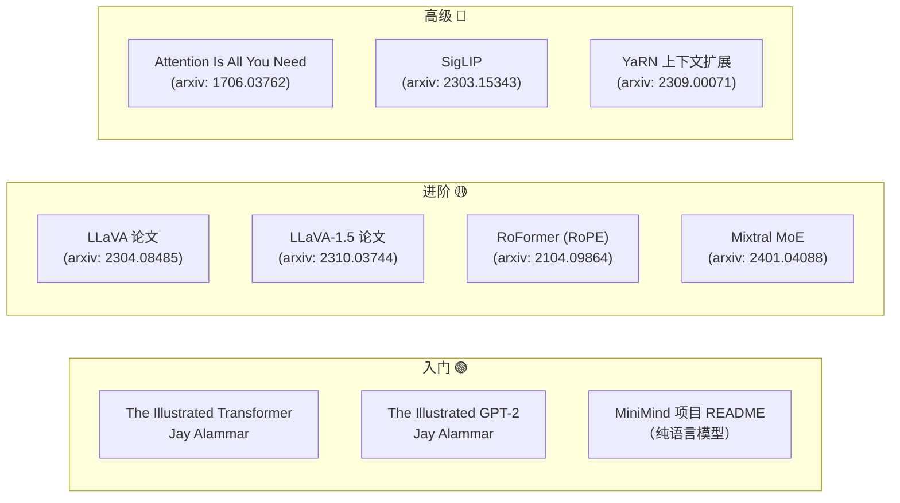
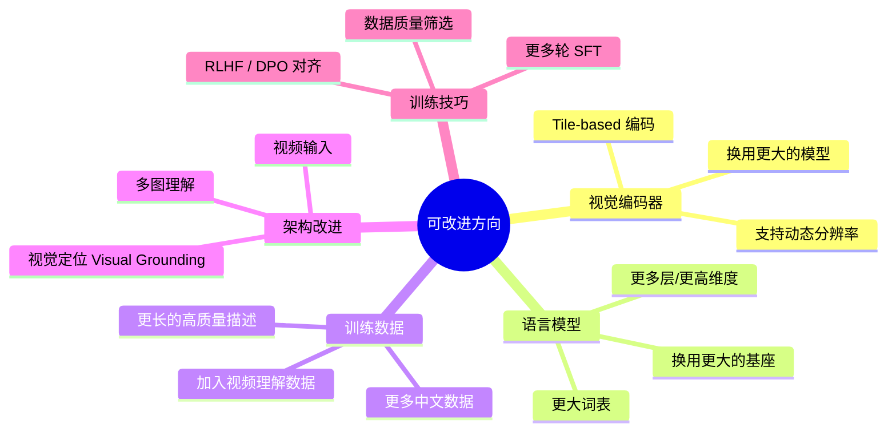
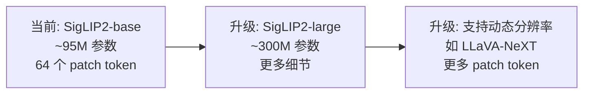
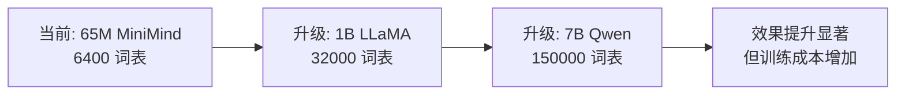
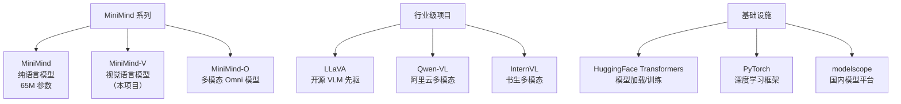
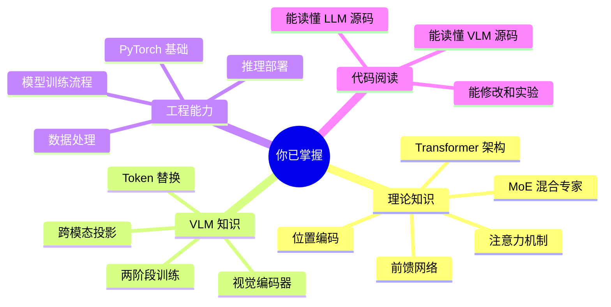
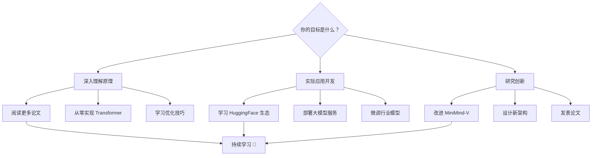

# 第十阶段：进阶拓展

> 🎯 **目标**：了解更广阔的 AI/ML 世界，知道从 MiniMind-V 出发还能去哪
> ⏰ **预计时间**：持续学习
> 📌 **前提**：已完成第一至第九阶段

---

## 10.1 推荐学习路线

---

## 10.2 推荐阅读材料

### 按难度排列

### 具体论文和资源

| 资源 | 类型 | 链接 | 说明 |
|------|------|------|------|
| The Illustrated Transformer | 博客 | jalammar.github.io | 最好的 Transformer 可视化教程 |
| LLaVA 论文 | 论文 | arxiv: 2304.08485 | MiniMind-V 的设计灵感来源 |
| LLaVA-1.5 | 论文 | arxiv: 2310.03744 | MLP 投影层的来源 |
| Attention Is All You Need | 论文 | arxiv: 1706.03762 | Transformer 原始论文 |
| RoFormer | 论文 | arxiv: 2104.09864 | RoPE 位置编码 |
| Mixtral | 论文 | arxiv: 2401.04088 | MoE 混合专家 |
| SigLIP | 论文 | arxiv: 2303.15343 | 视觉编码器 |

---

## 10.3 MiniMind-V 的改进方向

### 具体改进思路

#### 1. 升级视觉编码器

#### 2. 升级语言模型基座

#### 3. 增加更多能力

| 能力 | 需要什么 | 难度 |
|------|---------|------|
| 多图理解 | 支持多组 `<|image_pad|>` | 已支持基础版 |
| 视频理解 | 帧采样 + 时序编码 | 中等 |
| Visual Grounding | 坐标预测头 + 定位数据 | 中等 |
| OCR/文档理解 | 更高分辨率 + 文档数据 | 较高 |
| 流式输出 | 已支持（streamer） | 已完成 |

---

## 10.4 相关项目生态

---

## 10.5 学习检查清单

完成全部 10 个阶段后，你应该能够：

### 自我检测（终极版）

1. ✅ 能画出 Transformer 的完整架构图吗？
2. ✅ 能解释 RoPE 为什么比绝对位置编码好吗？
3. ✅ 能说出 Attention 的 5 个步骤吗？
4. ✅ 能解释 VLM 是如何让 LLM "看懂"图片的吗？
5. ✅ 能说出 Pretrain 和 SFT 阶段的 3 个区别吗？
6. ✅ 能独立修改代码并运行实验吗？

如果你对所有问题的回答都是"是"，恭喜你！你已经掌握了理解现代多模态 AI 模型的基础知识。

---

## 10.6 下一步建议

---

> 恭喜你完成了全部 10 个阶段的学习！
> AI 领域发展迅速，保持好奇心和持续学习的态度是最重要的。
> 如果对 MiniMind-V 有任何改进想法，欢迎贡献代码！
